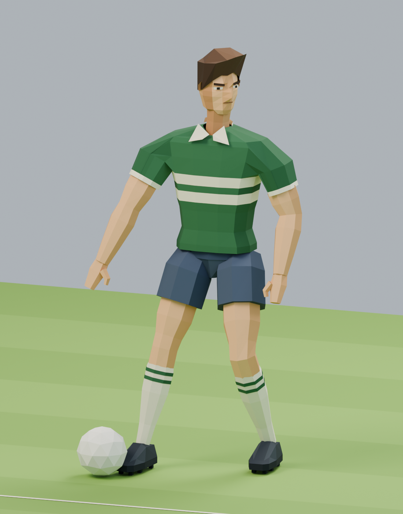

# Fußballer B – vollständig neuer Aufbau

Stand: 2. Oktober 2026. Auf die neue Nutzeranweisung „Starte komplett neu“ wurde eine eigenständige Figur direkt in der verbundenen Blender-MCP-Sitzung aufgebaut. Grundlage ist ausschließlich die in dieser Anfrage angehängte Stilvorlage B. Körper, Gesicht, Haare, Kleidung und Schuhe sind neu modellierte Geometrie; keine Körperbasis oder Meshes aus den vorherigen Entwürfen wurden übernommen.

Die Figur hat einen facettierten Kiefer mit modelliertem Nasenrücken, kurze braune Haare mit seitlicher Tolle, ein grünes Polotrikot mit zwei cremefarbenen Streifen, marineblaue Shorts, gestreifte Stutzen und dunkle Fußballschuhe mit Stollen. Die Ärmel gehen direkt aus dem Rumpfmesh hervor. Arme haben durchgehende Flächen am Ellenbogen. Die Beine stehen in einer asymmetrischen statischen Bereitschafts-/Ballkontrollpose.

## Dateien

- `Fussballer-B-Komplett-Neu.blend`: eigenständige native Datei mit genau einer neuen Szene, editierbaren Meshes, gepackter Referenz und eingebettetem Aufbau-Skript. In Blender erneut geöffnet und gespeichert.
- `Fussballer-Ballpose.png`, `Fussballer-Profil.png`, `Fussballer-Ruecken.png`, `Fussballer-Gesicht.png`: tatsächliche Blender-Renders in 1100 × 1400 Pixeln.
- `pruefung.json`: Geometrie- und Dateiprüfung.
- `../../work/create-footballer-b-fresh.py`: vollständig eigener Aufbau, in mehreren Schritten über Blender MCP ausgeführt.

## Prüfung und Grenzen

Figur einschließlich Ball: 1.974 Dreiecke in 57 editierbaren Meshobjekten. Alle Koordinaten sind endlich, keine Fläche ist glatt schattiert. Beide Stollensätze enden 3 mm über der Rasenebene. Vier Renderansichten und der Blender-Viewport wurden geprüft; Spalten an Gelenken und Überschneidungen am Hosenbund wurden vor dem Speichern bereinigt. Die wieder geöffnete Datei enthält ausschließlich die neue Szene und die gepackte Bildvorlage.

Die Figur ist eine statische Modellstudie mit mehreren separat editierbaren Teilen. Es gibt kein Animationsrig, keine Bewegungsclips und keine Integration in Doppel 6. Die geringe Dreieckzahl allein belegt keine mobile Laufzeitleistung: Die Einzelobjekte müssen für eine spätere Spielintegration gebündelt werden. Die künstlerische Abnahme durch die nutzende Person steht aus.
