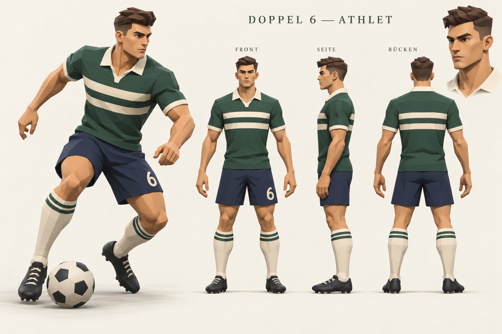

# Doppel 6: Figurenkonzept von Grund auf neu

Stand: 1. Oktober 2026. Die nutzende Person fordert nach den verworfenen Modellversuchen ausdrücklich eine vollständige Neukonzeption. Die Richtung bleibt hochwertiges stilisiertes 3D mit der sportlichen Lesbarkeit von ISS 64 / ISS 2000. Die bisherigen Blender-Körper werden nicht als Grundlage des neuen Figurenaufbaus übernommen.

Die Tafel ist eine mit dem integrierten Bildgenerierungswerkzeug erstellte **Konzeptzeichnung**. Daneben gibt es jetzt einen neu aufgebauten Graukörper und einen bekleideten Blender-Entwurf. Dessen fünf Ansichten sind tatsächliche Renders des gespeicherten Modells. Das ursprüngliche Referenzprojekt bleibt als reine Bildvorlage erhalten. Eine künstlerische Nutzerfreigabe ist nicht behauptet.

## Aktueller Blender-Entwurf

**Weitere Variante vom 2. Oktober 2026:** `G:\Blenderassets\FM\Spielermodell-2026-10-02\FM-Spieler-Neu.blend` wurde direkt über die wieder verbundene Blender-MCP-Sitzung erstellt. Grundlage ist die nachfolgend beschriebene eigene Körperstudie. Schultern und Kiefer sind schmaler, Haut und Schuhe matter und das Trikot dunkler. Die Datei enthält die Gruppen `FM_Spieler_Neutral` und `FM_Spieler_Ballpose` sowie die eingebettete Konzepttafel. Die neue Variante ist separat gespeichert; sie hat weiterhin kein Produktionsrig oder Bewegungsclips und ist nicht in die Spielgrafik integriert.

`FM-Athlet-Fussballkleidung.blend` entwickelt den neuen Graukörper weiter: kürzerer Hals, angepasste Kiefer- und Beinformen, fokussiertere Augenpartie und eine geschlossene kurze Frisur mit seitlich geführter Tolle. Das separate Polotrikot übernimmt die grüne Grundfarbe und zwei elfenbeinfarbene Ringe aus der Konzepttafel. Eigene Meshes bilden Kragen, marineblaue Shorts, gestreifte Stutzen sowie schwarze Fußballschuhe mit Schnürung und Stollen.

Die Datei enthält eine neutrale Figur und eine statische Ballpose. Die vollständige überarbeitete Anatomie bleibt in einer ausgeblendeten Reserve erhalten; bei der sichtbaren Figur ist verdeckte Haut unter Kleidung und Schuhen entfernt. Die separate Graukörperdatei bleibt erhalten. Bildvorlage und Hinweise sind in die Blender-Datei eingebettet.

Die Ansichten `Fussballer-Frontal.png`, `Fussballer-Profil.png`, `Fussballer-Ruecken.png`, `Fussballer-Ballpose.png` und `Fussballer-Gesicht.png` dienen dem Vergleich mit der Vorlage. Renderprüfung und native Dateiprüfung betreffen Geometrie, Kleidung und die feste Pose. Das Modell ist eine detaillierte Gestaltungsstudie; die Anzahl der Dreiecke und Einzelobjekte überschreitet das mobile Laufzeitbudget. Retopologie, Produktionsrig, Bewegungsclips und Integration in die bestehende Darstellung stehen aus. Die gespeicherte Datei belegt keine bereits erreichte Übereinstimmung mit allen künstlerischen Merkmalen der Konzeptzeichnung.

Die Generierung erfolgt über `work/create-athlete-footballer.py` auf Grundlage von `work/create-athlete-graybody.py`. `work/verify-athlete-footballer.py` prüft die erneut geöffnete native Datei. Blender MCP meldete beim Ausbau keine Verbindung; deshalb lief die Erstellung im installierten Blender 5.2.2 in einem separaten Hintergrundprozess.

## Leitbild

Ein junger erwachsener Fußballathlet mit drahtiger Kraft und erkennbarer Körperspannung. Schultern, Taille und Beine bilden eine klare Silhouette. Die Figur wirkt auch ohne Ball und Trikot als Sportler. Die Körpersprache zeigt Aufmerksamkeit, Balance und Bereitschaft zur nächsten Aktion.

| Bereich | Neuer Entwurf | Umsetzung im Modell |
| --- | --- | --- |
| Proportionen | Etwa 7,5 bis 8 Kopflängen; lange Beine, kompakter Hals, Taille deutlich schmaler als Schultern | Proportionen zuerst als neutrale graue Ganzkörperfigur prüfen |
| Gesicht | Junger Erwachsener, kantige Wangen, schlanker klarer Kiefer, konzentrierte Augen, geschlossener neutraler Mund | Große zusammenhängende Flächen; keine eingesunkenen Mundfalten oder hochdetaillierte Haut |
| Muskulatur | Ausgeprägte Oberschenkel und Waden, moderate Schultern, sehnige Unterarme | Silhouette und wenige anatomisch platzierte Flächen modellieren; Trikot nicht aus Körperhaut ausschneiden |
| Haare | Kurze Seiten und wenige modellierte dunkle Haarformen | Eigenständige geschlossene Haarkappe mit sauberem Ansatz |
| Kleidung | Sauberes Polotrikot, flach aufliegender Kragen, maßvolle Stoffweite, kürzere Fußballshorts | Kleidungsmesh separat mit durchgehenden Saum-, Ärmel- und Halsöffnungen aufbauen |
| Oberflächen | Matte Farben und bewusst gesetzte große Flächen | Licht erklärt die Form; keine zufällige Dreieckszerlegung oder photorealistischen Mikrotexturen |
| Pose | Belastetes Standbein, versetzte Füße, gedrehte Hüfte und gegenläufiger Oberkörper | Haltung aus Gewichtsverlagerung aufbauen; Fußkontakt und Schwerpunkt gemeinsam prüfen |

Grün, Elfenbein und Marineblau bilden das Mustertrikot. Im Spiel bleiben die vorhandenen Vereinsfarben und sechs Trikotmuster maßgeblich. Die Nummer 6 in der Tafel ist ein Gestaltungsbeispiel. Haut, Haare und Gesicht müssen später weiterhin aus der vorhandenen Spieleridentität abgeleitet werden.

## Modellbau auf neuer Grundlage

1. **Körper und Gesicht:** Ein neues Mesh nach Vorder-, Seiten- und Rückenansicht aufbauen. Zuerst Silhouette und Körperlängen in neutralem Grau prüfen. Den bisherigen Superhelden-Körper nicht weiter verformen.
2. **Kleidung und Haare:** Eigene saubere Topologie für Trikot, Kragen, Shorts, Stutzen, Schuhe und Haarkappe. Hals und Achseln müssen aus allen Ansichten geschlossen wirken. Keine verdeckten Hautflächen durch Stoff und keine losgelösten Kragenstücke.
3. **Rig und statische Posen:** Erst auf dem passenden Körper ein humanoides Skelett mit Schulter-, Ellenbogen-, Hüft-, Knie- und Fußgelenken einrichten. Neutrale Haltung, Ballkontrolle und Laufpose zeigen, ob Gelenke und Formen funktionieren.
4. **Bewegungsprobe:** Laufen, Bremsen, Drehen, Pass und Schuss auf derselben Figur. Standbein, Hüfte, Arme und Ballkontakt zusammen abstimmen. Kopfball-, Volley- und Torwartaktionen folgen derselben bestehenden Matchlogik.
5. **Spielkamera und Budget:** Den tatsächlich gebauten Spieler in der vorhandenen Three.js-Darstellung vergleichen. Unter 3500 Dreiecke und 15 Meshes je Figur bleiben zunächst der bestehende Laufzeit-Vergleichsmaßstab. Ein höheres Budget muss durch Messung einer vollständigen Matchszene begründet werden. Blender-Nahansichten allein belegen keine mobile Leistung.

Die Konzepttafel ist eine visuelle Orientierung, keine maßgenaue Konstruktionszeichnung. Perspektive der Ballpose, Gelenkpositionen und Konsistenz der drei Ansichten sind beim Modellbau geometrisch zu prüfen.

## Prüfung der neuen Figurenwirkung

- Der Körper muss in Vorder-, Seiten-, Rücken- und Dreiviertelansicht wie ein junger erwachsener Fußballer wirken. Das Gesicht darf in der Nahansicht keinen alten oder kindlichen Eindruck erzeugen.
- Die schwarze Silhouette muss Standbein, Körperdrehung und Beinbewegung klar zeigen. In der vorhandenen mobilen Matchkamera müssen Teamfarbe, Körperrichtung und Ball verständlich bleiben.
- Kragen, Ärmel, Schritt, Knie und Haaransatz werden aus allen Ansichten auf Formfehler und Durchdringungen geprüft.
- Künstlerische Übereinstimmung, technische Geometrieprüfung und tatsächliche Nutzerfreigabe werden getrennt dokumentiert. Technisch gültige Geometrie bestätigt keinen passenden Grafikstil.

Die Neukonzeption verändert noch keine Spielregeln, Taktiken, Banner, Spielstände oder Laufzeitgrafik. Es gibt keine Veröffentlichung und keinen beschlossenen Enginewechsel.

## Dateien und Herkunft

Projektablage: `G:\Blenderassets\FM\Neukonzept-2026-10-01`.

- `athlet-konzept.png`: neue stilisierte Modellvorlage mit drei Ansichten, Gesichtsstudie und Ballpose.
- `athlet-anatomie-studie.png`: erste, realistischere Anatomiestudie; nicht die Zielgestaltung.
- `FM-Neukonzept-Referenz.blend`: frisches Referenzprojekt mit eingebetteter Konzepttafel und Gestaltungsbrief, ohne Spielermodell.
- `FM-Athlet-Graukoerper.blend`: neuer anatomischer Grundkörper und statische Ballpose, vor dem Ausbau der Kleidung.
- `FM-Athlet-Fussballkleidung.blend`: aktueller bekleideter Modellstand mit neutraler Figur und statischer Ballpose.
- `Fussballer-*.png`: fünf tatsächliche Blender-Renderansichten des bekleideten Modells.
- `fussballer-pruefung.json` und `fussballer-dateipruefung.json`: Erstellungsprotokoll und Prüfung der erneut geöffneten Datei.
- `README.md`: dieser Gestaltungsbrief.
- `prompts.json`: vollständige Generierungs- und Bearbeitungsprompts; integriertes Bildgenerierungswerkzeug, keine externe bezahlte 3D-Generierung.
- `index.html`: lokale Ansicht des Modells neben der Konzepttafel.

Die früheren Modelle bleiben als verworfene Versuche erhalten. Der neue Modellbau verwendet eigene anatomische Profilmeshes; die verworfene importierte Körperbasis wurde nicht übernommen.
