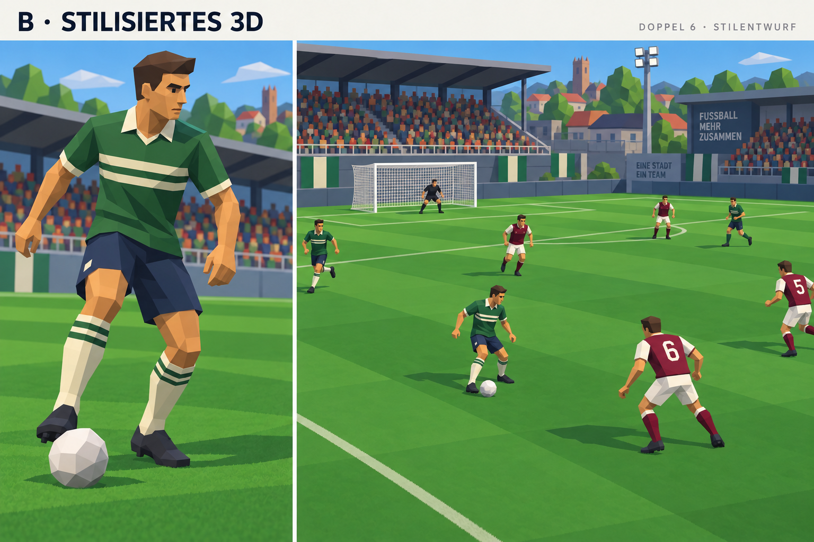
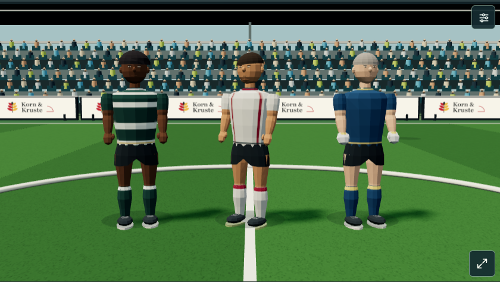

# Natürlichere 3D-Spielermodelle

Stand: 1. Oktober 2026. Prototyp 105 ist in der getrennten [3D-Vorschau](https://fussball.cakamper.at/3d/?v=105) veröffentlicht. Auf Nutzerwunsch hat die Modellqualität Vorrang vor zusätzlichen Zweikampf- und Grätschenanimationen.

## Festgelegter Grafikstil und nächste Schritte

### Musterspieler in Blender – Stufe 1

Die nutzende Person hat die lokale Bewegungsprobe als dem gewählten Stil nicht entsprechend zurückgewiesen. Ihre technische Prüfung gilt weiterhin, belegt aber keine akzeptierte Grafikqualität. Auf Wunsch wurde anschließend eine eigenständige [Blender-Musterfigur mit fünf Ansichten und editierbaren Dateien](3d-musterspieler-b/README.md) erstellt. Diese Stufe dient ausschließlich der Stilprüfung; sie besitzt noch kein Skelett und keine Bewegungsclips und ist nicht in das Match eingebunden. Die subjektive Freigabe bleibt offen.

Auch diese Musterfigur (Modellrevision 5) wurde anschließend als unzureichend zurückgewiesen. Sie ist als verworfener Entwurf dokumentiert. Auf Wunsch wird die lokale Blender-MCP-Anbindung verwendet: Der vorhandene Codex-Servereintrag wurde aktiviert, das Blender-Add-on ist vorhanden und eingeschaltet; Verbindung und Werkzeugverfügbarkeit müssen nach Start des Add-on-Servers und Codex-Neustart bestätigt werden. Für den nächsten Modellversuch ist zunächst eine geeignete Charaktergrundlage zu wählen.

Die lokale Verbindung wurde anschließend über Blender MCP erfolgreich geprüft: Blender 5.2.2 LTS und die Standardszene sind erreichbar. Der Ausgangsstand ist auf Nutzerwunsch unter `G:\Blenderassets\FM\FM-Stil-B-Arbeitsprojekt.blend` gespeichert; dies ist noch kein neuer Musterspieler. Poly Pizza, Sketchfab, Hunyuan3D und Rodin sind in der aktuellen Blender-Instanz nicht freigeschaltet. Das installierte Add-on verwendet Protokoll 11, der MCP-Server erwartet 13; die geprüften Grundfunktionen arbeiten mit dem vorhandenen Stand.

Am 1. Oktober 2026 hat die nutzende Person nach dem Vergleich von Pixelgrafik, stilisiertem 3D und stärker realitätsnahem Sport-3D den Stil **stilisiertes 3D** gewählt. Visuelle Grundlage ist Entwurf B, als modernisierte Richtung von International Superstar Soccer 64 / ISS 2000. Die Auswahl bestätigt den Grafikstil, nicht die technische Umsetzung des Konzeptbilds oder die bisherige Modellqualität von Version 105.

Die Referenz wurde mit dem eingebauten Imagegen-Werkzeug als Stilkonzept erzeugt und anschließend gegenüber dem zunächst zu realitätsnahen Entwurf vereinfacht. Sie zeigt eine Musterfigur und eine beispielhafte Spielsituation; Spielerzahl, Feldaufteilung, Bandenbeschriftungen und Perspektive sind keine neuen Produktregeln. Das Bild belegt weder eine laufende 3D-Szene noch deren Leistung auf Mobilgeräten.

### Gestaltungsmerkmale

- Die Figuren erhalten erwachsene, athletische Körperproportionen mit klar erkennbaren Schultern, Beinen, Händen und Schuhen. Silhouette und Pose sollen auch in der Spielkamera verständlich sein.
- Gesicht und Frisur verwenden bewusst modellierte, vereinfachte Formen. Haut-, Haar- und Gesichtsmerkmale der vorhandenen Spieler bleiben die Grundlage ihrer Identität.
- Materialien sind überwiegend matt, Farbflächen deutlich getrennt und Trikotdetails sparsam. Vereinsfarben und bestehende Trikotmuster bleiben erkennbar.
- Rasen und Tribünen verwenden ruhige, klare Formen und begrenzte Details. Licht und Schatten unterstützen die Lesbarkeit von Figuren und Ball.
- Lauf- und Aktionsbewegungen vermitteln Gewicht durch Standbein, Hüfte, Rumpf und Arme. Fuß- und Kopfkontakte sind an die tatsächlichen Matchereignisse gebunden.

### Geplante Umsetzung

1. **Musterfigur:** Eine Feldspielerfigur im ausgewählten Stil in Vorder-, Seiten- und Dreiviertelansicht erstellen. Nahkamera und mobiles Querformat zeigen, welche Details im Match wirken. Aussehen und Trikotvarianten werden aus bestehenden Merkmalen abgeleitet.
2. **Bewegungsprobe:** Laufen, Bremsen, Drehen, Pass und Schuss in einer wiederholbaren kurzen Sequenz auf derselben Figur abstimmen. Standfüße, Ballkontakt und Übergänge gemeinsam prüfen; vorhandene Kopfball-, Volley- und Torwartbewegungen müssen weiterhin zu den Gelenken passen.
3. **Matchvergleich:** Die Musterfigur in einer echten Vereinswelt-Partie mit beiden Teams, beiden Spielrichtungen und vorhandenen Kameras erproben. Figuren, Ball und Namen müssen auf dem Handy im Querformat lesbar bleiben.
4. **Ausbau:** Erst nach der Prüfung der Musterfigur weitere Aussehensvarianten und gezielte Stadiondetails übernehmen. Zusätzliche Zweikampf- und Grätschenanimationen bleiben ein eigener späterer Umfang.

Die vorhandene Three.js-Darstellung ist der technische Ausgangspunkt. Unity wurde als Möglichkeit besprochen; die Stilwahl beschließt keinen Wechsel. Ob die bestehende prozedurale Modellfabrik erweitert oder ein Modell mit Skelett importiert wird, entscheidet die Musterfigur anhand von Qualität, Gelenkkompatibilität, Offline-Build und gemessenen Grafikkosten. Das bestehende Budget von unter 3500 Dreiecken und 15 Meshes je Figur ist der Vergleichsmaßstab; Änderungen daran benötigen eine begründete Messung. Spielberechnung, Zufallsstrom und gespeichertes Aussehen werden durch die Grafik nicht verändert.

Abnahme bedeutet: erkennbarer ausgewählter Stil in Nah- und Matchansicht, kein sichtbares Schweben oder Gleiten während der Standphase, stimmiger Fuß-/Kopfkontakt, weiche Aktionsübergänge und erhaltene Pause, Wiederholung sowie 2D-Rückfall. Die vorhandenen Modell-, Kontakt-, Aktions- und Matchparitätsprüfungen bleiben Grundlage. Ladezeit und Laufzeit sind zusätzlich auf echter Mobilhardware zu messen.

## Lokale Umsetzung des gewählten Stils

Die Musterfigur, Bewegungsprobe und Anbindung an echte Partien sind auf Basis der vorhandenen Darstellung umgesetzt. Der neue Stand ist lokal gebaut und geprüft, aber noch nicht veröffentlicht. Die folgenden Abschnitte ab „Richtung und Umfang“ dokumentieren weiterhin den zuvor veröffentlichten Stand 105.

Die gemeinsame Modellfabrik verwendet einen schlankeren Rumpf, klarere Schulterformen, längere Beine und einen kleineren Kopf. Matte Materialien mit flächiger Schattierung setzen die gewählte Richtung um. Hautfarbe, Haare, Gesicht und Trikotmuster werden weiterhin aus den bestehenden Merkmalen gelesen. Die geprüfte Cornrows-Figur verwendet 15 Meshes und 2848 Dreiecke statt zuvor 3048; alle zehn Frisuren bleiben unter 3500 Dreiecken. Zusätzliche Stadiondetails gehören weiterhin zum späteren Ausbau.

Der Wurzelmaßstab bleibt 1,12. Die Hüfte liegt jetzt bei 1,02 statt 0,89, Oberschenkel und Unterschenkel sind 0,47 und 0,44 lang. Die neutrale Knöchelhöhe bleibt 0,11. Der Hals liegt bei 1,92; die Kopfgeometrie wird als zusammenhängende Einheit verkleinert. Diese Änderungen betreffen ausschließlich die Darstellung. Der gemeinsame Beinlöser liest die tatsächlichen Gelenklängen und berücksichtigt die Rumpfneigung. Dadurch passen die längeren Beine zur bisherigen Schrittphase und zur Rasenhöhe.

Laufbewegung und Abbremsen bleiben streckenabhängig. Die Körperrichtung wird mit einer zeitabhängigen Dämpfung geglättet; bei Richtungswechseln drehen Rumpf und Kopf leicht mit. Pass, Flanke, Schuss, direkter Freistoß und Volley verwenden ein belastetes Standbein und eine berechnete Fußbahn zur bestehenden Ballhöhe. Vorbereitung und Ausschwingen gehen weiterhin in die vorhandene Laufpose über. Kopfball, Torwartaktionen, Pausen, Banner und Wiederholungen verwenden die bestehenden Ereignisse und Abläufe. Es gibt keine neue Spielberechnung, Zufallsziehung, gespeicherten Felder oder Umrechnung von Spielständen.

### Bewegungsprobe öffnen

`node work/generate-player-motion-preview.cjs` erstellt [die eigenständige Bewegungsprobe](../outputs/player-motion-preview.html). Sie bettet die Produktionsszene, Modellfabrik und dieselben Bein- und Aktionsfunktionen ein. Drei Aussehensvarianten zeigen Laufen, Bremsen/Drehen, Pass, Flanke, Schuss, Kopfball, Volley und Stillstand. Pause, Neustart und reduzierte Bewegung sind bedienbar. Die Sequenz ist eine Grafikprobe und keine zusätzliche Matchsimulation.

Die lokale Vorschau lässt sich mit `node work/preview.cjs` starten; standardmäßig liegt die Bewegungsprobe unter `http://127.0.0.1:4174/player-motion-preview.html`. `SECHSER_PREVIEW_PORT` überschreibt den Port. Die vorhandene Matchdarstellung liegt auf derselben Vorschau unter `/`; der normale Offline-Build entsteht unverändert mit `node work/build.cjs`.

### Prüfung des lokalen Stands

- `work/test-player-model-v105.cjs` prüft Identität, Determinismus, Frisuren, Geometriebudget, Körperproportionen und erhaltene neutrale Kontakthöhe. `work/test-stylized-player-motion.cjs` prüft die tatsächlichen Gelenke bei 30/60/120 Grafikbildern pro Sekunde, Abbremsen sowie Standfuß und Ballkontakt für sechs Aktionen. Bei 750 Standkontakten beträgt die größte vertikale Abweichung 0,003081 Szeneneinheiten; Fuß und Ball sind beim Abspiel weniger als einen Ballradius voneinander entfernt.
- Die Browserprüfungen für Modelle, Laufkontakt und Bewegungen bestehen auf Desktop und im mobilen Querformat. Sie prüfen zwölf Identitäten, 289 weitere Standkontakte, 28 Aktions- und 20 Luftduellfälle sowie Pause, Sichtbarkeit, Gerätewechsel und 2D-Rückfall ohne Browserfehler. Die Sichtprüfung umfasst Nahansicht und Matchkamera.
- Die vollständige 2D/3D-Vergleichspartie ergibt nach 2543 Schritten identische Spielzeit, Ereignisse, Wechsel, Statistiken und verbuchtes Ergebnis. Tor-/Wechselbanner, Taktik, Live-Spielerinfo, Touch-Gesten, Standards, Torwartabspiele, Elfmeter und Torwiederholungen bestehen die bestehenden gezielten Prüfungen. Der neu erzeugte Offline-Build startet ohne Browserfehler.
- `work/check-player-motion-preview.cjs` prüft alle acht Bewegungsansichten, endliche Posen, Pause, Neustart, Offline-Nutzung, mobiles Layout und reduzierte Bewegung. Die Vorschau ist auf Desktop und bei 844 × 390 Pixeln angesehen worden.

Die Browsermessungen verwenden Software-WebGL. Laufzeit und Ladezeit auf echter Mobilhardware sowie die subjektive Nutzerabnahme bleiben offen. Die öffentliche Vorschau steht weiterhin auf dem zuvor veröffentlichten Stand 105.

## Richtung und Umfang

Die Spieler sollen wie natürlichere Sportspielfiguren wirken und auch im mobilen Querformat praktikabel bleiben. Die Umsetzung verbessert Silhouette, Körperproportionen, Muskeln, Kiefer, Hände und Schuhe innerhalb des bisherigen prozeduralen Gelenkmodells. Die Figuren bleiben stilisiert; Fotorealismus oder eine feste Bildrate sind nicht belegt.

Die bestehende Oberfläche, Vereinsfarben, TV-Kameras und Matchsteuerung bleiben erhalten. Dieser Block ergänzt keine Zweikampf- oder Grätschenbewegungen. Die bisherigen Lauf-, Pass-, Schuss-, Kopfball-, Volley-, Parade- und Wurfposen verwenden weiter ihre vorhandenen Drehpunkte und Kontaktwege.

## Umsetzung

- `dist/player-model-v105.js` ist die gemeinsame Modellfabrik für die Szene. Rumpf, Kiefer und Muskelkonturen werden organisch aufgebaut; Schuhe und Handflächen verwenden rundere Formen.
- `dist/pitch-scene-v98.js` erstellt die Figuren über diese Fabrik. Wurzelmaßstab und bestehende Gelenkpunkte bleiben erhalten, damit Kopf- und Fußkontakte weiter auf denselben Höhen liegen.
- `dist/world-pitch3d-v98.js` übergibt das vorhandene Aussehen aus dem Matchspieler. Hautfarbe (`skinTone`), Haarfarbe (`hairColor`), Frisur (`hairstyle`), Gesichtsform (`faceShape`), Bart (`facialHair`), Nase (`nose`) und Mund (`mouth`) bestimmen die Darstellung.
- Das gespeicherte Aussehen wird weder verändert noch ergänzt. Bei fehlendem Aussehen verwendet ausschließlich die Grafik einen deterministischen Ersatz. Es gibt keine neuen gespeicherten Felder, keinen zusätzlichen Engine-Zufall und keine Migration.
- Die sechs bestehenden Matchtrikotmuster und ihre Vereinsfarben sowie Nummern und Torwarthandschuhe bleiben erhalten.

## Geometrie und Messgrenzen

Statische Details werden mit Vertexfarben je beweglichem Gelenk gebündelt. Eine Figur verwendet 15 Meshes; das Budget liegt unter 3500 Dreiecken je Figur. Die geprüfte Cornrows-Variante verwendet 3048 Dreiecke. Die Trikottextur ist 128 × 128 Pixel groß. Diese Grenzen erlauben mehr Formdetail bei weniger getrennten Zeichenaufrufen.

Der vergleichbare Anfangsbildaufbau derselben Szene liefert:

| Messwert | Ausgangsstand 104 | Lokaler Stand 105 |
| --- | ---: | ---: |
| Zeichenaufrufe | 284 | 194 |
| Geometrien | 322 | 210 |

Eine spätere Aufnahme im Match liefert 210 Zeichenaufrufe, 212 Geometrien und 62.650 Dreiecke. Sie gehört zu einem anderen Bildzeitpunkt und darf nicht als direkter Vergleich zum Anfangsbildaufbau verwendet werden. Die Messwerte beschreiben Grafikkosten unter Software-WebGL. Sie belegen keine stabilen FPS auf einem echten Mobiltelefon.

## Prüfung und verbleibende Abnahme

`work/test-player-model-v105.cjs` prüft zwölf Modellfälle, darunter zehn Frisuren, deterministische Geometrie, unverändertes gespeichertes Aussehen, endliche Geometriedaten, äußere Rumpfnormalen, erhaltene Gelenkpunkte und das Geometriebudget. `work/check-player-model-v105.cjs` prüft die Zuordnung gespeicherter Identität, Desktop-TV, mobiles Querformat, Hochformat-Rückfall auf 2D und eine Nahansicht ohne Browserfehler.

Die lokale visuelle Prüfung akzeptiert vier Ansichten und bestätigt Verbesserungen an Silhouette, Gesichtern und Schuhen. Diese Prüfung ersetzt nicht die subjektive Freigabe durch den Nutzer. Bildbelege liegen unter `outputs/model105-tv-desktop.png`, `outputs/model105-tv-mobile.png` und `outputs/model105-gallery.png`.

Die abschließenden Prüfungen bestehen: 17 JavaScript-Testdateien und sechs Deploymentfälle, identischer vollständiger 2D/3D-Spielverlauf über 2543 Schritte, 28 Aktions- und 20 Luftduellfälle, Torwiederholungen beider Teams und Halbzeiten, Überspringen und natürlicher Abschluss, Standards, Banner, Taktik, Gerätewechsel und Kontextverlust. Die Sohlenprüfung misst maximal 0,004802 Szeneneinheiten Kontaktabweichung bei 289 Kontakten. Einzeldatei und eigenständiger Kameraprototyp starten ohne Browserfehler. Bestehende Abnahmebedingungen stehen im [3D-Leitfaden](3d-spieldarstellung.md) und im [Animationsplan](3d-spieleranimationen-plan.md).

Offen bleiben die Laufzeitprüfung auf echter Mobilhardware und die subjektive visuelle Freigabe. Quelle, Einzeldatei-Build, Live-HTML und ZIP stimmen für Version 105 überein. Die bestehende Hauptseite ist per SHA-256 unverändert. Live-Prüfungen bestätigen zwölf gespeicherte Identitäten, Desktop, mobiles Querformat, Hochformat-2D sowie 28 Aktionsfälle, 20 Luftduellfälle und 289 Sohlenkontakte ohne Browserfehler. Veröffentlichung: Commit `ca752646aba9581e61e4b9cfe94e1b100e6a70eb`, erfolgreicher [Workflow 36890266494](https://github.com/thealextd1337-spec/FM/actions/runs/36890266494). HTML-SHA-256: `d33f6e1343652ca2e177b403aa30cda85ff0fc2f718e8baf50b07e0c1eb97897`; ZIP: 12.442.563 Bytes. Lokaler Beleg: `outputs/release105-proof.json`.
## Lokaler Modellversuch nach der Zeichnung B

Am 1. Oktober 2026 entstand über das tatsächlich verbundene lokale Blender MCP ein neuer editierbarer Entwurf unter `G:\Blenderassets\FM\FM-Zeichnung-B-Entwurf.blend`. Maßgeblich ist die eigene Zeichnung `3d-stilreferenz-b.png`. Die kostenlose CC0-Körperbasis aus [Quaternius Universal Base Characters](https://quaternius.itch.io/universal-base-characters) liefert ausgearbeitete Anatomie, Hände, Gesicht und ein humanoides Skelett. Körperumfang und Frisur wurden angepasst; Trikot, Kragen, Shorts, Stutzen und Schuhe sind eigene Ergänzungen nach der Zeichnung. Verdeckte Formen sind eine Interpretation der einzelnen Bildvorlage.

Fünf tatsächliche Renderansichten, die Vorlage und ein Prüfprotokoll liegen im gleichen Ordner. Alle ausgewerteten Geometriekoordinaten sind endlich; der Entwurf hat 15.259 Dreiecke in 24 Meshes und 65 Skelettknochen. Die Bilddateien sind in der Blender-Datei eingebettet. Die neue lokale Bildvorschau startet mit `node work/serve-reference-player.cjs` unter `http://127.0.0.1:4209/`. Der alte Entwurf unter Port 4208 bleibt als verworfener Stand erhalten.

Die nutzende Person hat diesen Stand mit „Das passt nicht zu einem Fußballer“ verworfen. Die zu massige Körperbasis bleibt unter `G:\Blenderassets\FM\FM-Zeichnung-B-Verworfen-Massig.blend` archiviert.

### Überarbeiteter Fußballer

Der aktuelle Entwurf liegt unter `G:\Blenderassets\FM\FM-Fussballer-Entwurf.blend`. Schultern, Rumpf, Hals und Arme wurden schmaler, die Beine etwas länger. Die Anpassung betrifft Körpergeometrie und Skelett. Der Kragen ist kompakter; schwarze Fußballschuhe erhalten Schnürung, Seitenstreifen und Stollen. Eine statische Bereitschaftshaltung mit breiterem Stand, leicht gebeugten Knien und Ellenbogen sowie einem Fußball zeigt die Figur im sportlichen Zusammenhang. Verdeckte Haut im Trikot wurde entfernt, damit sie nicht durch den Stoff ragt.

Fünf neue tatsächliche Blender-Renderansichten und `FM-Fussballer-Pruefung.json` liegen im gleichen Ordner. Der Spieler umfasst 14.951 Dreiecke in 28 Meshes und 65 Skelettknochen. Die ausgewerteten Geometriekoordinaten sind endlich; beide Stollensätze berühren in der statischen Pose die Bodenhöhe mit weniger als 0,000001 Szeneneinheiten Abweichung. Die Vorschau unter `http://127.0.0.1:4210/` zeigt Dreiviertel-, Front-, Profil-, Rücken- und Gesichtsansicht neben der Zeichnung B. Start mit `D6_REFERENCE_PORT=4210` und `node work/serve-reference-player.cjs`; der Standardport des Servers bleibt 4209.

Auch die Überarbeitung ist ein Entwurf mit ausstehender Nutzerfreigabe. Stoffformen, Gesicht und Oberflächen benötigen weitere künstlerische Abstimmung. Bewegungsclips, Optimierung für die bestehende Matchgrafik und Prüfung auf Mobilhardware stehen aus; das vorhandene Skelett allein belegt keine fertigen Animationen. Regeln, Taktiken, Banner und Spielstände sind durch diesen Modellversuch unverändert. Das Spiel ist nicht neu veröffentlicht worden.

### Weitere Korrektur nach Rückmeldung zur Athletik

Die nutzende Person hat auch diesen Stand verworfen: „Das sieht aus wie ein Opa....wo ist die Athlethik aus deinem Bild?“ Der vorherige Spieler bleibt unter `G:\Blenderassets\FM\FM-Fussballer-Verworfen-Alt-Steif.blend` archiviert; sein Prüfprotokoll vermerkt die Zurückweisung.

Der aktuelle Entwurf ist `G:\Blenderassets\FM\FM-Athlet-Entwurf.blend`. Kräftigere Arme und Oberschenkel, eine stärker zulaufende Taille und eine kürzere Halspartie verändern die Silhouette. Dunklere, gröber gegliederte Haare und eine zurückhaltendere Mundform sollen den älteren Eindruck reduzieren. Die statische Ballkontrollhaltung ist asymmetrisch: gebeugte Knie, versetzte Füße, gedrehter Rumpf und leicht gekrümmte Finger. Das Trikot wurde im Rumpf stärker an die Figur angepasst; die Ärmelabschlüsse haben eine durchgehende Farbkante. Die ursprüngliche Gesichtstopologie bleibt erhalten.

Fünf tatsächliche Renderansichten und `FM-Athlet-Pruefung.json` liegen im gleichen Ordner. Der sichtbare Spieler enthält 19.056 Dreiecke in 27 Meshes sowie 65 Skelettknochen; die ausgewertete Geometrie ist endlich. Beide Stollensätze berühren den Boden in dieser statischen Pose mit weniger als 0,000001 Szeneneinheiten Abweichung. Die vorhandene Vorschau unter `http://127.0.0.1:4210/` zeigt jetzt diesen Stand. Die gespeicherte Blender-Datei ist maßgeblich; `work/blender-young-athlete.py` dokumentiert den ersten Überarbeitungsschritt, nicht sämtliche nachfolgenden manuellen Korrekturen.

Gesicht, Kragen, Stoffformen und kantige Flächengestaltung entsprechen weiterhin nicht vollständig der Zeichnung. Dies ist ausdrücklich keine bestätigte Stilabnahme. Bewegungsclips, Mobiloptimierung und Spielintegration stehen weiter aus; Spielregeln, Taktiken, Banner und Spielstände wurden nicht geändert.

### Vollständige Neukonzeption

Mit „Komplett neu Konzipieren...“ verwirft die nutzende Person auch den letzten Athletik-Entwurf. Er ist keine weitere Modellgrundlage. Das [neue Figurenkonzept](3d-neukonzept/README.md) definiert eine neue athletische Silhouette, junge kantige Gesichtszüge und eine saubere eigenständige Kleidungstopologie. Die neue Tafel und der Gestaltungsbrief liegen unter `G:\Blenderassets\FM\Neukonzept-2026-10-01`. Die lokale Vorschau unter Port 4210 zeigt jetzt dieses Konzept. Das frische Blender-Referenzprojekt enthält nur die eingebettete Bildvorlage und den Brief; neue Geometrie, Rig und Animationen sind noch nicht erstellt. Die Tafel wurde mit dem integrierten Bildgenerierungswerkzeug erzeugt und ist kein Render eines vorhandenen Modells. Es gibt keine behauptete Nutzerfreigabe oder neue Spielveröffentlichung.

### Neuer Graukörper und bekleidete Modellstudie

Der anschließende Auftrag zum Modellbau ist als eigener Graukörper und bekleideter Entwurf umgesetzt. `FM-Athlet-Fussballkleidung.blend` im Neukonzept-Ordner enthält eine angepasste Anatomie mit kürzerem Hals, einen überarbeiteten Kopf mit geschlossener kurzer Frisur sowie Polotrikot, Shorts, Stutzen und geschnürte Fußballschuhe mit Stollen. Die grün-elfenbeinfarbene Musterkleidung und Nummer 6 greifen die Konzepttafel auf. Die verworfene importierte Körperbasis wurde nicht übernommen.

Neutrale Figur, statische Ballpose, vollständige Anatomiereserve und Kleidungsmeshes liegen in getrennten Sammlungen. Fünf tatsächliche Blender-Renderansichten zeigen Front, Profil, Rücken, Ballpose und Gesicht. Die lokale Galerie unter `http://127.0.0.1:4210/Neukonzept-2026-10-01/index.html` zeigt den bekleideten Stand neben der Zeichnung. `fussballer-pruefung.json` beschreibt die erzeugte Geometrie; `fussballer-dateipruefung.json` dokumentiert das erneute Öffnen der gespeicherten Datei, zusammenhängende Trikot-/Shortsmeshes, eingebettete Vorlage, Renderdateien und Standfußhöhe.

Dies ist eine detaillierte statische Gestaltungsstudie. Die künstlerische Übereinstimmung bleibt anhand der Bilder zu bewerten. Produktionsrig, Bewegungsclips, Retopologie und mobile Optimierung stehen aus; keine neue Spielintegration oder Veröffentlichung. Der Graukörper und das ursprüngliche reine Referenzprojekt bleiben erhalten.
