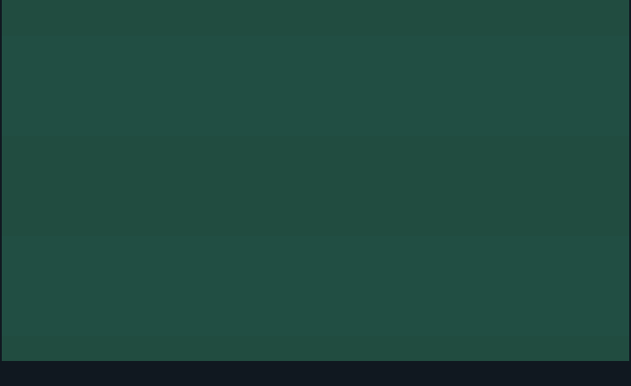

# Entwicklungsdokumentation

## Inhalt

- [3D-Darstellung echter Vereinswelt-Partien](3d-spieldarstellung.md): veröffentlichte getrennte Vorschau mit Anbindung an die bestehende Match-Engine, gemeinsame Steuerung, Offline-Build und Reichweite der Abnahme.
- [3D-Spielermodelle – Umsetzung 105](3d-spielermodelle.md): natürlichere Sportspielfiguren, gespeichertes Aussehen, mobile Geometriebudgets und Live-Abnahme; echte Mobil-Leistungsmessung und subjektive Nutzerfreigabe stehen noch aus.
- [Detailliertere 3D-Spieleranimationen – Umsetzung 102–105](3d-spieleranimationen-plan.md): flüssiges Laufen, Gelenkmodell, Pass-, Schuss- und Kopfballbewegungen mit Ballkontakt; die Modellqualität hat vor weiteren Zweikampf- und Grätschenanimationen Vorrang.

- [3D-Kameraprototyp im Querformat](kameraprototyp-3d.md): eigenständige lokale TV-Kamera mit synthetischem Spielablauf, SuperCollider-Sounds und vollständig eingebetteter Offline-Datei.

- [Sponsoren – sechs nationale Kataloge](sponsoren-entwuerfe/README.md): 36 eigene Namen und SVG-Logos, kompakte Bildzeichen und interaktive Angebotskarten mit Länderwechsel und Werbebandenvorschau.

- [Vereinswappen – 48 neue Entwürfe](wappen-entwuerfe/README.md): sechs Ländertafeln mit unterschiedlichen Bildzeichen, Formen und Schriftstilen; Gestaltungsvorschläge vor der technischen Übernahme.

- [Spielstart, Accounts, Spielstände, Hall of Fame und App-Stores – Plan](speicherstaende-hall-of-fame-store-plan.md): Startablauf und Parametermatrix, Karriereverwaltung, Accountwiederherstellung, Serverkarrieren, Gerätewechsel, offene Entscheidungen und Abnahme; [offizielle Rechts- und Storequellen](speicherung-store-recherche.md).

- [Spielerreferenz 92](spieler-referenz-v92.md): neues Referenzpaar, Farbprüfung, Bildherkunft und offene visuelle Abnahme vor dem Ausbau des Pools.
- [Produktregeln](product.md): feste Entscheidungen zu Spiel, Karriere, Oberfläche und Pokal.
- [Toranimationen, Spieler-Sprites und Trikots – Plan](toranimationen-spielersprites-plan.md): abgestimmte Regeln, Umsetzungsschritte und Abnahme für die Vereinswelt.
- [Vereinstrikots – Vorschau](vereinstrikots-vorschau.html): Heim-, Auswärts- und Torwarttrikots aller 48 Vereine als kleine Datenvorschau.
- [Spielerfrisuren – visuelle Beispiele](spielerfrisuren-beispiele.md): zehn Frisuren, frontale Profilansichten und vier Jubelposen als Sprite-Vorlagen.
- [Spieler-Sprites – Laufzeitvorschau](spieler-sprites-vorschau.html): gerenderte Profil- und Jubelansichten aus gespeicherten Merkmalen und Trikots.
- [Spieler-Sprites – drei Beispiele](spieler-sprites-beispiele.svg): Profil und Jubelansicht von drei Spielern in Spielgröße.
- [Vier hochwertige Spielerbildpaare](../dist/player-pair-preview.html): frontales Profil und feste Jubelpose je Motiv mit aktuellen Trikot-, Haut- und Haarfarben; [alle vier Ansichten](spieler-bildpaar-v87.png) sowie Bannerbeispiele für [Arme weit](spieler-bildpaar-banner-b-mobil-v87.png), [Faust vor der Brust](spieler-bildpaar-banner-c-mobil-v87.png) und [zwei Zeigefinger](spieler-bildpaar-banner-d-mobil-v87.png) sind ohne lokalen Server sichtbar.
- [Erweiterter Spieler-Bildpool](../dist/player-pool-preview-v88.html): acht Bildpaare, je zwei Gesichter für vier Jubelposen, in Profil- und Bannergröße; [Standbild](spieler-bildpool-v88.png).
- [Spieler-Bildpool mit 16 Paaren](../dist/player-pool-preview-v89.html): acht weitere Frisur- und Jubel-Kombinationen mit zwei Trikot- und Farbvarianten; [vollständiges Standbild](spieler-bildpool-v89.png) und [neues mobiles Torbanner](spieler-bildpaar-banner-e-mobil-v89.png).
- [Jugendspieler-Demo](../dist/player-creation-demo-v90.html): Verein wählen und per Knopfdruck echte Jugendspieler mit Profil- und Jubelbild ohne gezeichnete Nummer erzeugen; eigenständige HTML-Datei ohne Server. [Mobiles Beispiel](spieler-erstellung-faust-brust-v91.png).
- [Farbmaskenprüfung](../dist/player-mask-variants-v87.html): vier Bildpaare mit hellem, dunklem und rotem Trikot sowie verschiedenen Haut-, Haar- und Nummernwerten; [Standbild aller zwölf Varianten](spieler-masken-varianten-v87.png).
- [Torbanner – Laufzeitvorschau](../dist/goal-banner-preview.html): aktueller Banner mit „Faust vor der Brust“, Vereinswappen und fünf Ligatoren; [animiertes Beispiel](torbanner-animation-faust-brust-v91.gif), [Ansicht bei 320 Pixeln](torbanner-faust-brust-schmal-v91.png), [mobile Ansicht](torbanner-faust-brust-mobil-v91.png) und [breite Ansicht](torbanner-faust-brust-breit-v91.png) sind ohne lokalen Server sichtbar.

- [Trophäen-Sprites der Vereinswelt](trophy-sprites-plan.md): Länder- und Awardmotive, Flaggen und Grafikdateien.
- [Nationalitäten und Herkunft – Plan](nationalitaeten-plan.md): Länderpool und Generierung von Spielerherkunft, Namen und Flaggen.
- [KI-Vereine und Trainer – Entwurf](ki-vereine-trainer-entwurf.md): Plan für Computervereine, Trainerkarrieren und taktische Entscheidungen.
- [Vereinsmodell – Entwurf](vereinsmodell-entwurf.md): Identität, 36 unterschiedliche Startprofile, langsame Entwicklung und Balance der fiktiven Vereine.
- [Vereinskatalog – Entwurf](vereinskatalog-entwurf.md): 48 redaktionell festgelegte fiktive Namen, Farben und eigenständige Hintergründe für Liga- und Pokalvereine.
- [Spielerverträge – Entwurf](spielervertraege-entwurf.md): befristete Profiverträge, Gehalt, Ablauf und Marktfolgen im neuen Modell.
- [Welt-KI – Umsetzungsreferenz](ki-umsetzung.md): Datenmodell, Module, Ereignisfolge und Prüfschritte der neuen Vereinswelt.
- [Abnahme der neuen Vereinswelt](abnahme-welt-v69.md): Zehn-Saisons-Messung, Browserdurchgang und Freigabekriterien.
- [Entwicklung und Veröffentlichung](development.md): Quellstand, Tests, Build und Deployment.
- [Änderungsprotokoll](CHANGELOG.md): abgeschlossene Änderungen und neue Features.

## Änderungen dokumentieren

Abgeschlossene Änderungen und neue Features stehen in [CHANGELOG.md](CHANGELOG.md). Neue Einträge kommen oben unter „Noch nicht veröffentlicht“ hinzu. Bei einer Veröffentlichung werden die betreffenden Einträge unter eine Überschrift mit Datum verschoben.

Beschreibe pro Änderung kurz das sichtbare Verhalten, den Grund und bei Bedarf Auswirkungen auf bestehende Spielstände. Nenne relevante Tests oder manuelle Prüfungen. Halte Einträge für Spieler und Entwickler verständlich; Dateilisten allein erklären eine Änderung nicht.

Vorhandene, noch unfertige Änderungen im Arbeitsverzeichnis werden erst nach ihrer Fertigstellung dokumentiert.
