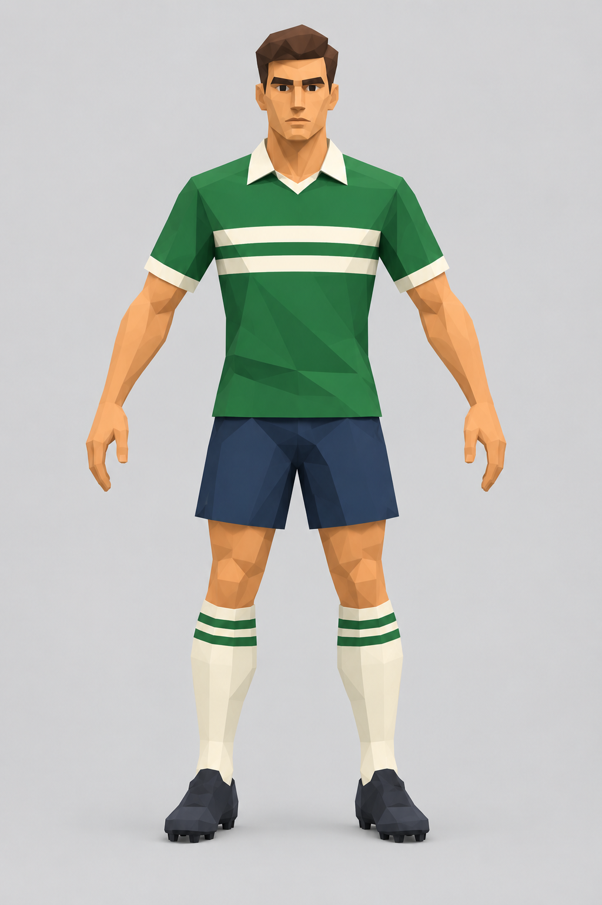
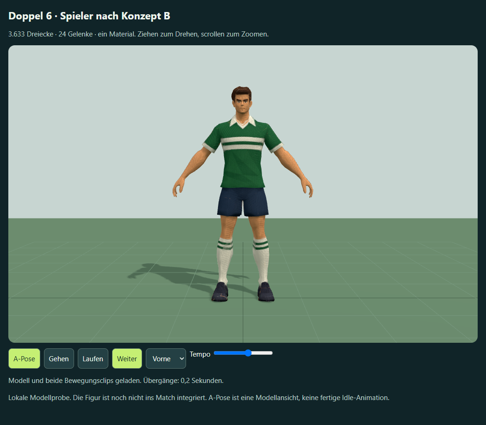
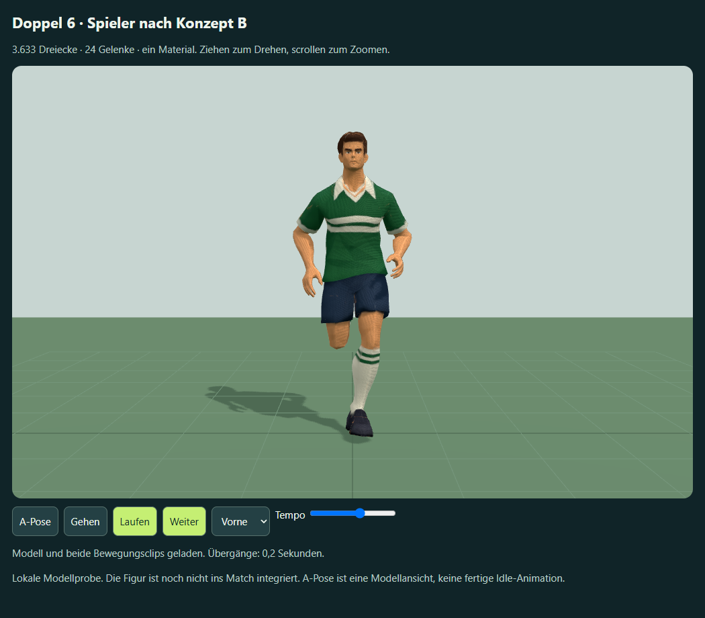
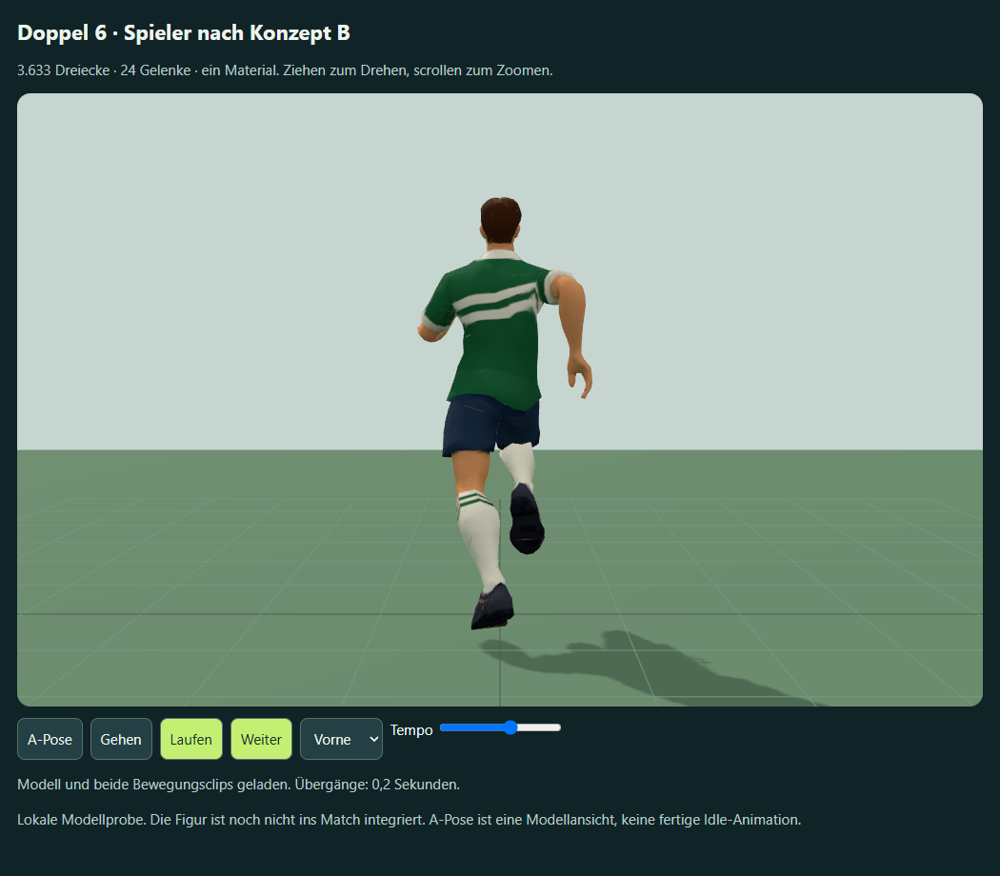

# Meshy-Spieler aus dem ursprünglichen Konzept B

**Aktuelle Modell- und Matchprobe:** [Fassung 6 mit korrigiertem Rumpf, beiden Mannschaften und ruhigeren Bewegungen](squad-torso-v6.md). Die [Ellenbogen aus Fassung 5](shirt-elbows-match-v5.md), [Fußballschuhe aus Fassung 4](football-boots-v4.md) und [Kopf-/Halskorrektur aus Fassung 3](head-neck-v3.md) bleiben Grundlage. Die Rückmeldung zu Fassung 3 war „Sieht besser aus“. Fassung 2 wurde hinsichtlich Kopf, Hals und Verhältnis zum Oberkörper als unpassend beurteilt. Die nachfolgende Beschreibung und Bilder halten die erste Figur als Vergleich fest.

Stand: 2. Oktober 2026. Auf Nutzerwunsch zurück zur ursprünglichen [Stilzeichnung B](../3d-stilreferenz-b.png), ohne die inzwischen verworfenen Blender-Figuren als Körperbasis. Mit dem eingebauten Imagegen-Werkzeug wurde eine einzelne frontale A-Pose abgeleitet. Vollständiger Prompt und Herkunft: [reference-prompt.json](reference-prompt.json).



Die Vorlage wurde mit Meshy CLI 0.4.0 als texturiertes Smart-Topology-Modell erzeugt und anschließend geriggt. Keine zusätzliche Remesh-, Retexture- oder kostenpflichtige Animationsaufgabe: Geh- und Laufclip stammen aus dem Rigging-Ergebnis. Weitere Posen und Referenzbilder sind vom Nutzer erlaubt, wurden in dieser Runde aber nicht benötigt.

## Ergebnis und tatsächliche Kosten

| Stufe | Ressource | Task-ID | Credits |
| --- | --- | --- | --- |
| Bild zu Modell, 2K-Farbtextur | image-to-3d | 01a0fc2e-3efb-7117-b622-4ec8adeb2c9b | 15 |
| Rig, Gehen, Laufen | rigging | 01a0fc30-ae91-7524-a424-45790a037d7b | 5 |

Beide Tasks melden SUCCEEDED und ihre Gebühren über `consumed_credits`: zusammen **20 Credits**. Der neue Weg ist nicht kostenlos. Der KI-Tokencounter bestätigt keine Meshy-Freiversuche; Kontoguthaben und Taskabrechnung sind getrennte Nachweise.

Projektordner:
`F:\Neuer Ordner (2)\ChatGPT\Fussballmanager\meshy_output\20261002_123516_doppel-6-concept-b-soccer-play_01a0fc2e`

Darin liegen `soccer-b.glb`, `rigged.glb`, `walking.glb`, `running.glb`, Meshy-Projektmetadaten, Task-Snapshots, heruntergeladene Vorschau und lokale GLB-Prüfungen. Arbeitsmarker `meshy_output/soccer-b-{geometry,rigging}.json` sichern die Operation und Task-ID. Der Ordner bleibt lokal und wird nicht mit Zugangsdaten oder temporären Asset-URLs veröffentlicht.

Die tatsächlichen GLBs besitzen jeweils **3.633 Dreiecke**, 3.192 Vertices, ein Mesh, ein Material und eine eingebettete Farbtextur. 3.500 war der angefragte Zielwert, keine exakte Obergrenze. Das Rig hat 24 Gelenke und 1,8 m Körperhöhe. Gehclip: 1,0667 s; Laufclip: 0,6667 s. Der sehr kurze Basisclip des Rigs ist eine A-Pose, keine entwickelte Idle-Animation.

## Lokale Browserprobe und Prüfung

`outputs/meshy-player-b-preview.html` enthält Three.js r160, GLTFLoader, OrbitControls, die drei geriggten GLBs und die MIT-Lizenz vollständig eingebettet. Kein Server und keine Meshy-Anfrage beim Abspielen. Gehen/Laufen/A-Pose, 0,2-s-Überblendung, Pause, Tempo, Drehen und Vorder-/Seiten-/Rückenansicht sind verfügbar. Horizontale Hüftverschiebung der Clips ist für die Probe festgehalten; das Original bleibt unverändert.





`work/inspect-meshy-glb.cjs` liest tatsächliche GLB-Accessor-Zahlen, Skins und Clips. Der Meshy-Snapshot enthält keine Face-Zahl; die erforderliche Rigging-Geometrieprüfung wurde deshalb am heruntergeladenen GLB vorgenommen. Nicht aus dem Vorschaubild geschätzt.

`work/check-meshy-player-preview.cjs` prüft den echten GLTF-Import in Edge/Three.js: 99 Posen über die drei Clips mit allen 3.192 verformten Vertices, endliche Positionen, 24 Gelenke, normalisierte Gewichte (maximale Summenabweichung 3,73e-8), offline ohne Netzanforderung, Moduswechsel, Pause/Weiter und Ansichtswahl. Bei 390 px entsteht kein horizontaler Überlauf. [Messwerte](browser-qa.json). Sichtprüfung der Vorder-, Geh-, Lauf- und Rückenbilder erfolgt. Ein Pause-Knopf-Zustandsfehler in der Probe wurde korrigiert und der Durchlauf wiederholt.

Die abgetastete gesamte Mesh-Unterkante liegt beim Gehen mindestens 1,56 cm, beim Laufen mindestens 1,29 cm über dem Boden. Diese Größe ist kein Standfußnachweis; Bodenbezug und Fußgleiten müssen beim Match-Adapter mit den tatsächlichen Fußgelenken abgestimmt werden. Kontinuierliche subjektive Abnahme und Leistung auf einem realen Mobilgerät bleiben offen.

Neu bauen und prüfen (kompatibles Node verwenden):

```powershell
node work/generate-meshy-player-preview.cjs
node work/check-meshy-player-preview.cjs
```

Der Generator benötigt die erhaltenen Meshy-GLBs und die lokalen Three.js-r160-Quellen in `outputs/meshy-viewer-vendor/`, geladen aus dem offiziellen `three@0.160.0`-Paket auf unpkg. Die fertige Einzeldatei enthält diese Abhängigkeiten bereits.

## Offene Spielintegration

Dies ist eine Modell- und Clipprobe, keine veröffentlichte Matchversion. Neue GLB-Figur und Mixer sind noch nicht an die prozeduralen Pass-, Schuss-, Kopfball-, Einwurf- und Torwartposen angeschlossen. Auch Vereinsfarben und gespeicherte Haut-/Haaridentitäten müssen auf das Texturmodell übertragen werden. Die Engine muss weiterhin Position, Ballkontakt und Aktionstiming bestimmen; Clips dürfen keine Eingabesperre oder spielverändernde Root-Motion erhalten. Die bestehenden Taktiken, Banner und Spielstände sind nicht verändert.
