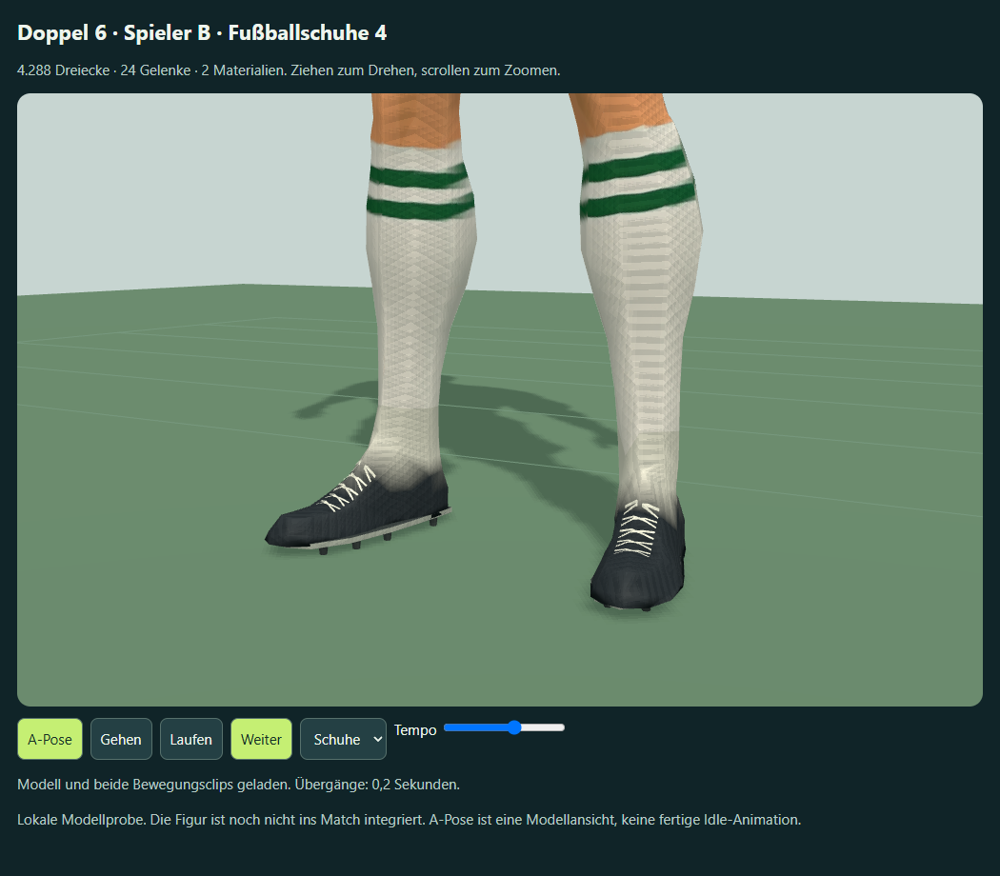
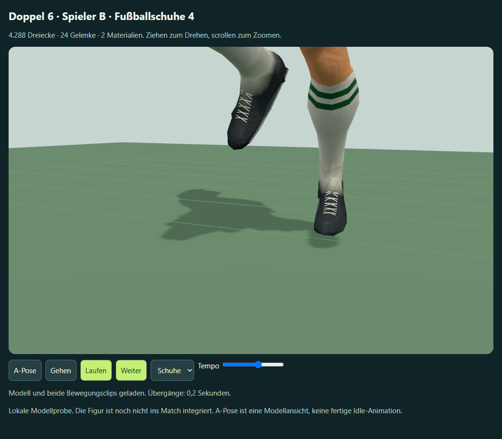

# Spieler B – Fußballschuhe, Fassung 4

2. Oktober 2026. Nach der positiven Rückmeldung zur Kopf-/Halskorrektur wurden auf Nutzerwunsch zuerst die Schuhe weiterbearbeitet. Lokale Blender-Ableitung aus Fassung 3, ohne neue Meshy-Aufgabe: **0 zusätzliche Credits**.




Schlankere Zehenpartie und abgesenkter Schaft ersetzen die klobige Schuhwirkung. Die unteren Knöchelflächen gehen farblich in die Stutzen über. Eine dünne Sohlenplatte, acht sechseckige Stollen und fünf geometrische Kreuzschnürungen pro Fuß ergänzen die Silhouette. Die Schnürungen folgen in Teilstücken der tatsächlichen Schuhoberfläche, damit sie nicht im Obermaterial verschwinden. Das bisherige Körpermodell, Rig und beide Bewegungsclips bleiben Grundlage.

`work/refine-meshy-football-boots.py` bearbeitet die drei GLBs in einem getrennten Blender-Hintergrundprozess. Neue Details erhalten über die nächsten Körperdreiecke interpolierte und normalisierte Hautgewichte. Ein Blender-Mesh wird mit zwei Materialien exportiert; Three.js importiert die beiden Materialprimitive als zwei SkinnedMeshes. Zusammen **4.288 Dreiecke**, 24 Gelenke und die vorhandene eingebettete Körpertextur. Fassung 3 hatte 3.832 Dreiecke. Gehclip 1,0667 s, Laufclip 0,6667 s.

Die eigenständige Offline-Datei `outputs/meshy-player-b-preview-v4.html` enthält die Modelle und Bibliotheken. Die Ansichtsauswahl besitzt zusätzlich **Schuhe**. Stand- und Lauf-Nahansichten sowie die Figur von vorne, seitlich und hinten wurden betrachtet. Die Browserprüfung besteht mit 99 Posen über sämtliche Vertices beider SkinnedMeshes, endlichen Positionen, maximaler Gewichtssummenabweichung 4,57e-8, offline ohne Netzanforderungen, Clipwahl, Pause/Weiter und ohne horizontalen Überlauf bei 390 px. [Messwerte](browser-qa-v4.json).

Die Prüfung gilt für die Modellprobe. Match-Integration, präziser Standfuß-/Ballkontakt und Leistung auf echten Mobilgeräten stehen weiterhin aus.

Abgeleitete Dateien:
`F:\Neuer Ordner (2)\ChatGPT\Fussballmanager\meshy_output\20261002_190848_doppel-6-soccer-b-proportions_01a0fd96\football-boots-v4`

Enthalten sind `rigged.glb`, `walking.glb`, `running.glb`, `Meshy-B-Fussballschuhe-v4.blend` und `refinement.json`. Ältere Modellfassungen bleiben erhalten. Der Marker `meshy_output/soccer-b-football-boots-v4.json` nennt Quelle und Ziel. Ursprünglicher Meshy-Rigging-Task: `01a0fd98-e202-72a6-b832-3681cb2e6a59`; die lokale Ableitung hat keine neue Task-ID.

```powershell
node work/generate-meshy-player-preview.cjs meshy_output/soccer-b-football-boots-v4.json outputs/meshy-player-b-preview-v4.html "Spieler B · Fußballschuhe 4"
node work/check-meshy-player-preview.cjs outputs/meshy-player-b-preview-v4.html outputs/meshy-b-v4 2
```
