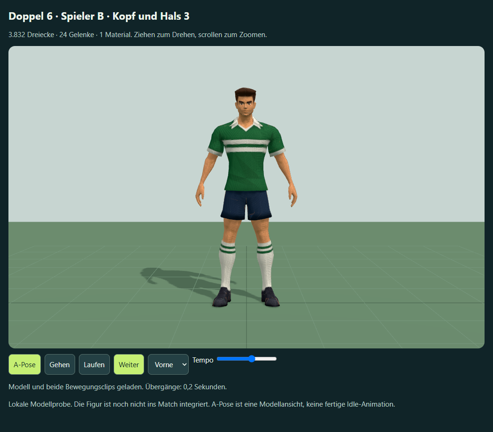
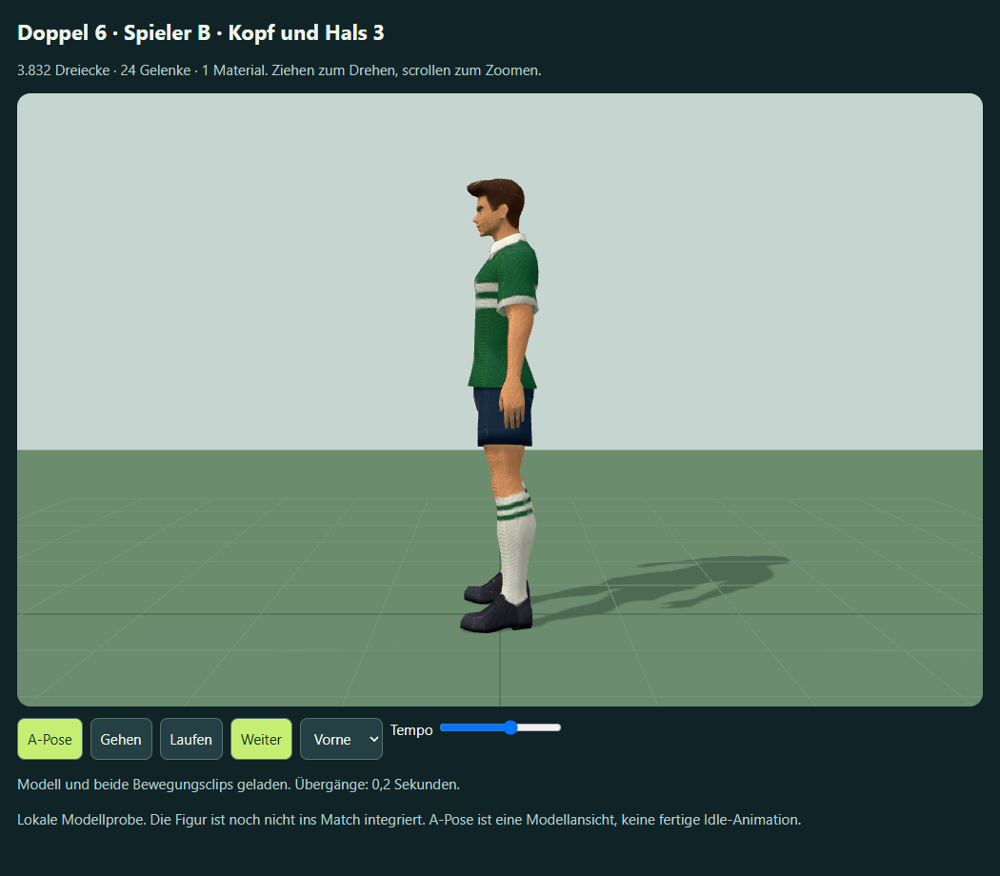
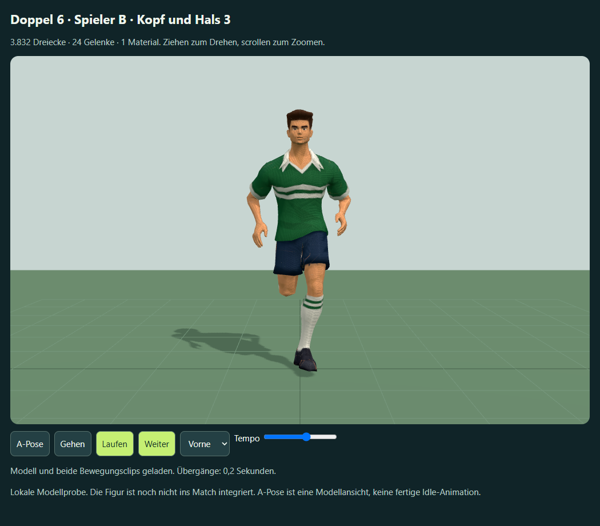

# Spieler B – Kopf und Hals, Fassung 3

2. Oktober 2026. Auf die Rückmeldung „Proportionen passen nicht“ wurde zuerst die Richtung eingegrenzt: „Kopf, Hals und Verhältnis zum Oberkörper“. Die vorhandene geriggte zweite Figur wurde lokal in Blender 5.2.2 weiterbearbeitet, ohne Bild- oder Meshy-Neugenerierung. Keine zusätzlichen Meshy-Credits; bisherige Task-Abrechnung bleibt insgesamt 70.





Der Kopf wird um seine vorhandene Gelenkbasis breiter und höher, anschließend 2,4 cm abgesenkt. Halsquerschnitt und Übergang werden verbreitert, die Halsgeometrie zwischen Basis und Kopfgelenk verkürzt. Mesh und Kopf-/Hilfsgelenke sind gemeinsam angepasst; die bisherigen Ruheachsen bleiben erhalten, sodass vorhandene Drehungen weiterhin funktionieren. Die Gesamthöhe bleibt rund 1,8 m. Schultern und Arme der vorherigen Korrektur bleiben Grundlage.

| Gemessener Vergleichswert | Fassung 2 | Fassung 3 |
| --- | --- | --- |
| Kopfbreite | 15,24 cm | 17,68 cm |
| Kopfhöhe | 24,21 cm | 26,32 cm |
| Abstand Hals- zu Kopfgelenk | 7,32 cm | 4,92 cm |

Kopfmaße sind die Achsengrenzen von 953 tatsächlich verformten Vertices mit mindestens 50 % Kopfgewicht in der A-Pose. Der Gelenkabstand ist kein Maß der sichtbaren freien Hautfläche. [Browsermesswerte](browser-qa-v3.json).

`work/refine-meshy-head-neck.py` erzeugt abgeleitete GLBs und eine native Blender-Datei in einem isolierten Hintergrundprozess; die offene Blender-Szene wird nicht geändert. 3.832 Dreiecke, ein Mesh, ein Material und 24 Gelenke bleiben erhalten. Gehclip 1,0667 s und Laufclip 0,6667 s behalten ihre Dauer. Native Achsen, UVs, Material und Gewichte bleiben Grundlage; Quellen und ältere Proben werden nicht überschrieben.

`work/check-meshy-player-preview.cjs` prüft 99 Posen mit sämtlichen verformten Vertices: endliche Positionen, Gewichtssummen (maximale Abweichung 3,98e-8), offline ohne Netzanforderungen, Moduswahl, Pause/Weiter, Blickwinkel und 390-px-Layout bestehen. Vorder-, Seiten-, Lauf- und Rückenbilder wurden betrachtet. Diese Prüfung bestätigt die technische Ableitung; künstlerische Nutzerabnahme, Match-Integration, präziser Fußkontakt und Leistung auf realen Mobilgeräten bleiben offen.

Aktuelle eingebettete Probe: `outputs/meshy-player-b-preview-v3.html`. Neue Ableitungen liegen unter:
`F:\Neuer Ordner (2)\ChatGPT\Fussballmanager\meshy_output\20261002_190848_doppel-6-soccer-b-proportions_01a0fd96\head-neck-refined-v3`

Dateien: `rigged.glb`, `walking.glb`, `running.glb`, `Meshy-B-Kopf-Hals-v3.blend`, `refinement.json`. Der lokale Marker `meshy_output/soccer-b-head-neck-v3.json` sichert Quelle und Ziel. Produzierender ursprünglicher Rigging-Task bleibt `01a0fd98-e202-72a6-b832-3681cb2e6a59` in Ressource `rigging`; diese lokale Bearbeitung hat keine neue Meshy-Task-ID.

Probe neu bauen und prüfen:

```powershell
node work/generate-meshy-player-preview.cjs meshy_output/soccer-b-head-neck-v3.json outputs/meshy-player-b-preview-v3.html "Spieler B · Kopf und Hals 3"
node work/check-meshy-player-preview.cjs outputs/meshy-player-b-preview-v3.html outputs/meshy-b-v3
```
