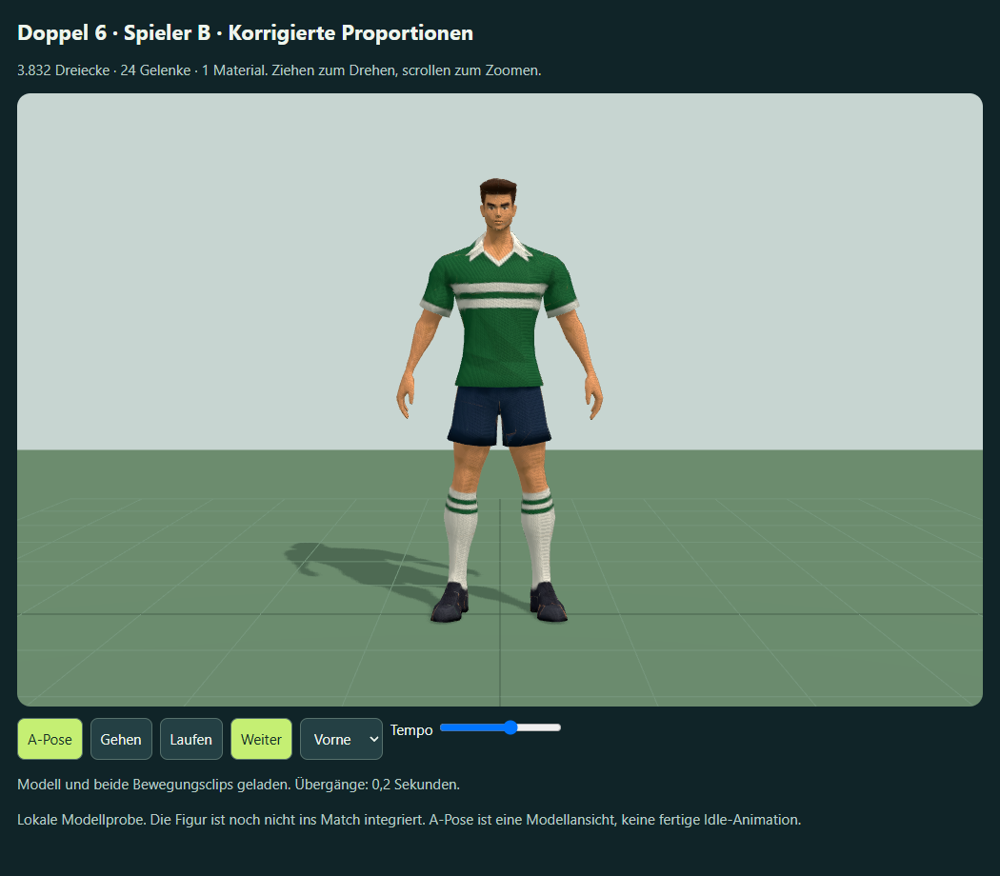
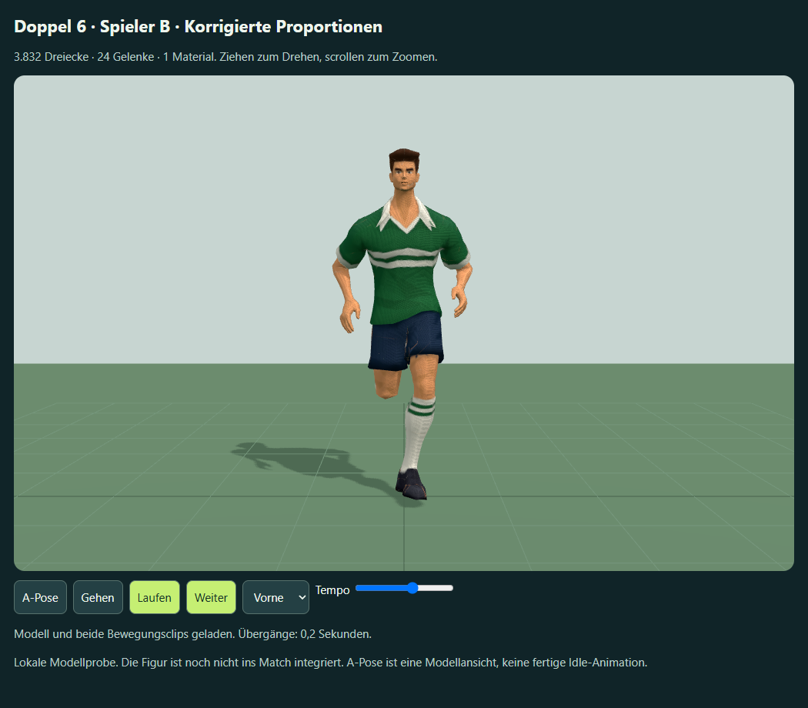

# Spieler B – Proportionskorrektur 2

Die nutzende Person hat die Proportionen dieser Fassung weiterhin als unpassend beurteilt und Kopf, Hals und Verhältnis zum Oberkörper als Hauptproblem benannt. Die darauf aufbauende lokale [Fassung 3](head-neck-v3.md) hält diese Korrektur getrennt fest. Die technische Prüfung dieser Fassung belegt keine Stilfreigabe.

2. Oktober 2026. Auf Rückmeldung „mehr Schulter, weniger Unterarme“ wurde die vorhandene A-Pose mit dem eingebauten Imagegen-Werkzeug gezielt überarbeitet. [Vollständiger Bearbeitungsprompt](reference-prompt-v2.json), [neue Bildvorlage](reference-a-pose-v2.png). Meshy Smart Topology und Rigging erzeugten eine zweite Figur; deren Schultergelenke waren zunächst nur etwa 1 % weiter auseinander. Die konkreten Proportionen wurden anschließend lokal in Blender 5.2.2 verfeinert, ohne weitere Meshy-Aufgaben.




## Tatsächliche Maße und Prüfung

| Merkmal | Erste Figur | Korrigierte zweite Figur |
| --- | --- | --- |
| Abstand der Oberarmgelenke | 39,22 cm | 44,61 cm (+13,7 %) |
| Unterarmlänge, Gelenk zu Handgelenk | 25,29 cm | 22,88 cm (−9,5 %) |
| Durchmessermaß in der Unterarmmitte | 8,80 cm | 7,53 cm (−14,4 %) |

Das Durchmessermaß ist zweimal das 90. Perzentil des Vertexabstands zur Knochenachse im mittleren Bereich, mit mindestens 50 % Unterarmgewicht (15 Vertices je Probe). Es ist ein reproduzierbarer Vergleichswert, kein anatomischer Umfang. Bild und Gelenkmaße sind gemeinsam geprüft. Die ursprüngliche Gesamtgröße von 1,8 m bleibt erhalten.

Die lokale Bearbeitung verschiebt die Schulter-/Armketten und ihre gewichteten Meshbereiche um 2,5 cm je Seite, verstärkt die Oberarmquerschnitte maßvoll und reduziert Unterarmquerschnitt/-länge. Mesh, Ruhe-Rig und Handpositionen wurden gemeinsam angepasst. UVs, Material, Gewichte und Gelenknamen bleiben Grundlage. 30-Hz-Zeitstempel nahe ganzzahligen Frames wurden vor Export gerundet, damit Blender das letzte Gehbild nicht abschneidet. Gehclip 1,0667 s und Laufclip 0,6667 s bleiben erhalten.

Ergebnis: 3.832 Dreiecke, ein Mesh, ein Material, 24 Gelenke. `work/refine-meshy-proportions.py` läuft ausschließlich in einem separaten Blender-Hintergrundprozess; die offene Arbeitsszene bleibt erhalten. Lokale Benutzerressourcen sind unter `outputs/blender-meshy-user/` isoliert. [Browserprüfung](browser-qa-v2.json): 99 Posen mit allen verformten Vertices, endliche Positionen, Gewichtssumme mit maximal 4,66e-8 Abweichung, Offline-Import, Gehen/Laufen, Pause, Ansichtswahl und 390-px-Layout bestanden. Vorder-, Seiten-, Lauf- und Rückenbilder wurden betrachtet. Keine bestätigte Stilabnahme, Match-Integration oder reale Mobil-Leistungsmessung.

## Dateien und Abrechnung

Aktuelle vollständig eingebettete Probe: `outputs/meshy-player-b-preview-v2.html`. Die erste Probe und die zweite rohe Meshy-Probe bleiben separat erhalten. Neu bauen:

```powershell
node work/generate-meshy-player-preview.cjs meshy_output/soccer-b-proportions-v2.json outputs/meshy-player-b-preview-v2.html "Spieler B · Korrigierte Proportionen"
node work/check-meshy-player-preview.cjs outputs/meshy-player-b-preview-v2.html outputs/meshy-b-refined-v2
```

| Stufe | Ressource / Task-ID | Tatsächliche Credits |
| --- | --- | --- |
| Texturiertes Modell | image-to-3d / 01a0fd96-70c3-71ea-9419-0ec4eee6769b | 15 |
| Rig und enthaltene Geh-/Laufclips | rigging / 01a0fd98-e202-72a6-b832-3681cb2e6a59 | 5 |
| Lokale Blender-Korrektur | kein Meshy-Task | 0 |

**Weitere 20 Credits**, laut `consumed_credits`; über alle bisherigen Versuche insgesamt 70. Kein bezahlter Remesh oder zusätzlicher Animationsclip.

Meshy-Projekt mit unveränderten Originalen und Task-Snapshots:
`F:\Neuer Ordner (2)\ChatGPT\Fussballmanager\meshy_output\20261002_190848_doppel-6-soccer-b-proportions_01a0fd96`

Die korrigierten Dateien liegen im Unterordner `proportions-refined/`: `rigged.glb`, `walking.glb`, `running.glb`, `Meshy-B-Proportionen-v2.blend` und `refinement.json`. Der lokale Ableitungsmarker `meshy_output/soccer-b-proportions-v2.json` verweist auf das ursprüngliche Rigging und den Ergebnisordner. Originaldateien werden nicht überschrieben.
