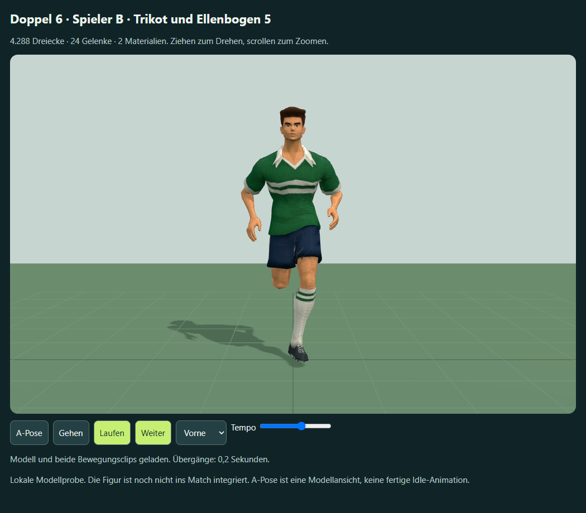
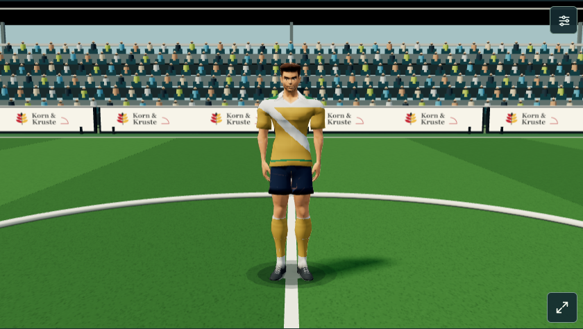

# Spieler B – Trikot, Ellenbogen und lokale Matchprobe

2. Oktober 2026. Auf Nutzerwunsch wurden zuerst Ellenbogen und der Trikotsitz am Bauch angepasst; danach folgt die vereinbarte Integration **eines Testspielers** in die echte Vereinswelt-Partie. Keine neue Meshy-Aufgabe: **0 zusätzliche Credits**.




## Modellkorrektur

`work/refine-meshy-shirt-elbows.py` erzeugt aus der Schuhfassung 4 neue GLBs. 65 Bauch-/Trikotvertices werden lokal mit weichem Höhenverlauf verschmälert und in der Tiefe enger geführt. Ein Teil der Hüftgewichte des Trikots geht zum unteren Wirbelsäulengelenk, um den Saum weniger stark mit der Hüfte auszubeulen. 65 Ellenbogenvertices erhalten eine kleinere radiale Korrektur und einen kontinuierlichen Übergang zwischen Oberarm- und Unterarmgewicht. Gelenkpositionen, Kopf-/Schulterproportionen, Schuhe und Clipzeiten bleiben Grundlage.

Jedes exportierte GLB enthält weiterhin **4.288 Dreiecke**, zwei Materialien und 24 Rig-Gelenke. Gehclip 1,0667 s; Laufclip 0,6667 s. Die drei Modelle und `refinement.json` liegen unter:
`F:\Neuer Ordner (2)\ChatGPT\Fussballmanager\meshy_output\20261002_190848_doppel-6-soccer-b-proportions_01a0fd96\shirt-elbows-v5`

Native Projektdatei gemäß Projektregel:
`G:\Blenderassets\FM\Meshy-B-Matchprobe-v5\Meshy-B-Trikot-Ellenbogen-v5.blend`

Der lokale Marker `meshy_output/soccer-b-shirt-elbows-v5.json` verweist auf den ursprünglichen Rigging-Task `01a0fd98-e202-72a6-b832-3681cb2e6a59` und die Ableitung. Keine neue Task-ID oder API-Abrechnung.

## Anschluss an die Partie

`dist/player-meshy-v106.js` bindet das importierte Skin an die vorhandenen Körper-, Knie-, Fuß-, Ellenbogen- und Halsgruppen. Diese Gruppen treiben auch weiterhin die übrigen Figuren. Gelenklängen und Fußhöhe stammen vom tatsächlichen importierten Rig. Die kalibrierte Kopfballreichweite wird nur für diese Figur verwendet. Der Renderer bewegt keine Engine-Spieler, wartet auf keinen Clip und verzögert keine Befehle.

Im Match verwendet der Testspieler die bestehenden prozeduralen Idle-/Walk-/Run-Gewichte, Richtungsdämpfung, Aushol-, Kontakt- und Ausschwingphasen. Die Meshy-Geh-/Laufclips bleiben in der getrennten Modellprobe erhalten; sie übernehmen keine spielverändernde Root-Motion. Pass, Schuss, Kopfball und Volley werden an die bestehenden Aktionsereignisse angeschlossen. Die Matchtrikotfarben einschließlich Akzentfarbe sowie die vorhandenen sechs Musterpfade werden auf der Kleidung dargestellt. Das goldene Diagonaltrikot wurde in der Nahansicht betrachtet.

Die übrigen Figuren, Torhüter und Schiedsrichter bleiben die bisherigen Modelle. Die Testfigur hat weiterhin das Gesicht und die Frisur von Modell B; vollständige individuelle Meshy-Spieleridentitäten und eine Übernahme des gesamten Kaders sind kein Bestandteil dieses Blocks.

`outputs/meshy-match-preview.html` ist eine eingebettete Offline-Datei mit GLTFLoader, Three.js und Modell. Sie startet direkt mit einer echten Testpartie und ersetzt einen Feldspieler. Die Speicherkennungen `sechser.world.meshy-trial-v5` und `doppel6-world-meshy-trial-v5` trennen die Probe von bestehenden Vereinswelten. Der Testspeicher verwendet eine feste eigene Karriere-ID. `?qa=1` lässt für automatisierte Prüfungen den Test-Fixture-Aufbau dem jeweiligen Harness; das Modell wird trotzdem geladen. Die normale Spiel-/Live-Seite lädt den Adapter noch nicht. `v106` im Dateinamen bezeichnet keine veröffentlichte Version.

## Prüfung und Grenzen

- Modellprobe: 99 verformte Posen, beide SkinnedMeshes, 24 Gelenke, endliche Positionen und normalisierte Gewichte (maximale Summenabweichung 3,94e-8); Offline-Nutzung und 390-px-Layout bestanden. [Messwerte](browser-qa-v5.json).
- Native Blender-Datei auf G: erneut geöffnet; 24 Knochen, ein tatsächliches Skin-Mesh mit zwei Materialien, endliche Geometrie und normalisierte Gewichte geprüft. Die importierte Knochenanzeige mit eigener ungewichteter Icosphere gehört nicht zum Figuren-Skin. `work/check-meshy-native.py` prüft gezielt die Meshes mit Armature-Modifikator. Der GLTFLoader teilt die zwei Materialprimitive in zwei SkinnedMeshes auf.
- Matchprobe: acht Bewegungs-/Aktionszustände und 172 zusätzliche Posen über Laufzyklen sowie Kontakt/Ausschwingen. Die unterste Mesh-Position beim Gehen/Laufen beträgt mindestens 0,088 m bei 0,09 m Rasenoberkante. Kopfball-Surface-Abstand bei der Kontaktpose 0,266 m zum Ballzentrum (Ballradius 0,28 m). Dies ist eine visuelle Kalibrierung, keine neue Kollisionsregel. [Messwerte](match-qa-v5.json).
- Pass, Schuss und Kopfball wurden zusätzlich über die echten Engine-Aktionsfunktionen ausgelöst und beim importierten Spieler erkannt. Die automatische Partie, Querformat am Desktop und bei 844 × 390 px sowie Entsorgung und erneuter Modellaufbau wurden geprüft. Keine Browserfehler.
- Eine vollständige reproduzierbare Partie verläuft mit und ohne 3D identisch hinsichtlich Verlauf, Toren, Wechseln, Statistiken und gebuchtem Ergebnis. Für diesen Vergleich überspringt der Harness Wiederholungen in beiden Läufen, damit zusätzliche Darstellungswartezeiten nicht als Gameplay-Abweichung gezählt werden. Wiederholungsaufzeichnung, Berechnungsstillstand, Pause, Überspringen und Elfmeterwiederholung wurden separat mit dem vorhandenen Replay-Test geprüft.
- Bestehende Taktik-/Wechselwege, Torbannerverzögerung, Standards, Abseits, Halbzeit-/Abpfiffhinweise, Hochformat, Kontextverlust, Verlassen und Offline-Build bestehen in der Browserregression. Bewegungs-, Kontakt-, Interpolations- und Projektionsprüfungen bestehen zusätzlich.

Standbilder und numerische Verformungsprüfungen belegen die lokale Umsetzung. Fortlaufende subjektive Nutzerabnahme und Leistung auf einem echten Mobilgerät stehen aus. Keine Veröffentlichung und keine Änderung bestehender Karriereberechnungen; Soundgenerierung bleibt ausgelassen.

```powershell
node work/build.cjs
node work/generate-meshy-match-preview.cjs
node work/check-meshy-match-preview.cjs
node work/check-meshy-match-regression.cjs
node work/generate-meshy-player-preview.cjs meshy_output/soccer-b-shirt-elbows-v5.json outputs/meshy-player-b-preview-v5.html "Spieler B · Trikot und Ellenbogen 5"
node work/check-meshy-player-preview.cjs outputs/meshy-player-b-preview-v5.html outputs/meshy-b-v5 2
```
