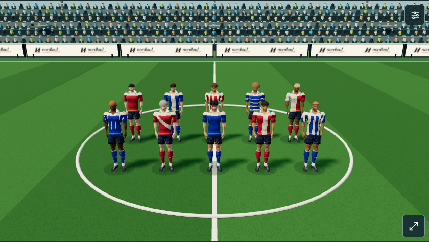
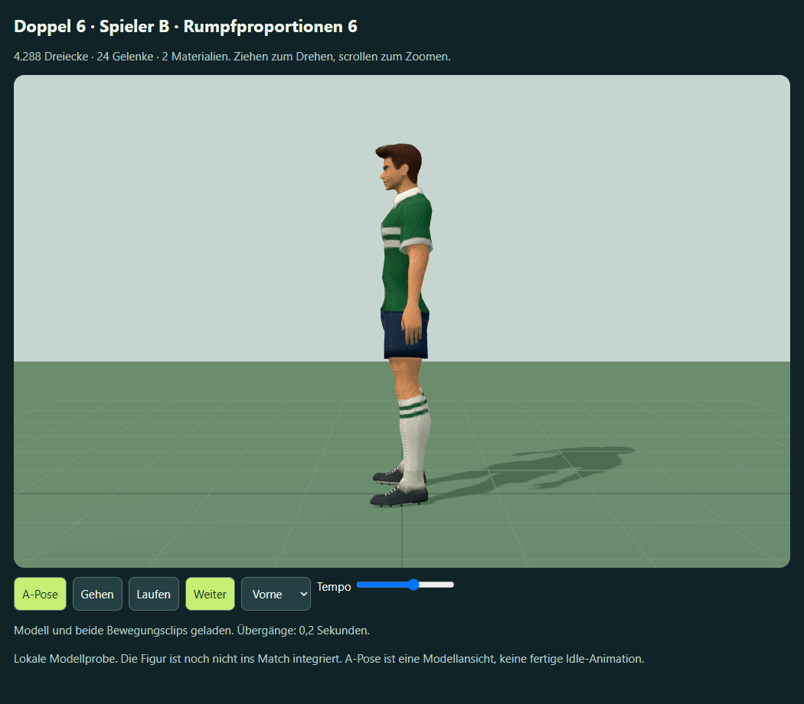

# Mannschaften, ruhigere Bewegungen und Rumpfkorrektur

2. Oktober 2026. Lokaler Ausbau der Matchprobe: alle zehn Feldspieler (fünf je Team) verwenden das neue Modell. Torhüter und Schiedsrichter behalten ihre bisherigen Figuren. Noch keine Veröffentlichung; die Live-Version bleibt 105. **0 zusätzliche Meshy-Credits**, keine neue Soundgenerierung.

## Figuren und Kleidung

Hauttöne, Haarfarben und die zehn gespeicherten Frisuren werden aus den vorhandenen Karriere-Spielern gelesen. Separate leichte Haargeometrien folgen dem Halsgelenk. Die ursprüngliche Haartolle wird nur in der gemeinsamen Laufzeitgeometrie zur Kopfhaut zurückgeführt, damit Kurzrasur und Glatze unterschiedliche Silhouetten haben. Es werden keine Spielerdaten ergänzt oder migriert. Das zugrunde liegende Gesicht bleibt Modell B; vollständige individuelle Gesichtsmodelle sind noch offen.

Vereinsfarben, Akzent, sechs Trikotmuster und einfarbige Trikots werden auf dem importierten Skin dargestellt. Rückennummern liegen über die Ruhekoordinaten direkt auf dem Rückenteil und verformen sich mit der Kleidung; die frühere schwebende Nummernfläche entfällt. Kontrastkonturen helfen auf hellen und dunklen Mustern.



## Rumpfproportionen nach Nutzerkorrektur

Die Seitenansicht zeigte eine stark eingezogene Taille mit ausgestelltem Trikotsaum. `work/refine-meshy-torso.py` bearbeitet die vorhandene Fassung 5 in Blender: engerer Saum, weniger eingeschnürter Übergang zum Brustkorb und flachere obere Rückenlinie. Eine Textur-/Raummaske begrenzt die Korrektur auf den Rumpf der Kleidung; Übergänge zur Schulter werden weich gedämpft. 429 Vertices je GLB, höchstens 2,86 cm Versatz. Kopf-/Halsgelenke, Schuhe, Gewichte und Clipzeiten bleiben erhalten. Die erste Korrektur wurde nach Betrachtung der Seitenansicht am unteren Saum weiter verfeinert.



GLBs: `meshy_output/20261002_190848_doppel-6-soccer-b-proportions_01a0fd96/torso-v6/{rigged,walking,running}.glb`.
Native Datei: `G:\Blenderassets\FM\Meshy-B-Mannschaften-v6\Meshy-B-Rumpf-v6.blend`.
Herkunft: bestehender Rigging-Task `01a0fd98-e202-72a6-b832-3681cb2e6a59`; Marker `meshy_output/soccer-b-torso-v6.json`, lokale Ableitung ohne API-Aufgabe. Jedes GLB hat 4.288 Dreiecke, zwei Materialien und 24 Gelenke. Die native Datei enthält ein Skin-Mesh mit zwei Materialien; der GLTFLoader teilt die Materialprimitive in zwei SkinnedMeshes auf.

## Bewegungen und Ressourcen

`pitch-motion-v102.js` verwendet längere Schritte und maximal 14 Phasenradianten pro Sekunde (etwa 2,23 komplette Laufzyklen). Die vorherige unbegrenzte Frequenz von 6,2 Radianten pro Szenenmeter wirkte bei hohem Spieltempo hastig. Ein geringerer Armschwung, weichere visuelle Anlauf-/Bremsdämpfung und ruhigere Drehübergänge ergänzen die Korrektur. Die Körperhöhe berücksichtigt den längeren Schritt, damit Standfüße weiter den Boden treffen.

Die Engine-Position wird weiterhin sofort übernommen. Die Änderungen betreffen Gelenke und Darstellung; keine Clipwartezeiten, keine zusätzliche Eingabeverzögerung, keine Änderung von Pass-/Schussereignissen oder Matchgeschwindigkeit. Der bestehende gemeinsame Puffer eines Simulationsschrittes bleibt erhalten. Meshy-Clips sind in der separaten Modellprobe erhalten; die Partie verwendet die eigenen ereignisgebundenen Posefunktionen.

Auch das sichtbare Ausschwingen erhält mehr Zeit: Pass 0,40 s, Schuss/Volley/Freistoß 0,60 s und Kopfball 0,62 s. Der Kontakt bleibt am Ereignisbeginn; eine folgende Aktion ersetzt die aktuelle Pose sofort. Ballflug und Engine-Timer werden dadurch nicht verlängert.

`player-meshy-v106.js` teilt zwei Skin-Geometrien und zwei Grundtexturen zwischen den zehn Spielern. Skelette und Farbuniformen bleiben pro Spieler getrennt. Frisurgeometrien und Nummerntexturen werden wiederverwendet. Ressourcen besitzen Referenzzähler: ein Wechsel entfernt nur die Ressourcen des austretenden Spielers; nach Verlassen der gesamten Szene gehen alle aktiven Referenzen auf null. Erneuter Aufbau funktioniert. Der normale Hauptbuild lädt diesen optionalen Adapter weiterhin nicht.

Die Offline-Datei `outputs/meshy-match-preview.html` startet eine echte Testpartie mit eigenem Speicher (`sechser.world.meshy-squad-v6`, `doppel6-world-meshy-squad-v6`). `?qa=1` überlässt den Spielaufbau dem Testharness. `outputs/meshy-player-b-preview-v6.html` zeigt die separate Modellfassung mit originalen Geh-/Laufclips.

## Prüfung und Grenzen

- 99 verformte Modell-/Clipposen, 24 Gelenke, endliche Positionen und normalisierte Gewichte; native Datei erneut geöffnet und geprüft. [Modellnachweis](browser-qa-v6.json).
- Acht Bewegungs-/Aktionszustände und 172 weitere Spielposen; Fußunterkante mindestens 0,087 m bei 0,09 m Rasen. Pass, Schuss, Volley und Kopfball treffen den Ball in der Kontaktpose. Echte Engine-Pass-/Schuss-/Kopfballereignisse, automatischer Start und Wiederaufbau geprüft. [Matchnachweis](match-qa-v6.json).
- Zehn importierte Feldspieler, zwei Teams, gespeicherte Aussehensmerkmale, zehn Frisuren und sieben Kleidungsstile; gemeinsames Skin/Grundtexturen und getrennte Skelette nachgewiesen. Einzelentfernung entsorgt keine noch verwendete Geometrie; vollständiger Abbau entsorgt sie genau einmal. [Mannschaftsnachweis](squad-qa-v6.json).
- Stand, Gehen und Laufen im laufenden gepufferten Matchrenderer beobachtet; kontrollierte Schritte bei 30/60/120 Hz, Cadence-Grenze, Bremsen, Drehen, unterbrechbare Aktionen und unveränderte Wurzelposition geprüft. 748 Sohlenkontakte der bisherigen Modellfabrik bestehen weiterhin.
- Vollständige reproduzierbare 2D/3D-Partie stimmt in Verlauf, Toren, Wechseln, Statistiken und Ergebnis überein. Replay wird nur in diesem Paritätsvergleich auf beiden Seiten übersprungen; vier Tor-/Richtungsfälle, Wiederholungsstillstand, Pause, Überspringen und Elfmeteranzeige separat geprüft.
- Tor-/Wechselbanner, Taktikwege, Abseits, Elfmeter, Halbzeit, Abpfiff, Hochformat, Kontextverlust und Offline-Build bestehen weiterhin. Keine Browserfehler und keine externen Requests in der Mannschaftsprobe.

844 × 390 px Querformat wurde im Browser geprüft. Eine Messung auf einem echten Mobiltelefon und die subjektive Freigabe der neuen Proportionen/Bewegungen bleiben offen; Software-WebGL und Standbilder belegen keine reale Gerätebildrate. Der gemessene natürliche Matchausschnitt umfasste 58 Draw Calls und rund 76.652 Dreiecke einschließlich Stadion; dies ist kein FPS-Versprechen.

```powershell
node work/build.cjs
node work/generate-meshy-match-preview.cjs
node work/check-meshy-match-preview.cjs
node work/check-meshy-squad.cjs
node work/check-meshy-match-regression.cjs
node work/generate-meshy-player-preview.cjs meshy_output/soccer-b-torso-v6.json outputs/meshy-player-b-preview-v6.html "Spieler B · Rumpfproportionen 6"
node work/check-meshy-player-preview.cjs outputs/meshy-player-b-preview-v6.html outputs/meshy-b-v6 2
```
