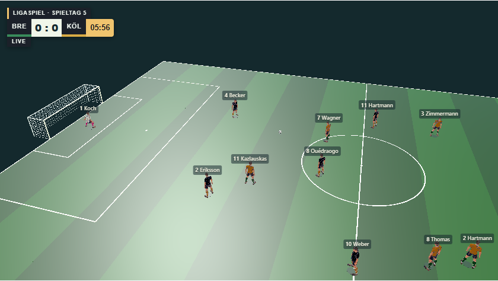
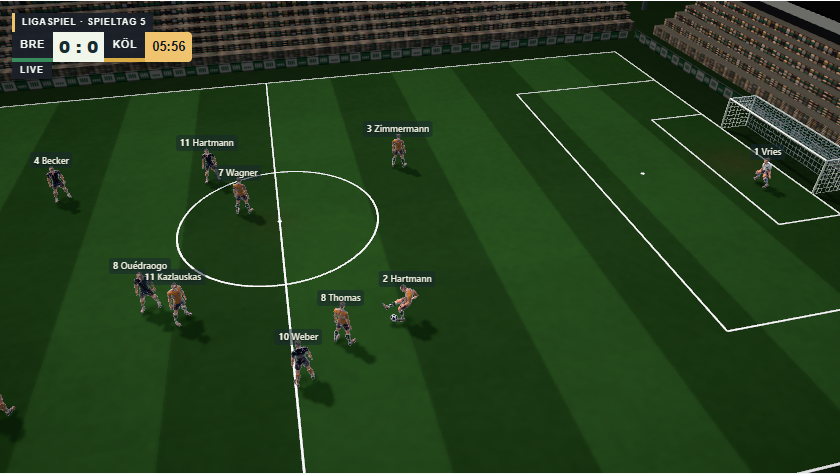
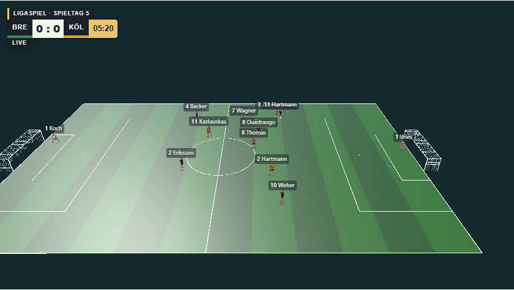
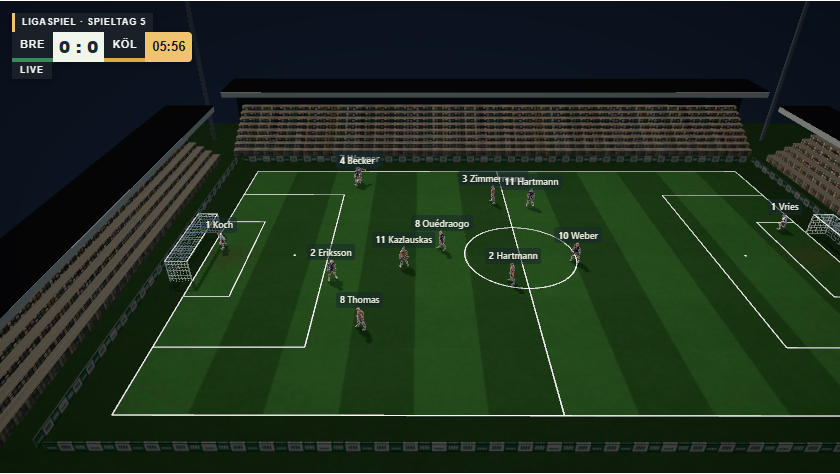
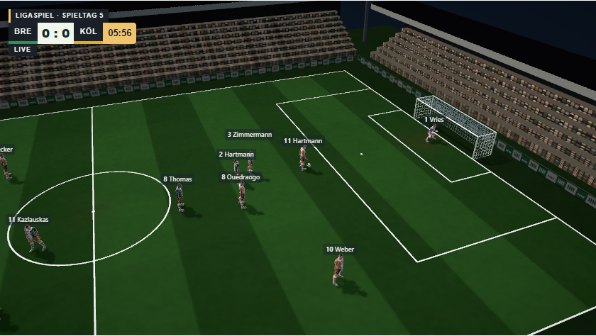
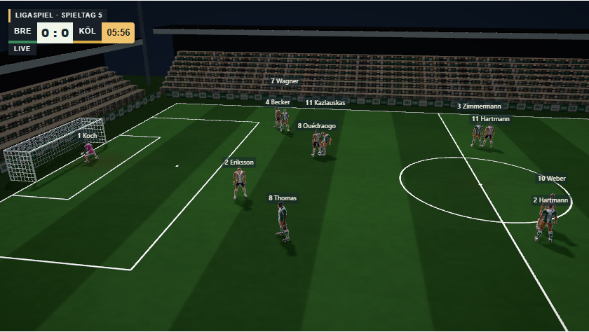

# Unity: Flutlicht-Optik und Stadion

Stand: 8. Oktober 2026. Bearbeitet von **Claude** (Claude Code, Opus 5.5) auf Nutzerauftrag „Unity-Engine verbessern – Optik, Animationen, das ganze Paket“. Branch `claude/unity-visuals`. Phase 1 von 4 (Optik & Licht). Phasen 2–4 (Animationen/IK, Spielermodelle/Trikots, Kamera/Präsentation) folgen am 9. Oktober auf Branch `claude/unity-phases-2-4` und werden gemeinsam mit Phase 1 in Release 112 veröffentlicht (Abschnitt unten).

## Sichtbare Änderung

Die Vereinswelt-Partie in Unity bekommt einen Flutlichtabend statt eines flachen, ausgewaschenen Felds:

- **Licht:** Ein hohes Hauptlicht mit echten weichen Schattenkarten ersetzt das bisherige pauschale weiße Umgebungslicht (Faktor 2). Das Umgebungslicht ist jetzt ein kühler Himmel über dunklerem Rasenrückstrahl. Spieler werfen echte Schatten; weiche Kontaktschatten unter Füßen und Ball halten die Figuren am Boden.
- **Rasen:** Ein eigener Shader (`D6Pitch`) zeigt Mähstreifen mit weichen Kanten, eine leichte Querschnittlinie, mehrstufiges Rauschen, abgenutzte Torräume und Anstoßpunkt, einen dunkleren Auslaufbereich und leichte Flutlicht-Lichtkegel.
- **Spieler:** Der Trikotshader (`WorldKit`) empfängt und wirft Schatten, nutzt Umgebungslicht und eine Randaufhellung. Kleine Figuren bleiben so vor dem Rasen lesbar; Stoff erhält einen schwachen Glanz.
- **Stadion:** Gestufte Tribünen mit Zuschauern auf allen vier Seiten, überwiegend in den Heimfarben. Dazu Rückwände, Dächer mit Blende in Vereinsfarbe, LED-Werbebanden in Vereinsfarben und vier Flutlichtmasten mit leuchtenden Lampenfeldern. Die Stadionteile werfen bewusst keine Schatten, weil lange Dach- und Mastschatten das Spiel überdecken würden. Liegt eine Kamera hinter einer Tribüne, wird diese Tribünenseite ausgeblendet.
- **Bildqualität:** 4× MSAA statt keiner Kantenglättung. Post-Processing mit leichter Kontrast- und Belichtungskorrektur, Vignette und schwachem Bloom auf Banden und Lampen.

Die Demo- und Kontaktproben (`Load`) stellen das bisherige Licht wieder her; die Änderung betrifft nur echte Vereinswelt-Partien.

## Grenzen

Reine Darstellung. Positionen, Ereignisse, Uhr, Ball und Ergebnis kommen unverändert aus der bestehenden Simulation. Keine Änderung an Spielregeln, Spielständen oder Karriereformaten. Keine neuen Pakete und keine Meshy-Credits.

Die Schatten verwenden ausschließlich das Hauptlicht. Schatten zusätzlicher Lichter bleiben aus, weil genau deren Sampler den früheren WebGL-Fehler verursacht hat (siehe `prototypes/match-engine-unity/README.md`). Mobile Leistung ist nicht gemessen: Schattenkarte (2048, 110 m), MSAA und Post-Processing kosten GPU-Zeit. Für Android ist eine automatische Qualitätsstufe nötig, bevor dieser Stand mobil freigegeben wird.

## Prüfungen

- `D6Cli.Tests` per Unity-CLI: FootballTests 23, Locomotion 215, Momentum 72, Action 22, Motion (0 Fehler), WorldView 24 – alle bestanden.
- WebGL-Build per `D6Cli.WebBuild`: erfolgreich, 0 Fehler, 3 bekannte Warnungen (`endFrameRendering`, RuntimePipelineConfig); Manifest mit `build-manifest.cjs` neu erzeugt.
- `work/platform/qa/shot-unity-visuals.cjs`: echte Partie im Edge-Browser mit GPU in allen fünf Kameraperspektiven (folgen, weit, Seitenlinie, diagonal, Hintertor), 0 Seiten-/Konsolenfehler. Vorher-Bilder mit dem gesicherten alten Build: `outputs/platform/unity-visuals/before/`, nachher: `outputs/platform/unity-visuals/after/`.

## Arbeitsweise mit der Unity-CLI

`prototypes/match-engine-unity/D6Cli.cs` (im Unity-Projekt unter `Assets/Doppel6EngineProbe/Editor/`) stellt parameterlose Einstiegspunkte für `-executeMethod` bereit. Der Unity-Editor muss für diese Befehle geschlossen sein.

```sh
unity run "G:/unity/My project" -- -nographics -executeMethod D6Cli.Tests -d6repo "<Repository>" -logFile outputs/unity-cli/tests.log
unity run "G:/unity/My project" -- -executeMethod D6Cli.WebBuild -d6repo "<Repository>" -logFile outputs/unity-cli/build.log
node prototypes/match-engine-unity/build-manifest.cjs
```

`D6Cli.WebBuild` setzt Buildziel, Pipeline und PlayerSettings anschließend zurück. Vor dem Build `generate-identity.cjs` ausführen und `ProbeBuildIdentity.cs` nach `Assets/Doppel6EngineProbe/Runtime/` kopieren. Neue Dateien: `WorldViewEnvironment.cs` (Runtime), `D6Common.hlsl` (Art), `D6Pitch.shader`, `D6Env.shader`, `D6Blob.shader` (Art/Resources).

| Vorher | Nachher |
| --- | --- |
|  |  |
|  |  |

## Phasen 2–4 (Release 112)

Stand: 9. Oktober 2026, **Claude** (Opus 5.5), Branch `claude/unity-phases-2-4`, Unity-Quellkennung `28badd2c1f7386dbe67f5a8244b33cf49f98eba2378c8442ece04ba16f199e7f`. Unity bleibt reine Darstellung: Uhr, Positionen, Ereignisse, Regeln, Ergebnis und Speicherung kommen unverändert aus der nativen JS-Simulation; Unity verbraucht keine Simulationszufallszahlen und sendet nichts in den Spielzustand zurück.

### Phase 2: Animationen und Kontakte

- Jeder vorhandene Lauf-/Sprint-/Rückwärtsclip des 28-Gelenk-Rigs wird beim Start auf dem tatsächlichen Mesh vermessen (`FootballGait`): Meter pro Zyklus eines stehenden Fußes und gemessene linke/rechte Aufsetzzeit. Die Schrittkadenz folgt damit der beobachteten nativen Geschwindigkeit; Clipwechsel Gehen → Laufen → Sprint behalten denselben Fuß am Boden. Schnelle Läufe/Rückwärtsläufe wechseln mit Hysterese, Drehungen nutzen eigene Stand-, Geh- und Laufclips.
- Bodenkontakt je Mesh (`FootballGround`): gemessene Sohle des Standbilds setzt die Figur auf den Rasen; schwebende generierte Clips (Keeperbereitschaft, Innenseitpass) werden um ihren konstanten Abstand abgesenkt, nie angehoben. Liegende/kniende Posen bleiben unberührt.
- Begrenzte Korrekturen nur bei bestätigten nativen Kontakten: Fuß zum tatsächlichen Pass-/Schusskontakt, beide Handflächen bei zentralem Keeperball, Kopf/Oberkörper höchstens begrenzt zum Kopfballkontakt. Ein Kontakt löst sich über 0,1 s statt zu springen. Fouls nutzen das gemessene Fall-/Aufstehfenster. Ein gebuchtes Tor lässt die Torschützenseite an ihrer Position jubeln.
- Keine Teleports, kein Vorhersagen von Bewegungen, keine erfundenen Kontakte.

### Phase 3: Spielermodelle und Trikots

- `WorldKit.shader` liest die Trikotbereiche in Bind-Pose-Achsen (Brust/Rücken, Hose, Stutzen) aus der vorhandenen Stoffmaske. Vereinsfarbe, Muster (Streifen, Ringel, Hälften, Schärpe …), Kragen, Hose (Trim/Accent) und Stutzenband kommen aus der gespeicherten Matchkombination; Musterkanten sind kantengeglättet.
- Die echte Rückennummer aus dem Payload erscheint groß auf dem Rücken und klein auf der Brust, in der Farbe mit dem besten Kontrast zu Trikot und Muster. Torhüter tragen Handschuhe; Keeper- und Feldspielertrikots bleiben getrennt.
- Keine neuen Meshy-, Bild- oder Assetjobs.

### Phase 4: Kamera und Präsentation

- Rückschau und Torwiederholung erhalten eine eigene ruhigere, kühlere Bildfarbe mit Rahmung; sie verändern die Wiedergabe nicht.
- Namensschilder bleiben für alle Spieler sichtbar und weichen überlappend nach oben aus (Ballbereich zuerst, mit Haltewert gegen Springen).
- Tribünen-Occlusion mit 0,8 m Hysterese gegen Flackern.
- Qualitätsstufe: Geräte mit primärer Touchbedienung starten mit `reduced` (keine MSAA, harte 1024er-Schatten über 70 m, kein Bloom); `?quality=standard|reduced` erzwingt eine Stufe. Ohne Angabe entscheidet Unitys Mobilkennung.
- Optionale native `match.geometry` (Version 1) wird 1:1 für Unity-Feld/Tore/Strafraum verwendet; die gemeinsame 2D/THREE-Projektion bleibt 68 × 44, nur die Unity-Kopie wird gestreckt. Ohne Kennzeichnung bleibt alles exakt wie bisher. Der native Block selbst (GPT, Branch `codex/native-match-player-integration`) ist nicht Teil dieses Releases.
- Fünf Kameras, Nähe-Regler, Pause/Fortsetzen, vergrößerte Halbzeit, Desktop-/Touchbedienung und 2D-Rückweg bleiben erhalten.

### Prüfungen

- `D6Cli.Tests` (Unity-CLI, 9. Oktober): Football 23, Locomotion 215, Momentum 72, Action 22, Motion 0 Fehler, WorldView 24, neue FootballGaitTests 75 bestanden / 0 fehlgeschlagen.
- `D6Cli.WebBuild`: 0 Fehler, 3 bekannte Warnungen; Manifest und Quellkennung neu erzeugt und gegen alle Quell- und Builddateien geprüft.
- `test-world-unity-contract.cjs`: optionale Geometrie, Legacy-Rückfall, Torjubel-Felder.
- `check-world-unity.cjs --http-build` (24 Fälle) und `work/check-release-112.cjs`: echte Vereinswelt mit Vereinen/Trikots/Namen, Pause/Fortsetzen, Rückschau, vergrößerte Halbzeit, 2D-Rückweg, Touch-Qualitätsstufe und vollständige native/Unity-Partieparität (Ereignisse, Spielerberichte, Finanzen). Nachweise unter `outputs/release-112/`.
- `shot-unity-visuals.cjs` mit GPU: finaler Build in allen fünf Kameras, 0 Seiten-/Konsolenfehler.

| Folgekamera | Seitenlinie |
| --- | --- |
|  |  |

### Grenzen

- Reale Mobilhardware ist nicht gemessen. Die reduzierte Stufe ist eine konservative Wahl, keine Freigabe; Emulation und PC-Messungen ersetzen keine Geräteabnahme.
- Die Clips stammen weiterhin aus dem vorhandenen Rig; neue Bewegungen (z. B. echte Brems- oder Ausfallschrittclips) erfordern neue Animationen.
- Native Feldgröße/sechs Feldspieler sind vorbereitet, aber erst mit der späteren nativen Integration sichtbar; dann ist ein gemeinsamer Kamera-/3D-Abgleich nötig.
