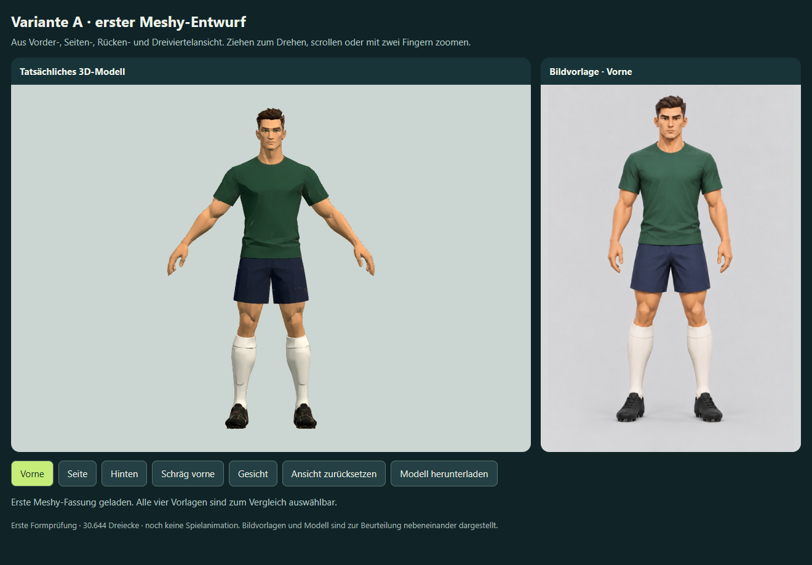

# Spieler A: erste Meshy-Fassung aus vier Blickwinkeln

Stand: 2. Oktober 2026. Die nutzende Person hat nach dem Proportionsvergleich ausdrücklich **A** gewählt und eine erste Meshy-Fassung mit mehreren Blickwinkeln beauftragt. Das Modell dient jetzt der Beurteilung vor weiterer Bearbeitung.

## Vorlagen und erster Modelllauf

- [Vorne](front.png): die ausgewählte Variante A, unverändert übernommen.
- [Seite](side.png), [Hinten](back.png), [Schräg vorne](quarter.png): aus A abgeleitete Ansichten derselben Figur in gleicher Kleidung und A-Pose.
- Sichtprüfung der vier Bilder: Gesamtgröße, Arm-/Handhöhe und Kleidungssäume weitgehend konsistent. Es sind generierte Bilder; exakte geometrische Übereinstimmung wird nicht behauptet. Die im Prompt genannten Zentimeter und Kürzungsprozente sind Gestaltungsziele, keine nachgemessenen Modellmaße.
- Gemeinsamer Meshy-Auftrag mit vier einzelnen Eingabebildern, Vorderansicht zuerst; `meshy-7.1`, Bildoptimierung aus, A-Pose, 2K-Textur, matte Darstellung, Ziel 30.000 Dreiecke.
- Tatsächliches Modell: **30.644 Dreiecke**, 33.968 exportierte Vertices, ein Mesh, ein Material und eine eingebettete Farbtextur. Kein Rig und keine Animationsclips.

## Dateien und Task-Nachweis

Ressource: `multi-image-to-3d`. Task: `01a0fe49-c2c9-7082-b41d-74303994bca2`. Gesicherte Operation: `d6-player-a-multiview-01a0fe23-v1`.

Projekt: `meshy_output/20261002_222413_doppel-6-spieler-a-mehransicht_01a0fe49`.

- `player-a.glb`: texturiertes erstes Modell, 3.781.368 Bytes.
- `player-a-source.glb`: gespeicherte Geometrie vor der Reduktion, 659.252 Dreiecke, 15.811.188 Bytes, ohne Textur. Sie ist eine Bearbeitungsgrundlage und kein mobiles Laufzeitmodell.
- `preview.png`: tatsächlich heruntergeladenes Meshy-Vorschaubild.
- `task_01a0fe49-c2c9-7082-b41d-74303994bca2.json` und `metadata.json`: Original-Task und lokale Herkunftskette; enthalten temporäre Asset-URLs und werden nicht in die Spielseite aufgenommen.
- `outputs/spieler-a-meshy-v1.html`: vollständig eingebettete drehbare Offline-Probe mit Modell und den vier Vorlagen, Vorder-/Seiten-/Rücken-/Dreiviertel-/Gesichtsansicht und GLB-Download.

Der bestehende Vorschau-Endpunkt `http://127.0.0.1:4216/` zeigt jetzt diese Studie über `outputs/spieler-neustart.html`. Der vorherige Einzelbildversuch bleibt als `outputs/spieler-neustart-einzelbild.html` erhalten.

Tatsächliche Kosten dieses Auftrags: **30 Meshy-Credits**, bestätigt durch `consumed_credits`. Kontostand vor dem Auftrag: 4.050 Credits. Die Ansichten stammen aus dem eingebauten Imagegen-Werkzeug; keine weiteren Meshy-Modellläufe, Rigging- oder Animationsaufträge. Kostenschätzung anhand der [Meshy-Preisliste](https://docs.meshy.ai/en/api/pricing), gelesen am 2. Oktober 2026. Vollständige Bildprompts und Parameter: [generierung.json](generierung.json), zusätzlicher API-Payload: [meshy-request.json](meshy-request.json).

## Prüfung und weitere Bearbeitung

[Browserprüfung](browser-qa.json): alle 33.968 Vertexpositionen endlich, vier verfügbare Referenzen, Ansichtsschalter und Zurücksetzen geprüft. Keine externen Netzanforderungen oder Browserfehler. Layout bei 844 × 390 und 390 × 844 ohne horizontalen Überlauf. Die orthografische Modellkamera zeigt Modell und Vorlage mit vergleichbarer Figurenhöhe; die GLB-Geometrie selbst wird dadurch nicht umgeformt.

Vorder-, Seiten-, Rücken-, Dreiviertel- und Gesichtsansicht wurden tatsächlich angesehen. Meshy hat die Grundform rekonstruiert; Hals, Gesicht, Armhaltung und Trikotfalten weichen noch sichtbar von A ab. Insbesondere verändert das erzwungene A-Pose-Ergebnis die Armspreizung gegenüber der Vorlage. Die nutzende Person bewertete diese erste Fassung anschließend mit „Damit kann man arbeiten“ als brauchbare Basis und beauftragte die [zweite Rekonstruktion A2](../spieler-a2-mehransichten/README.md). Eine Produktionsfreigabe folgt daraus noch nicht. Der lokale Vorschau-Endpunkt zeigt nun den direkten Vergleich; die eigenständige erste HTML-Probe bleibt erhalten.

Die Studie ist nicht ins Match integriert und nicht veröffentlicht. Materialbereiche für Vereinsfarben, austauschbare Frisuren, mobile Reduktion, Rigging, Fußballbewegungen und Hardwareleistung werden erst nach der Formentscheidung weiterbearbeitet.

Weitere Meshy-Schritte sollen auf dieser gesicherten Task beziehungsweise dem Modell aufbauen: lokale Formkorrektur mit Blender, Remesh für ein späteres Budget, Retexture bei reiner Texturänderung und Rigging nach akzeptierter Körperform. Remesh und Retexture korrigieren nicht automatisch falsche Körperproportionen. Eine neue Bildrekonstruktion bleibt ein gesonderter kostenpflichtiger Lauf. Keine automatische Neugenerierung.

Reproduzieren: `node work/generate-player-a-study.cjs`, anschließend `node work/check-player-a-study.cjs` mit der vorhandenen Playwright-/Edge-Laufzeit. Die Quellen unter `dist/` wurden für diese Studie nicht geändert.
