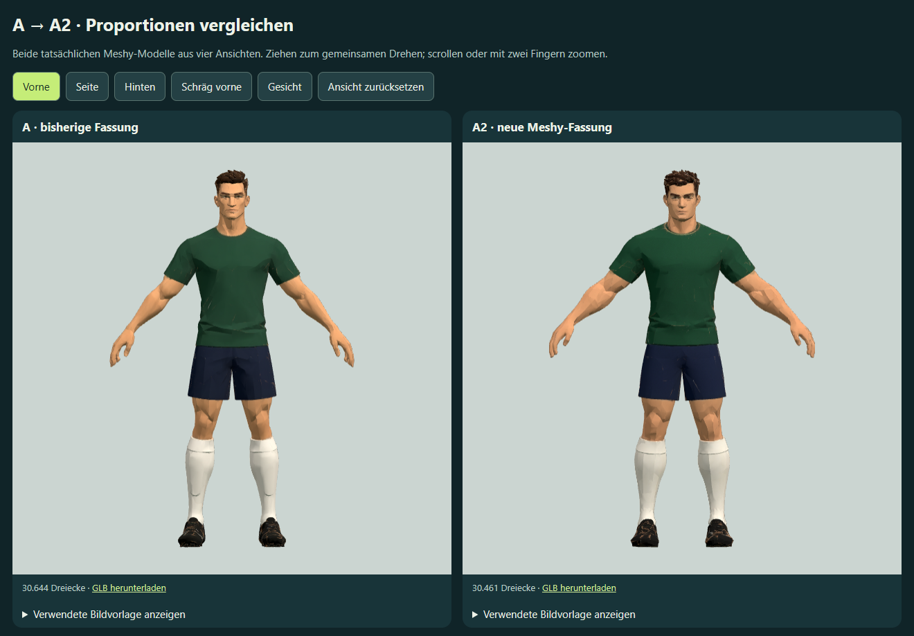

# Spieler A2: neue Meshy-Rekonstruktion nach Proportionskorrektur

Stand: 2. Oktober 2026. Die erste [Meshy-Fassung A](../spieler-a-mehransichten/README.md) wurde mit „Damit kann man arbeiten“ als brauchbare Basis bewertet. Anschließend wurde ausdrücklich eine zweite Rekonstruktion aus korrigierten Referenzbildern beauftragt.

## Korrigierte Referenzen

[Vorne](front.png), [Seite](side.png), [Hinten](back.png) und [Schräg vorne](quarter.png) zeigen dieselbe Figur in grüner Kleidung, dunkelblauen Shorts, einfarbigen hellen Stutzen und schwarzen Fußballschuhen. Die Vorderansicht wurde mit dem eingebauten Imagegen-Werkzeug bearbeitet; die drei anderen Ansichten verwenden diese neue Vorderansicht als Formvorgabe und die jeweilige alte Ansicht für den Kamerawinkel.

Gestaltungsziele: Arme ungefähr 8 % kürzer, sichtbarer Hals ungefähr 20 % kürzer und 10 % breiter, etwas weichere Kieferkanten bei gleicher Identität. Diese Angaben sind Promptvorgaben und keine gemessenen Ergebnisse. Generierte Ansichten sind keine geometrisch exakten Projektionen; beispielsweise können Handhaltung und Stofffalten zwischen Bildern variieren. Ganze Figur, freie Arme, Kleidung und Perspektiven wurden vor der 3D-Übertragung angesehen.

Vollständige Eingabeprompts und Werkzeugherkunft: [generierung.json](generierung.json). Zusätzliche Meshy-Parameter: [meshy-request.json](meshy-request.json). Alle vier Bilder wurden gemeinsam an `multi-image-to-3d` übergeben: `meshy-7.1`, A-Pose, Ziel 30.000 Dreiecke, 2K-Farbtextur, keine Bildoptimierung, Geometrie vor der Reduktion speichern. Das ist eine neue Rekonstruktion; die GLB von A wird nicht per Text umgeformt.

## Herkunft und Dateien

Ressource: `multi-image-to-3d`. Task: `01a0fe5a-2a50-739e-9f40-dc61766d1cf1`. Operation: `d6-player-a2-multiview-01a0fe23-v1`.

Projekt: `meshy_output/20261002_224215_doppel-6-spieler-a2-mehransich_01a0fe5a`.

- `player-a2.glb`: texturierte neue Fassung.
- `player-a2-source.glb`: Geometrie vor der Reduktion, als separate Bearbeitungsgrundlage.
- `preview.png`: tatsächlich heruntergeladene Meshy-Vorschau.
- `task_01a0fe5a-2a50-739e-9f40-dc61766d1cf1.json` und `metadata.json`: Herkunftskette mit temporären Download-URLs; nicht in die Vorschau eingebettet.
- [model.json](model.json): lokale Modellzuordnung ohne signierte URLs.
- `outputs/spieler-a2-meshy-vergleich.html`: drehbarer Offline-Vergleich der tatsächlichen GLB-Dateien A und A2. Gemeinsame Kamerasteuerung, vier Blickwinkel, Gesichtsansicht, einblendbare Vorlagen und GLB-Download beider Modelle. Beide Figuren werden auf 1,8 m Anzeigehöhe normalisiert; die gespeicherte Modellgeometrie wird dadurch nicht verändert.

Meshy-Kostenschätzung: 30 Credits für die texturierte Mehrbildgenerierung laut [Preisliste](https://docs.meshy.ai/en/api/pricing), gelesen am 2. Oktober 2026. Kontostand vor Auftrag: 4.020 Credits. **Tatsächlich berechnet: 30 Credits**, bestätigt durch `consumed_credits` des erfolgreich abgeschlossenen Tasks. Die Referenzbilder stammen aus dem eingebauten Imagegen-Werkzeug und verbrauchen keine Meshy-Credits.

## Ergebnis und Prüfung

Das texturierte Modell besitzt **30.461 Dreiecke**, 32.646 exportierte Vertices, ein Mesh, ein Material und eine eingebettete Farbtextur; 3.947.176 Bytes. Kein Rig und keine Animationen. Die untexturierte Quellgeometrie hat 395.358 Dreiecke und 9.489.588 Bytes; sie ist kein mobiles Laufzeitmodell.

Vorder-, Seiten-, Rücken-, Dreiviertel- und Gesichtsansicht wurden angesehen. Der Hals wirkt im Vergleich kompakter, der Kragen etwas ausgeprägter und das Gesicht voller. Meshy hat zugleich Armspreizung, Armstärke, Frisur, Stofffalten und Schuhform mit verändert. Insbesondere wirken die Arme breiter ausgestellt und kräftiger; die beauftragte Kürzung wurde nicht als isolierte, vermessene Änderung bestätigt. Die höhere Handposition beweist wegen der veränderten Pose keine kürzeren Arme. Daher wird A2 als Versuchsergebnis geliefert, ohne eine vollständige Erfüllung der Proportionsziele oder Nutzerabnahme zu behaupten. Keine weitere automatische Generierung.

[Browserprüfung](browser-qa.json): beide Modelle und sämtliche Vertexpositionen endlich, alle Blickwinkel sowie Zurücksetzen, gemeinsame Kamerasteuerung beim Ziehen und bytegleicher GLB-Download geprüft. Vier Referenzen je Modell laden ohne externen Netzwerkzugriff; keine Browserfehler. 844 × 390 und 390 × 844 ohne horizontalen Überlauf. Prüfung mit Headless Edge und Software-WebGL; keine Leistungsabnahme auf einem physischen Mobilgerät.

Der lokale Endpunkt `http://127.0.0.1:4216/` zeigte zunächst diese Probe über `outputs/spieler-neustart.html` und zeigt nach der neuen Rückmeldung nun den [A2/A3-Vergleich](../spieler-a3-mehransichten/README.md). Diese A/A2-Probe bleibt unter `outputs/spieler-a2-meshy-vergleich.html` erhalten, die erste A-Probe unter `outputs/spieler-a-meshy-v1.html`. Eine Freigabe der Körperform, Rigging, Fußballbewegungen, Vereinsfarben und spätere mobile Reduktion stehen weiterhin aus.

## Umfang

Eine neue 3D-Generierung, kein weiterer bezahlter Modelllauf, Rigging- oder Animationsauftrag. Die Varianten bleiben separat erhalten. Keine Änderung der Matchgrafik oder gespeicherter Spieler, keine Veröffentlichung. Die Referenzkorrektur garantiert keine exakten Armlängen im rekonstruierten Modell.

Reproduzieren mit `node work/generate-player-a2-study.cjs`, danach `node work/check-player-a2-study.cjs` mit vorhandener Playwright-/Edge-Laufzeit.
