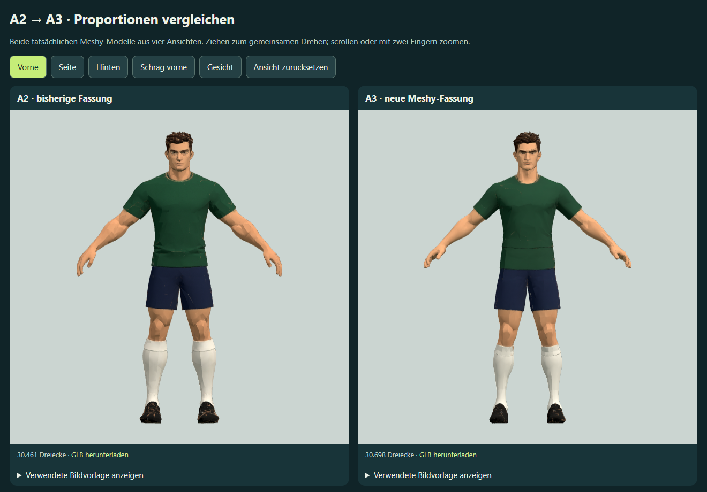

# Spieler A3: längerer, dünnerer Hals und weniger muskulöse Arme

Stand: 2. Oktober 2026. Nach dem Vergleich mit [A2](../spieler-a2-mehransichten/README.md) wurde ausdrücklich ein etwas längerer und dünnerer Hals sowie weniger muskulöse Arme beauftragt. A3 ist eine neue Meshy-Rekonstruktion aus vier überarbeiteten Ansichten; keine lokale Verformung des A2-Meshes.

## Referenzen und Prompt

[Vorne](front.png), [Seite](side.png), [Hinten](back.png) und [Schräg vorne](quarter.png). Die Vorderansicht wurde im eingebauten Imagegen-Werkzeug korrigiert. Die übrigen Ansichten verwenden die neue Vorderansicht als Körpervorgabe und die jeweils alte Ansicht für die Kamera. Alle vier Bilder wurden vor der Übertragung angesehen und gemeinsam an Meshy übergeben.

Gestaltungsziele im Prompt: sichtbarer Hals ungefähr 10 % länger und 12 % dünner, Ober- und Unterarme ungefähr 12 % schlanker im Durchmesser mit weniger ausgeprägten Muskelkonturen; Armlänge erhalten. Gesicht, Kopfgröße, Frisur, Schulterbreite, Rumpf, Beine und Kleidung sollten beibehalten werden. Diese Zahlen sind **Gestaltungsziele, keine nachgemessenen Modellwerte**. Generierte Referenzen sind keine geometrisch exakten Projektionen.

Vollständige Prompts und Werkzeugherkunft: [generierung.json](generierung.json). Meshy-Payload: [meshy-request.json](meshy-request.json). Gleiche Einstellungen wie A2: `meshy-7.1`, vier separate Bilder, A-Pose, Ziel 30.000 Dreiecke, 2K-Farbtextur, keine Bildoptimierung, Quellgeometrie vor der Reduktion speichern.

## Modell und Herkunft

Ressource: `multi-image-to-3d`. Task: `01a0fe64-923c-72ed-adba-e313fc3ae963`. Operation: `d6-player-a3-multiview-01a0fe23-v1`.

Projekt: `meshy_output/20261002_225335_doppel-6-spieler-a3-mehransich_01a0fe64`.

- `player-a3.glb`: texturiertes Modell, **30.698 Dreiecke**, 38.805 exportierte Vertices, ein Mesh, ein Material, eine eingebettete Farbtextur; 3.993.920 Bytes. Kein Rig und keine Animationen.
- `player-a3-source.glb`: untexturierte Quellgeometrie vor der Reduktion, 788.748 Dreiecke, 18.918.564 Bytes; kein mobiles Laufzeitmodell.
- `preview.png`: tatsächliches Meshy-Vorschaubild, heruntergeladen und angesehen.
- `task_01a0fe64-923c-72ed-adba-e313fc3ae963.json` und `metadata.json`: Task und Herkunftskette mit temporären Download-URLs; nicht in die HTML-Probe eingebettet.
- [model.json](model.json): Modellzuordnung und vorherige Vergleichsfassung ohne signierte URLs.

**Tatsächlich 30 Meshy-Credits**, bestätigt durch `consumed_credits`. Kontostand vor Auftrag: 3.990 Credits. Schätzung 30 Credits nach [Meshy-Preisliste](https://docs.meshy.ai/en/api/pricing), gelesen am 2. Oktober 2026. Die Bildbearbeitung mit dem eingebauten Imagegen-Werkzeug verbraucht keine Meshy-Credits.

## Vergleich

`outputs/spieler-a3-meshy-vergleich.html` ist eine eigenständige Offline-Probe mit den tatsächlichen Modellen A2 und A3, gemeinsamer Kamerasteuerung, Vorder-/Seiten-/Rücken-/Dreiviertel-/Gesichtsansicht, einblendbaren Referenzbildern und GLB-Download. Beide Figuren sind auf dieselbe Anzeigehöhe normalisiert; die gespeicherten GLB-Dateien bleiben unverändert. Die erste A2-Vergleichsdatei bleibt erhalten.

Der lokale Endpunkt [A2/A3 vergleichen](http://127.0.0.1:4216/?a3-multiview-vergleich) zeigt jetzt A3 über `outputs/spieler-neustart.html`.

Vorder-, Seiten-, Rücken-, Dreiviertel- und Gesichtsansicht wurden am tatsächlichen Modell angesehen. Die Arme wirken deutlich schlanker und weniger muskulös; der Hals erscheint länger und schmaler als bei A2. Meshy hat auch Armhaltung, Trikotfalten, Gesicht, Waden und weitere Details mit verändert. Eine exakte Maßtreue oder unveränderte Armlänge wird nicht behauptet. Die subjektive Nutzerabnahme bleibt offen. Ein weiterer bezahlter Lauf wird nicht automatisch gestartet.

[Browserprüfung](browser-qa.json): beide GLB-Dateien geladen, sämtliche 32.646 beziehungsweise 38.805 Vertexpositionen endlich, alle fünf Ansichten und Zurücksetzen geprüft. Ziehen synchronisiert beide Kameras; heruntergeladene A3-GLB ist bytegleich zur Originaldatei. Vier Referenzen je Modell laden; keine Browserfehler und keine externen Netzanforderungen. Layout bei 844 × 390 und 390 × 844 ohne horizontalen Überlauf. Prüfung mit Headless Edge und Software-WebGL; Leistung auf echter Mobilhardware bleibt ungeprüft. Die bisherige A/A2-Probe wurde mit denselben erweiterten Skripten ebenfalls erfolgreich geprüft.

## Rückmeldung zur Qualität

Die nutzende Person bewertet die Körperform von A3 grundsätzlich als passend, die Qualität jedoch als unzureichend. Damit bleibt A3 die Körperbasis; eine Gesamtfreigabe liegt nicht vor. Die erfolgreichen Browsertests belegen Laden, endliche Geometrie und Steuerung, nicht die künstlerische Qualität.

In der Gesichtsnahansicht fallen grobe Flächen an Nase, Wangen und Hals, unsaubere Augen-/Brauenkonturen sowie ein unruhiger Kragenübergang auf. Diese Sichtprüfung trennt Formfehler und Farb-/Schattierungsartefakte noch nicht vollständig. Die Farbtextur ist eingebettet, zusätzliche Normal- oder Materialdetailkarten fehlen. Für die Generierung war bewusst ein facettierter Stil vorgegeben; die gewünschte Körperform ist deshalb von der Oberflächenqualität getrennt weiterzubearbeiten.

Der vorgeschlagene Qualitätsschritt wurde auf Nutzerauftrag als [erste Qualitätsfassung A4](../spieler-a4-mehransichten/README.md) umgesetzt: lokale Gesichts-/Haar-/Kragenbereinigung, erhaltene Körper-/Halspositionen und einmalige 4K-Retexture für tatsächlich 10 Credits. Detailvergleich und native Blender-Datei sind gesichert. Die neue Textur enthält weiterhin Gesichts-/Kragenfehler und verschobene Farbgrenzen an Kleidung; die Qualitätsabnahme bleibt offen. Die A3-Datei bleibt erhalten.

Keine Match-Integration, keine Änderung gespeicherter Spieler oder Veröffentlichung. Rigging, Fußballbewegungen, variable Vereinsfarben und Mobiloptimierung folgen erst nach der Qualitätsabnahme.

Reproduzieren: `node work/generate-player-a2-study.cjs a3`, prüfen mit `node work/check-player-a2-study.cjs a3`. Dieselben Skripte ohne Argument oder mit `a2` erhalten die bisherige Vergleichsfassung.
