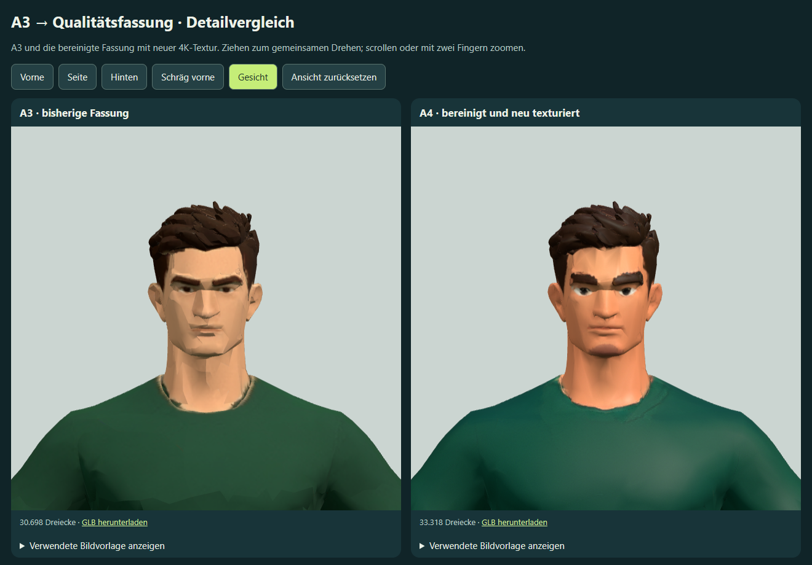
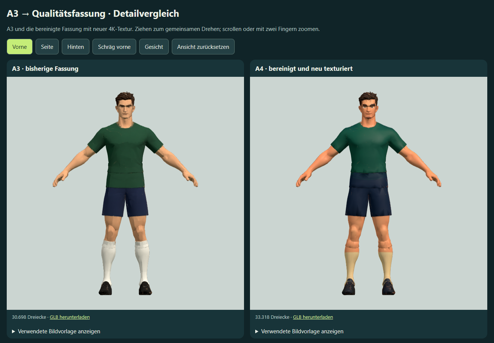

# A3 → erste Qualitätsfassung A4

Der anschließend beanstandete Kragen wurde separat als [A5 – lokaler Kragenabschluss](../spieler-a5-mehransichten/README.md) korrigiert. A4 bleibt als Vergleichsbasis erhalten.

Die grundsätzlich akzeptierte Körperform von A3 bleibt die Basis. Auf Auftrag wurde das vorhandene Modell lokal bereinigt, anschließend einmal in Meshy mit neuen 4K-Texturen versehen und als A3/A4-Vergleich bereitgestellt. **Der Qualitätsschritt ist umgesetzt; das Ergebnis ist noch keine künstlerisch abgenommene Spielfigur.**

[Drehbaren Vergleich öffnen](http://127.0.0.1:4216/?a4-qualitaetsvergleich). Die Offline-Datei liegt unter `outputs/spieler-a4-meshy-vergleich.html`. Der lokale Server liefert über `outputs/spieler-neustart.html` jeweils den neuesten Vergleich; ältere Query-Namen wählen dort keine historische Fassung.

## Lokale Bereinigung und erhaltene Form

`work/refine-player-a3-quality.py` verwendet die tatsächliche A3-GLB. Doppelte Positionen wurden verschweißt, Gesichtsflächen lokal unterteilt und Wangen/Kiefer vorsichtig geglättet; Nase, Augen und Mund bleiben geschützt. Haare und Kragen wurden schwach geglättet, Oberflächennormalen neu berechnet. Die maximale lokale Verschiebung ist am Gesicht auf 3 mm, an Haaren und Kragen auf 1,5 mm begrenzt, bezogen auf 1,8 m Anzeigehöhe.

Die Prüfung von 18.812 ursprünglichen Körperpositionen unterhalb der Kragenzone und 188 Positionen am freien Hals ergibt jeweils 0 m Positionsabweichung. Damit wurden Arm-, Bein- und Halsproportionen nicht durch eine neue Rekonstruktion ersetzt. Dies ist ein Positionsnachweis in diesen Bereichen, keine vollständige Prüfung von UV-Nähten oder Deformationstopologie. Bericht: `meshy_output/player-a3-quality/local-cleanup.json`.

Die lokal bereinigte Basis `meshy_output/player-a3-quality/player-a3-clean.glb` hat 33.319 Dreiecke. Die Arbeitsdatei liegt separat unter `G:\Blenderassets\FM\Spieler-A3-Qualitaet-2026-10-02\Doppel6-A3-Quality-Working.blend`.

## Meshy-Auftrag und Kosten

Ressource `retexture`, Task `01a0fe79-ac66-70dd-b201-302e6830570a`, Operation `d6-player-a3-quality-retexture-01a0fe23-valid-v1`. **Tatsächlich 10 Credits**, bestätigt durch `consumed_credits`; Kontostand vor Auftrag 3.960 Credits. Keine weitere bezahlte Generierung gestartet.

Meshy erhielt die lokal bereinigte GLB als `model-url`, keine neue Körperrekonstruktion und keine neuen Referenzbilder. Die vier A3-Bilder bleiben als Körperreferenz im Vergleich sichtbar. [Payload mit vollständigem Texturprompt](meshy-request.json): `meshy-6`, ursprüngliche UVs erhalten, PBR aktiviert, 4K-Texturauflösung, Lichtbereinigung aktiviert. Ziel waren saubere Haut-/Augendetails, dunkle Haare, grünes Trikot ohne hellen Kragenring, marineblaue Shorts, elfenbeinfarbene Stutzen und schwarze Fußballschuhe.

Ein erster Submit wurde vor Task-Annahme wegen Überschreitung der 800-Zeichen-Promptgrenze abgewiesen. Nach Kürzung auf 681 Zeichen wurde genau ein Auftrag angenommen. Derselbe Task wurde bis `SUCCEEDED` fortgesetzt und heruntergeladen.

Projekt `meshy_output/20261002_231708_doppel-6-spieler-a3-qualitaet_01a0fe79` enthält die originale Retexture-GLB `player-a4-quality.glb` (19.203.084 Bytes), tatsächliche Meshy-Vorschau, Taskdaten und Metadaten. Task-/Metadaten enthalten temporäre Download-URLs und gehören nicht in die Vorschau.

## Fertige Vergleichsdateien und Prüfung

`work/finish-a4-shading.py` berechnet nach dem Retexture erneut zusammenhängende Oberflächennormalen, reduziert die Normalmap-Stärke auf 0,2 und entfernt die erzeugte Emissionsschattierung. Es verschiebt keine Modellpositionen; die rohe Meshy-Datei bleibt erhalten.

Der Download im Vergleich ist `meshy_output/player-a3-quality/player-a4-final.glb`: **33.318 Dreiecke**, 40.824 exportierte Vertices, ein Mesh, ein Material, drei eingebettete Bilder (Farb- und Normaltextur 4096 × 4096, kombinierte Materialkarte 2048 × 2048); 18.937.400 Bytes. Kein Rig, keine Animationen. Die konfigurierte 4K-Auflösung gilt nicht für jede Materialkarte.

Die native Endfassung mit gepackten Texturen liegt unter `G:\Blenderassets\FM\Spieler-A3-Qualitaet-2026-10-02\Doppel6-A4-Qualitaet-4K.blend`. `work/finalize-player-a4-quality.py` importiert den tatsächlich angebotenen Download, speichert und öffnet diese Datei erneut. [Native Prüfung](asset-qa.json): endliche Positionen, gespeicherte Texturen und erfolgreicher Wiederimport. Meshy zentriert/skaliert das Modell einheitlich. Nach Normalisierung auf dieselbe Höhe und denselben Mittelpunkt beträgt die maximale beidseitige Positionsabweichung zur bereinigten Basis etwa 0,0000001335 m. Ein degeneriertes Dreieck wurde entfernt; exportierte Vertexzahlen unterscheiden sich wegen UV-/Normalenaufspaltung.

[Browserprüfung](browser-qa.json): beide tatsächlichen GLBs geladen, alle Positionen endlich, fünf Ansichten, Zurücksetzen und gemeinsame Dreh-/Zoomkameras geprüft; A4-Download bytegleich zur finalen GLB. Vier Körperreferenzen laden pro Modell. Keine Browserfehler oder externen Netzanforderungen. 844 × 390 und 390 × 844 ohne horizontalen Überlauf. Headless Edge mit Software-WebGL; Leistung auf echter Mobilhardware ungeprüft. Die rund 84 MB große eingebettete Offline-Vergleichsdatei ist eine Modellstudie und kein optimierter Spielbuild.

## Sichtprüfung und offene Qualität

Vorder-, Seiten-, Rücken-, Dreiviertel- und Gesichtsansicht des tatsächlichen Modells wurden angesehen. Arme, Hals und Kleidungsoberflächen wirken glatter, Augen sind schärfer. Die Textur verschiebt jedoch Haut-/Kleidungsfarbgrenzen am Trikotsaum und an den Stutzen, verändert Haut-/Stutzenfarben und enthält weiter kantige Gesichtsfarben, grobe Brauen, dunkle Kinnfarbe sowie unruhige Kragenränder. Eine reduzierte Normalmap beseitigt diese in der Farbtextur gespeicherten Fehler nicht. Eine erfolgreiche technische Prüfung ist deshalb keine Qualitätsfreigabe.

Die frühere A3-Datei und die lokal bereinigte Basis mit ursprünglicher Textur bleiben erhalten. Vor Rigging wäre gezielte Gesichts-/Kleidungsretusche mit Sichtabnahme nötig. Kein weiterer kostenpflichtiger Lauf, keine Match-Integration, keine Änderung von Spielständen und keine Veröffentlichung.

Reproduzieren: zunächst `work/refine-player-a3-quality.py` in einer isolierten Blender-Instanz; den gespeicherten erfolgreichen Meshy-Task nicht neu anlegen. Danach `work/finish-a4-shading.py` und `work/finalize-player-a4-quality.py` in isoliertem Blender. Vergleich mit aktuellem Node-Runtime: `work/generate-player-a2-study.cjs a4`, Prüfung `work/check-player-a2-study.cjs a4`.
