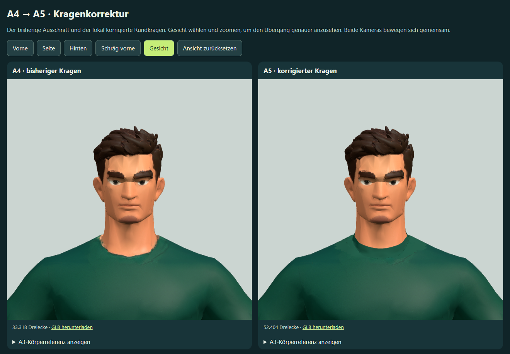

# A5 – lokaler Kragenabschluss

Auf die Rückmeldung zu den verbliebenen Ungenauigkeiten am Kragen wurde der Ausschnitt von A4 lokal korrigiert. Der gleichmäßige Rundkragen hat jetzt eine eigene Geometrie und ein mattes, aus dem vorhandenen Trikot abgeleitetes Material. Die hellen Hautflecken am Rand werden durch eine lokale Materialzuordnung entfernt. **0 zusätzliche Meshy-Credits**, kein weiterer Generierungsauftrag.

[A4/A5 vergleichen](http://127.0.0.1:4216/?a5-kragenvergleich). „Gesicht“ zeigt den Übergang in der Nahansicht; beide Modelle lassen sich gemeinsam drehen und zoomen. Die Offline-Datei liegt unter `outputs/spieler-a5-meshy-vergleich.html`. Der lokale Server liefert unter allen Query-Namen jeweils `outputs/spieler-neustart.html`, also die aktuelle Fassung.

## Änderung und Grenzen

`work/refine-a4-collar.py` liest die tatsächlich angebotene A4-GLB. Im Kragenbereich wurden vorhandene Flächen lokal unterteilt, damit die Materialgrenze kleinen Flächen folgen kann. 13.304 verfeinerte Flächen erhalten das saubere Kragenmaterial; außerhalb dieses Bereichs bleiben die vorhandenen Texturen erhalten. Das zusätzliche umlaufende Band besteht aus 128 Segmenten und sieben Reihen, insgesamt 768 Quads beziehungsweise 1.536 Dreiecken. Es folgt den lokalen Querschnitten, mit regelmäßigem Verlauf und einer kleinen Oberflächenanhebung; die seitliche Ausdehnung ist begrenzt. Es ist eine Oberflächengeometrie für die Modellstudie, kein geschlossenes Druckmodell.

Die bestehenden Körperpositionen bleiben erhalten; neue Unterteilungspositionen liegen auf der ursprünglichen Dreiecksoberfläche. Die wieder importierte GLB weicht bei der Prüfung der ursprünglichen Positionen und der eingefügten Oberfläche höchstens um etwa 0,000000203 m ab, bezogen auf 1,8 m Anzeigehöhe. Arm-, Bein- oder Halsproportionen wurden nicht neu rekonstruiert. Die bisherigen A4-Oberflächennormalen wurden auf die lokal verfeinerten Flächen interpoliert, damit der Hals seine glatte Schattierung behält.

Der Rand ist im tatsächlichen Front- und Schrägvergleich sichtbar sauberer; Seiten- und Rückenansicht wurden ebenfalls angesehen. Die neue Stofffläche ist gleichmäßiger als die generierte Textur und kann sich bei unterschiedlichem Licht leicht vom übrigen Trikot abheben. Gesichtsdetails, Trikotsaum und Stutzenfarbgrenzen sind weiterhin offene Qualitätsstellen. Die Nutzerabnahme des neuen Kragens steht aus; keine Aussage über Rigging oder Verformung bei Animation.

## Dateien und Prüfung

- Finale GLB: `meshy_output/player-a3-quality/player-a5-collar.glb`, 19.407.872 Bytes, 52.404 Dreiecke und 52.119 exportierte Vertices. Zwei Blender-Meshobjekte, zwei Materialien; im Browser drei Mesh-Primitives/Draws durch die Materialaufteilung. Drei eingebettete PBR-Bilder aus A4, kein Rig oder Bewegungsclip.
- Native Datei mit gepackten Texturen: `G:\Blenderassets\FM\Spieler-A3-Qualitaet-2026-10-02\Doppel6-A5-Kragen.blend`. Isoliert gespeichert, gerendert und wieder geöffnet; die vorherige A4-Datei bleibt erhalten.
- [Geometrie- und native Prüfung](asset-qa.json): endliche Positionen, erhaltene Körperoberfläche, erfolgreicher GLB-Rückimport und Wiederöffnen der Blender-Datei.
- [Browserprüfung](browser-qa.json): beide tatsächlichen Modelle geladen, fünf Ansichten und Zurücksetzen, gemeinsame Kamerasteuerung, vier vorhandene Körperreferenzen je Modell sowie bytegleicher A5-Download geprüft. Keine Browserfehler oder externen Anfragen; bei 844 × 390 und 390 × 844 kein horizontaler Überlauf. Software-WebGL in Headless Edge, keine Mobilhardware-Messung.

Die etwa 125 MB große eingebettete Offline-Vergleichsdatei und die lokal erhöhte Dreieckszahl dienen der Nahansichtsprüfung. Optimierung für das Spiel folgt nach der Modellabnahme. Keine Änderung an Match, gespeicherten Spielern oder Live-Version.

Reproduzieren: Blender isoliert mit `--background --factory-startup --python-exit-code 1 --python work/refine-a4-collar.py`; danach mit dem vorhandenen aktuellen Node-Runtime `work/generate-player-a2-study.cjs a5` und `work/check-player-a2-study.cjs a5`.
