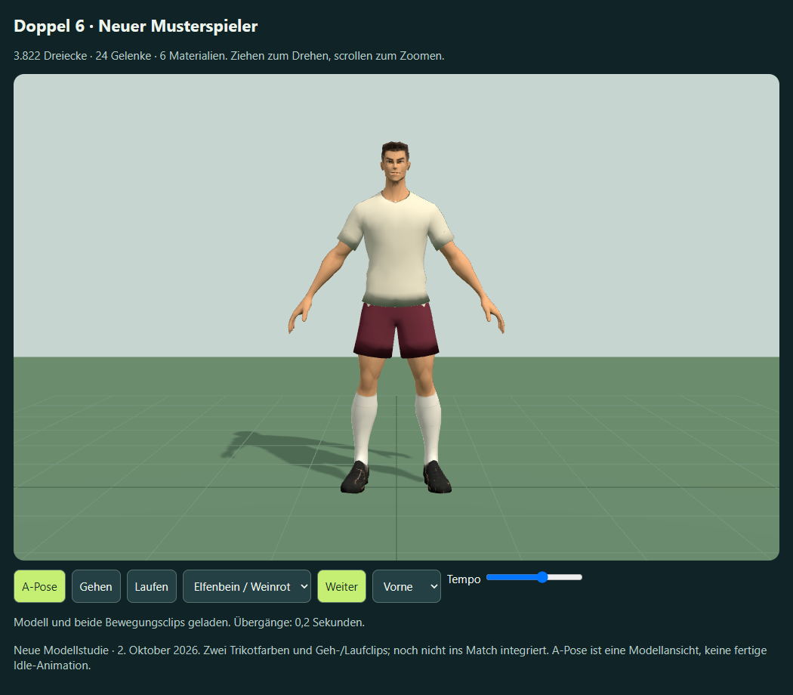

# Neuer Meshy-Musterspieler

Stand: 2. Oktober 2026. Erster ausgeführter Schritt der neu besprochenen Modellpipeline. Die Nutzeranweisung „starte damit“ bezieht sich auf den Plan, eine neue Referenz und einen einzelnen Musterspieler zu entwickeln. Die nutzende Person hat die Proportionen dieser Figur ausdrücklich zurückgewiesen. Dieser Versuch bleibt als verworfene Studie erhalten. Die anschließend ausgewählte Variante A wird als [neue Meshy-Fassung mit vier Blickwinkeln](../spieler-a-mehransichten/README.md) beurteilt.

## Ergebnis

- Neue einzelne A-Pose nach der Athleten-Konzepttafel, erzeugt mit dem eingebauten Imagegen-Werkzeug: [Referenz](referenz-a-pose.png).
- Neue texturierte Meshy-Figur: 3.822 Dreiecke statt angepeilter 3.500 (9,2 % darüber), 1,8 m, 24 Rig-Gelenke.
- Automatisches Rig mit enthaltenen Geh- und Laufclips; keine zusätzlichen bezahlten Animationen.
- Lokale Blender-Aufbereitung mit sechs festen Materialbereichen. Trikot und Hose wechseln zwischen Waldgrün/Marine und Elfenbein/Weinrot. Stutzen, Schuhe, Gesicht und Haare behalten in dieser Studie ihre Originaltextur. Die Zuordnung wird einmal beim Export erstellt; der Browser erkennt keine Kleidungsbereiche anhand von Farben oder Körperhöhen.
- Eigenständige Offline-Probe: `outputs/spieler-neustart.html`, mit Drehen, Zoomen, Vorder-/Seiten-/Rücken-/Gesichts-/Schuhansicht, Pause und Wiedergabetempo.

## Dateien und Herkunft

Meshy-Projekt: `meshy_output/20261002_215210_doppel-6-neuer-musterspieler_01a0fe2c`.

| Stufe | Ressource | Task-ID | Tatsächliche Credits |
| --- | --- | --- | ---: |
| Texturiertes Modell | image-to-3d | 01a0fe2c-6776-77c9-a044-fabe257e4585 | 15 |
| Rig, Gehen, Laufen | rigging | 01a0fe30-6f3d-707f-ba66-d9127ec6656d | 5 |

Summe dieses Durchlaufs: **20 Meshy-Credits**. Die Bildvorlage wurde über das eingebaute Imagegen erzeugt und ist kein Meshy-Task. Vor der Generierung meldete das Konto 4.070 Credits. Lokale Nachbearbeitung und Prüfungen verbrauchen keine Meshy-Credits.

Der erste API-Aufruf wurde wegen der für Smart Topology nicht unterstützten Option `remove_lighting` mit HTTP 400 abgelehnt. Die ursprüngliche Operation ist `rejected` mit `task_id: null`; es entstand kein Generierungsauftrag. Erst der korrigierte Auftrag lieferte die oben aufgeführte Modell-ID. Keine weitere kostenpflichtige Modellvariante wurde erstellt.

Im Projekt liegen Originalmodell `player.glb`, Original-Rig `rigged.glb`, `walking.glb`, `running.glb`, Preview und Task-Snapshots. Unter `prepared/` liegen das lokal aufbereitete `rigged.glb`, die beiden unveränderten Clips und die native Datei `Doppel6-Musterspieler.blend`. Eine Kopie der nativen Datei liegt gemäß Projektablage unter `G:\Blenderassets\FM\Meshy-Neustart-2026-10-02\Doppel6-Musterspieler.blend`.

## Prüfung und Grenzen

[Browsernachweis](browser-qa.json): 99 über die drei Ansichten/Clips verteilte Posen, endliche verformte Vertexpositionen, maximale Abweichung der Gewichtssumme 3,97e-8. Beide Farbvarianten ändern Trikot und Hose; die übrigen Materialfarben bleiben erhalten. Offline-Datei ohne externe Netzanforderungen oder Browserfehler; Bedienelemente und mobiles Querformat 844 × 390 geprüft. Zusätzlich besteht der bisherige Meshy-Viewer-Prüfer einschließlich schmaler 390-Pixel-Ansicht.

Vorder-, Seiten-, Rücken-, Lauf- und Gesichtsansichten wurden tatsächlich angesehen. Die neue Vorlage wurde in ein plausibles bewegliches Modell umgesetzt, erreicht aber noch nicht die Detailqualität der Konzeptzeichnung. Mundpartie, Gesicht und Kleidungssäume sind sichtbar zu grob. Die Materialgrenzen an Hals und Hosensaum benötigen manuelle Bereinigung; die automatische Flächenzuordnung ist eine Arbeitsgrundlage. Die Haarkategorie enthält noch keine vollständige austauschbare Frisur. Haut-/Gesichtsvarianten und sechs Vereinsmuster sind noch nicht umgesetzt.

Die Tests belegen keine fertige Fußballanimation oder mobile Bildrate. Standfußgleiten, Bremsen/Drehen, Pass-/Schusskontakt, Torwartaktionen, nahe TV-Matchkamera und zwölf Figuren auf echter Mobilhardware sind noch offen. Die neue Figur wurde nicht in die Matchgrafik übernommen und nicht veröffentlicht. Die vorhandenen Matchadapter und früheren Studien bleiben erhalten.

## Reproduzieren und weiterarbeiten

1. `work/prepare-player-neustart.py` in einem separaten Blender-Hintergrundprozess mit dem oben genannten Meshy-Projekt als Argument ausführen. Originale werden nur gelesen; Ergebnisse landen in `prepared/`.
2. `node work/generate-player-neustart.cjs` erzeugt die vollständig eingebettete Offline-Probe auf Basis des vorhandenen Viewer-Generators.
3. `node work/check-player-neustart.cjs` prüft die neue Probe und erstellt die Bildnachweise. Verwendet die vorhandene gebündelte Playwright-Laufzeit und Edge.
4. `node work/serve-player-neustart.cjs` öffnet einen lokalen Vorschau-Endpunkt unter `http://127.0.0.1:4216/`.

Nächste fachliche Entscheidung: Silhouette und Gesicht der tatsächlichen Figur anhand der drehbaren Probe beurteilen. Danach die akzeptierte Basis manuell an Gesicht und Materialnähten bereinigen und die ersten Fußballaktionen an dieselbe Figur anbinden. Zusätzliche Meshy-Generierungen sind dafür bisher nicht beauftragt.

Bildprompt und Parameter: [generierung.json](generierung.json). API-Kostenschätzung vor Auftrag anhand der [Meshy-Preisliste](https://docs.meshy.ai/en/api/pricing), gelesen am 2. Oktober 2026: Smart Topology/meshy-t2 mit 2K-Textur 15 Credits, Rigging 5 Credits. Die fertigen Tasks bestätigen diese Summe.
