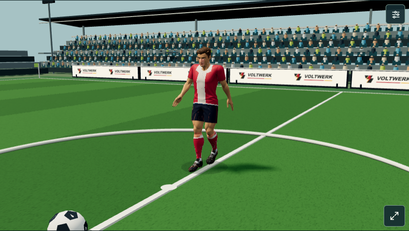
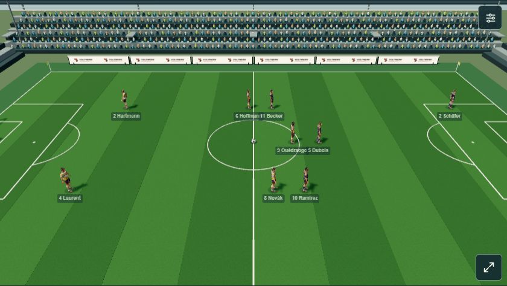
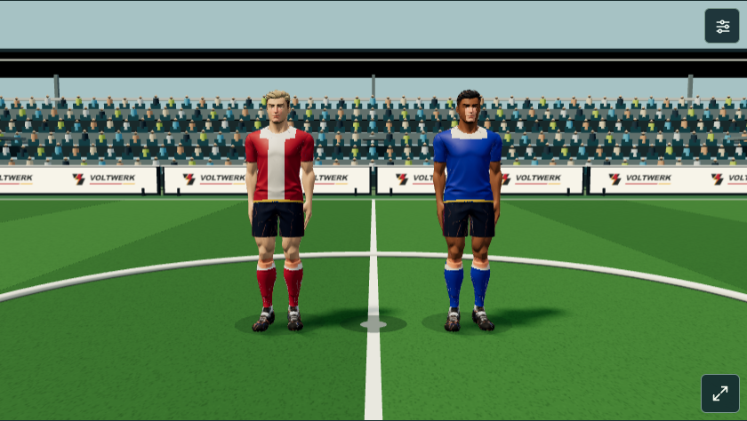
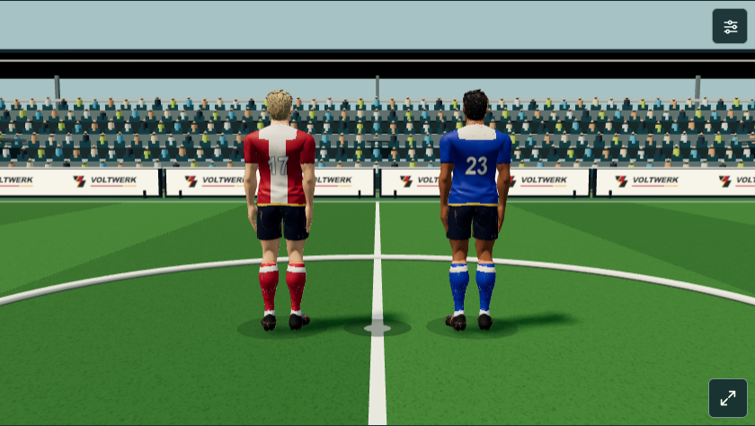
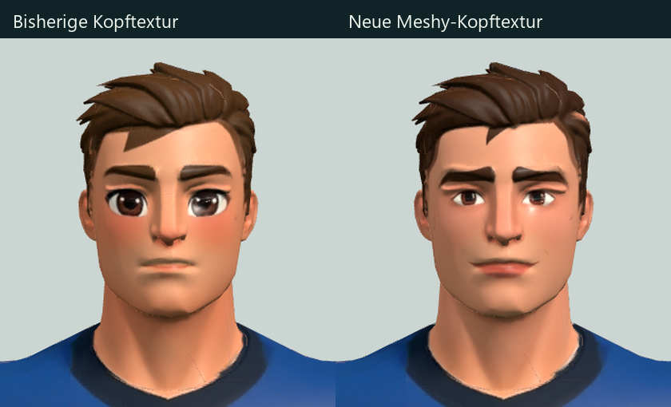
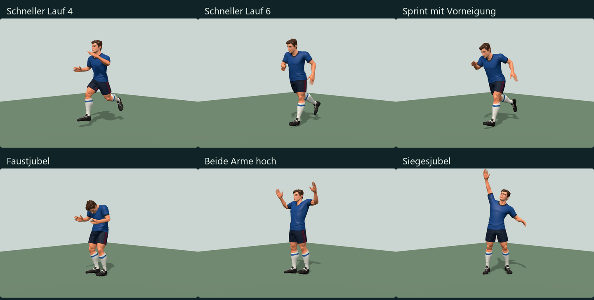
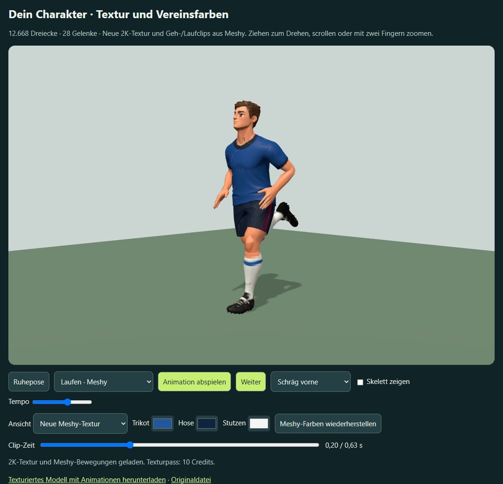
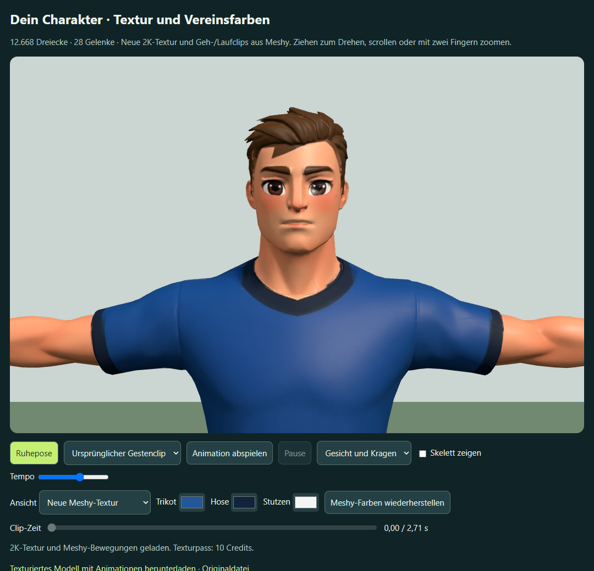
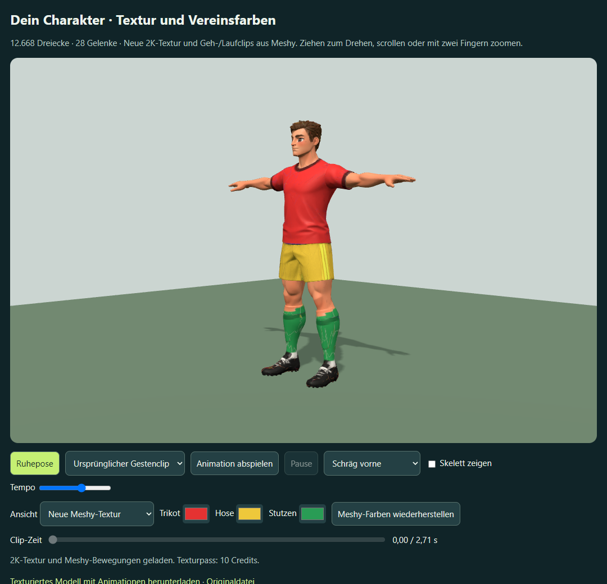

# Nutzercharakter mit Meshy-Textur und Bewegungen im Match

Aktueller Stand für Prototyp 107: Meshy-Rig `football-v130.glb` mit 34 Clips und Matchkorrekturen bis v133. [Systemdokumentation](../3d-system.md), [Veröffentlichung und Nachweise](../release-107.md). Die folgenden lokalen Beschreibungen dokumentieren ihre damaligen Zwischenstände.

Aktueller lokaler Stand v127: ruhigeres Dribbling, native direkte Bodenpässe/-schüsse, erreichbares Keeper-Herauslaufen, Ausprüfung beim Ballführen und Saisonstatistik im Spielerprofil. [Änderungen, Dateien und Prüfungen v127](changes-v127.md). Bestehende 32 Meshy-Clips, keine weiteren Credits oder Veröffentlichung; Altstände werden nicht nachberechnet.

Aktuelle lokale Korrektur: [Höhere Abwehr und Elfmeter-Schussbutton v126](changes-v126.md), mit ballabhängigem Abwehrblock, Deckung ohne untätige Abseitsläufer und bedienbarem Elfmeterschießen. Native Szenen, zwei vollständige 3D-Partien, 2D-/3D-Vergleich und echtes Speichern/Laden geprüft; noch nicht veröffentlicht.

Aktuelle lokale Verfeinerung: [Ruhigere Schritte und Richtungswechsel v125](changes-v125.md), mit weicheren Fußbindungen und sanfteren Lauf-Drehübergängen am bestehenden Meshy-Rig. 32 Clips, 0 neue Credits; Vergleichsszenen und vollständige Matchabnahme, noch nicht veröffentlicht.

Aktueller lokaler Matchblock: [Laufziele, Abseits, Grätschen, Torwart-Nachstellschritte, Paraden und Ballaufsprung v124](changes-v124.md). 32 bestehende Meshy-Clips, keine zusätzlichen Credits; direkt aufgestellter zweiter Anstoß und native Bewegungsprüfungen im regulären Offline-Spiel.

Die nutzende Person hat den selbst in Meshy geriggten Charakter als neue Grundlage ausgewählt und ausdrücklich Meshy für die Animationen vorgegeben. Die hochgeladene Datei `C:\Users\alex\Downloads\Meshy_AI_Stilisierter_Fußball_Charged_Spell_Cast.glb` wurde unverändert gesichert. Der aktuelle Charakter besitzt **32 Clips**. Die letzte Erweiterung der Clip-Datei ergänzt zwei Meshy-Foulreaktionen für tatsächlich **6 Credits** und eine wiederverwendete, gekürzte Standbewegung. Der lokale Ausbau v115 verwendet diese vorhandenen Clips ohne zusätzliche Credits.

## Fußballentscheidungen und Abläufe v115 – 4. Oktober 2026

Passspiel und Technik beeinflussen das Abspielen zum besser postierten Mitspieler; Stellungsspiel beeinflusst Lauf-Timing, Abseitsrisiko und Deckungsabstand. Überlaufene Verteidiger verfolgen vorwärts, Torhüter kommen im Strafraum mit begrenztem bodennahen Zugriff entgegen. Meshy-Stopp geprüft, Anstoß/Bodenabstoß/Einwurf korrigiert, einhändige Paraden und Abpraller integriert; Tempo, Kopfballreichweite, Fehlschussstreuung, Torquerungen und freie Luftballlandung abgestimmt. [Änderungen, Dateien und Prüfbelege](changes-v115.md). Dieselben 32 Meshy-Clips, 0 neue Credits; reguläres lokales Offline-Spiel, noch nicht veröffentlicht.

## Warping im laufenden Spiel v114 – 4. Oktober 2026

Spieler laufen in Eckball- und Anstoßformationen; Ballbesitz, Flug, Fanghöhe und sichtbare Kontaktpunkte bleiben beim Bildwechsel konsistent. Grätschen und native Keeperreaktionen wechseln weich, ausgegangene Flanken laufen vor dem Abstoß weiter. [Änderungen, Dateien und Prüfgrenzen](changes-v114.md), [Baseline](warping-baseline-v114.json), [Matchmessung](warping-qa-v114.json), [Torwartübergänge](warping-contacts-v114.json) und [Prüfläufe](gates-v114.json). Reguläres lokales Offline-Spiel; 0 weitere Credits, keine Veröffentlichung.

## Kontaktkorrektur und Abwehrlinie v113 – 4. Oktober 2026

[Reguläres Offline-Spiel](../../outputs/Doppel-6-Fussballmanager.html) und [Bewegungsprobe](../../outputs/spieler-nutzer-bewegungsprobe.html) verwenden die neue Fassung. Ballannahmen behalten ihre Schritte und zeigen den Ball vor der Bewegung; entspannter Stand, Paraden von der tatsächlichen Torwartposition, Fangpunkt vor dem Torwart und auslaufende Fehlschüsse sind integriert. Fouls benötigen reale Reichweite und zeigen Fallen, Abfangen und Aufstehen am Kontaktort. Die Abwehr rückt bei eigenem Ballbesitz auf und bleibt gegen den Ball stärker an die taktische Linie gebunden. Beide Teams verwenden dieselben Regeln.

[Änderungen, Dateien, Downloads und Prüfgrenzen](changes-v113.md), [Kontaktbelege](contact-qa-v113.json), [Fangen/Fouls/Taktik](flow-qa-v113.json), [Torwartposition und Fehlschüsse](keeper-origin-misses-qa-v113.json), [Prüfläufe](gates-v113.json). Keine Veröffentlichung oder Spielstandumrechnung; die folgenden Abschnitte beschreiben frühere Stände.

[Aktuelle lokale Matchprobe öffnen](http://127.0.0.1:4216/?nutzercharakter-match&bewegung=v112). Startet eine eigene Testpartie mit zehn Feldspielern und beiden Torhütern auf Basis des neuen Charakters. Die aktuelle Offline-Datei liegt unter `outputs/spieler-nutzer-match.html`. Die separate Kopf-/Animationsprobe bleibt unter `outputs/spieler-nutzer-kopftextur.html` erhalten, einschließlich Vorher/Nachher, neun Clips, Stofffarbreglern und GLB-Download. Frühere Proben ebenfalls separat; der lokale Server liefert jeweils die neueste Probe über `outputs/spieler-neustart.html` (alle Query-Varianten zeigen diesen neuesten Stand).

## Reguläre 3D-Integration und Animationskorrektur v112 – 4. Oktober 2026

Die reguläre lokale Fassung verwendet jetzt den ausgewählten Meshy-Charakter für alle zwölf Spieler und sämtliche bisher angebundenen Bewegungen. Quellseite `dist/index.html` und normale Offline-Datei `outputs/Doppel-6-Fussballmanager.html` laden dieselbe Modellfabrik, ohne Testkarriere oder neue Speicherkennung. Die Matchprobe ergänzt ausschließlich ihren Teststart; die [Bewegungsprobe](http://127.0.0.1:4216/?bewegungsprobe=1&bewegung=v112) verwendet dieselbe Basis und nun 27 Situationen. **Keine neuen Meshy-Credits und kein Release.**

Reproduziertes Rückwärtslaufen mit Ball wurde korrigiert: Ballführer folgen der Bewegungsrichtung, behalten keine Defensiv-Rückwärtsgewichte und drehen sich im Stand nicht ihrem eigenen Ball nach. Zwölf gezielte Fälle bei 30/60/120 Hz, stabile Pause und 3600 Bilder der tatsächlichen Match-Renderkette bestehen; im geprüften Abschnitt keine falsche Ballführungsrichtung mehr. Defensive Rückwärtsbewegungen ohne Ball bleiben erhalten. Der normale Build enthält alle Assets offline; Laden und absichtlich fehlende Dateien verbrauchen keinen Simulationszufall und führen keine Speichermigration durch.

Auch Kopfballklärungen starten jetzt am tatsächlichen Kontakt statt an der entfernten Zielposition. Neue Abflugrichtung, Luftweg ohne Bodenaufnahme und kontinuierliches Weiterrollen sind integriert; hohe Ausbälle behalten beim Eckballnachlauf ihre Flugbewegung. Dies betrifft zukünftige Ereignisse gemeinsam in 2D/3D, ohne alte Ergebnisse oder Spielstände umzurechnen.

[Alle Änderungen, betroffene Dateien und Prüfgrenzen](changes-v112.md), [Baseline](animation-audit-baseline-v112.json), [korrigierte Matchbilder](animation-audit-qa-v112.json), [Quell-/Offline-/Fehlerfall](model-integration-qa-v112.json), [Ballbewegung](ball-motion-qa-v112.json), [Matchvergleich](regression-v112.json) und [Bedienung](motion-lab-qa-v112.json). Die folgenden Abschnitte dokumentieren die vorangegangenen Ausbaustufen mit den damaligen Integrationsgrenzen.

## Ballaktionen, Paraden und Ballmaßstab – lokale Fassung v111

Die Meshy-Aufgabe `01a103be-1bae-748f-aff4-9a9f744b8695` verwendet das vorhandene Rig und ergänzt Male Bend Over Pick Up (276), Jump to Catch and Fall (419), Leap Right and Catch (465) sowie Stand Up 1 (344). Das Asset enthält 29 Clips, auch die zuvor bewahrte Zaubergeste und die ungenutzte zweite Standvariante; nicht alle sind Fußballaktionen. [Asset und tatsächliche Kosten](ball-actions-assets-v111.json), [native Datei mit 29 Aktionen und gepackten Texturen](ball-actions-native-qa-v111.json). Datei: `meshy_output/user-character-2026-10-03/character-football-v111.glb`; Blender: `G:\Blenderassets\FM\Nutzercharakter-2026-10-03\Doppel6-Nutzercharakter-Meshy-Ballaktionen-Torwart.blend`.

`dist/player-user-ball-actions-v111.js` verbindet die bestehenden Laufclips mit kurzen abwechselnden Dribbelkontakten. Kurzpass, Flanke und Fußannahme verwenden angepasste Ausschnitte des Fußballschusses 410 mit unterschiedlichen Gewichten, Kontaktkorrektur und vollständigem Ausklang. Es wurden dafür keine eigenständigen Pass-/Dribbelclips von Meshy erzeugt. `player-ball-events-v111.js` setzt flüchtige Empfangsposen bei tatsächlichem Ballbesitzwechsel. Hohe Brust-/Kopfannahmen, Kopfball, Grätsche und weitere bestehende Aktionsposen bleiben prozedural. Bestehende Lauf-, Rückwärts-, Brems-, Stand-, Schuss- und Jubelbewegungen bleiben integriert.

Torhüter zeigen bodennahe, hohe und seitliche Fangbewegungen; die linke Parade spiegelt Gelenkpaare, die bodennahe Seitenparade ergänzt eine Ganzkörperneigung. Die Fanghände werden zum dokumentierten Kontaktpunkt geführt. Nach einer Abwehr verfolgen sie nicht den wegfliegenden Ball. Gehaltene Bälle liegen zwischen beiden Händen, der Blick folgt ihnen. Hohe Paraden gehen ins Aufstehen über; vor dem Abschlag gelangt der Ball aus den Händen zum Fuß. Die Posekorrekturen laufen im Browser und sind nicht in die herunterladbaren Meshy-Clips gebacken.

Der Ball hat nun einen sichtbaren Radius von 0,1764 statt 0,252, also **30 % weniger Durchmesser als die vorherige Probe**. Sein Durchmesser beträgt ungefähr ein Achtel der stehenden Spielerhöhe. Schatten, wegabhängige Rollrotation, 2D-, Tor- und Elfmeterszenen folgen der Verkleinerung. Flugwege und Matchentscheidungen werden dafür nicht umgerechnet. Kontaktprüfungen verwenden den neuen Radius; alle vier geprüften Fangposen berühren den kleineren Ball mit beiden verformten Handschuhgeometrien.

Die [Bewegungsprobe](http://127.0.0.1:4216/?bewegungsprobe=1&bewegung=v111) umfasst 26 Situationen mit Zeitlupe, drei Ansichten, Pause und GLB-Download. [Posen und Fangkontakte](ball-actions-qa-v111.json), [Empfang, Halten/Loslassen und Abpraller](ball-events-qa-v111.json), [Bedienung](motion-lab-qa-v111.json), [Modell und Ballmaßstab](match-browser-qa-v111.json), [Lokomotion](locomotion-qa-v111.json), [Roll-/Blockkontakt](ball-motion-qa-v111.json) und [acht Eckballfälle](corner-ball-qa-v111.json) prüfen die Integration. Der [vollständige Matchvergleich](regression-v111.json) endet nach 2909 Schritten identisch 1:0; Offline-/Lifecycle-Gates und [Wiederholungen](replay-qa-v111.json) bestehen. Kopfballkontakt wurde für den kleineren Ball angepasst und liegt im geprüften Fall 0,155 vom Ballzentrum entfernt, innerhalb des Radius 0,1764. Handschuhe bleiben einfache Skinformen; langsames Gehen, kontinuierliche künstlerische Bewegungsabnahme und echte Mobil-Hardwareleistung bleiben offen. Die neue Figurenfabrik bleibt eine lokale Probe; Live-Version 105 wird nicht geändert.

Auf Wunsch wurde das detaillierte Briefing zusätzlich an den Meshy-Agenten im bestehenden Fußballspieler-Chat geschickt: gezielte Katalogsuche nach fehlenden Fußballclips, Erhalt des Rigs und der Texturen, vollständige Kontakt-/Ausklangphasen und kleiner separater Ball. Bereits vorhandene Clips sollen nicht erneut erzeugt werden. Seine Katalogsuche bestätigt die fehlenden eigenständigen Dribbel-/Pass-/Annahmeclips und empfiehlt Laufclip plus Fußkorrektur. [Briefing, Antwort und vorgeschlagene Torwart-Alternativen](meshy-agent-v111.md). Keine weitere kostenpflichtige Animation aus dieser Anfrage.

## Stand, Schuss, Torhüter und rollende Abpraller – lokale Fassung v110

Meshy-Aufgabe `01a10392-b967-7448-ab3e-cb01e1873276` verwendet das vorhandene Rig und die Aktionen 11, 12 und 410: zwei Standvarianten und „Kick a Soccer Ball“. Die erste Standvariante wird für Feldspieler und Torhüter verwendet; die zweite hebt die Arme und bleibt deshalb lediglich im Asset verfügbar. Bremsen und Fußanker laufen weiter; auch Rumpf und Arme folgen im Stand dem vollständigen Meshy-Clip. Der Fußballschuss hat eine kurze Vorbereitung, Kontakt bei Clipsekunde 0,49, vollständigen Nachschwung und 0,22 Sekunden Übergang zurück zur Lokomotion. Der grafische Schuss dauert 0,95 Sekunden, ohne die Enginezeit anzuhalten. Andere Ballaktionen und Torwartparaden verwenden weiterhin die vorhandenen prozeduralen Bewegungen.

Beide Torhüter verwenden nun denselben texturierten 28-Gelenk-Charakter, ihr tatsächliches Torwarttrikot und einfache skinnierte Handschuhkörper. Der Hals-/Kopfblick wirkt auf das ausgegebene Skin-Skelett; die Ballposition bei gehaltenen Bällen nutzt den tatsächlichen Handknochen. Geometrie und PBR-Texturen werden weiterhin geteilt, zwölf Skelette bleiben unabhängig. Handschuhe sind noch einfache Formen; eine feine Finger-/Fanghandmodellierung und Mobil-Leistung bleiben offen.

Freie Bälle übernehmen die horizontale Geschwindigkeit ihres ankommenden Fluges, rollen anschließend mit kontinuierlicher Reibung weiter und können erst beim tatsächlichen Linienübertritt einen Standard auslösen. Spieler verfolgen den bewegten Ball. Ein abgewehrter Flug beginnt jetzt am dokumentierten Kontaktpunkt und mit der ankommenden Ballhöhe. Geplante Feldspielerblocks bewegen den Abwehrspieler rechtzeitig zur Bahn und zeigen die Blockpose vor Kontakt. Kandidaten müssen erreichbar sein; bei verfehltem Kontakt entsteht kein künstlicher Abpraller. Die Ballrotation folgt dem zurückgelegten Weg, Pause hält sie an. Ein daraus entstehender Eckball behält den bisherigen sichtbaren Nachlauf.

Dies ändert zukünftige Vereinswelt-Partien: neue freie Bälle speichern `rebound.vx/vy` in Simulationssekunden, ältere freie Bälle ohne diese Felder werden nicht umgerechnet. Erreichbarkeit und verfehlte Blocks ändern gegebenenfalls neue Matchentscheidungen. Historische Ergebnisse werden nicht nachberechnet. Die gemeinsame Engine bleibt für 2D und 3D identisch; die neue Figurenfabrik bleibt auf die lokale Probe begrenzt.

[Assetnachweis](stance-shot-assets-v110.json), [wieder geöffnete native Blender-Datei](stance-shot-native-qa-v110.json), [Oberkörper/Schuss/Rückkehr/Torwartblick](player-completion-qa-v110.json), [Rollweg und tatsächliche Skin-Kontakte](ball-motion-qa-v110.json) und [Bedienung](motion-lab-qa-v110.json) dokumentieren die Prüfung. Der Rolltest bewegt sich in 0,2 Sekunden nach dem früheren Endpunkt um 2,83 m weiter; die beiden geprüften Blocks treffen das Skin innerhalb des Ballradius. Ein absichtlich entfernter Verteidiger erzeugt keinen Abpraller. Lokomotion und acht Eckballfälle bestehen ebenfalls. Die [vollständige 2D-/3D-Regression](regression-v110.json) prüft identische Matchdaten, Offlinebetrieb und Bedienung; [Wiederholungen](replay-qa-v110.json) separat.

Aktuelles Asset: `meshy_output/user-character-2026-10-03/character-football-v110.glb`. Native Datei: `G:\Blenderassets\FM\Nutzercharakter-2026-10-03\Doppel6-Nutzercharakter-Meshy-Stand-Schuss.blend`, 25 Aktionen, alle Texturen gepackt. [Bewegungsprobe mit Stand, Schuss und Torwartblick](http://127.0.0.1:4216/?bewegungsprobe=1&bewegung=v110). Kein Release; Live-Version bleibt 105. Die folgenden Abschnitte beschreiben die früheren Ausbaustufen.

## Ballnachlauf bei Eckbällen – 3. Oktober 2026

In der aktuellen [Matchprobe](http://127.0.0.1:4216/?nutzercharakter-match) bleibt der Ball nach einem zur Ecke führenden Ausball zunächst auf seiner bisherigen Bahn. Flache Bälle rollen gebremst weiter, hohe Bälle behalten ihre vertikale Endgeschwindigkeit und fallen auf den Boden. Der Nachlauf dauert regulär 0,85 Sekunden, anschließend blendet der Ball aus und an der Ecke wieder ein. Seine Versetzung erfolgt während einer kurzen vollständig unsichtbaren Phase. Ball und Schatten blenden gemeinsam; 2D und 3D lesen dieselbe flüchtige Darstellungsbahn. Das Eckballbanner erscheint zur bestehenden Entscheidung, die zweisekündige Wartezeit und Eckballausführung bleiben unverändert.

`dist/world-corner-ball-v109.js` hält den tatsächlich beendeten Flug samt Darstellungskurve bis zum Eckball-Callback fest und speichert den Nachlauf ausschließlich in einer WeakMap. Die horizontale Geschwindigkeit ist auf 18 m/s begrenzt, damit sehr kurze Engineflüge den Ball nicht weit in die Tribüne schicken. Die Zeit folgt derselben pausierbaren Grafikuhr wie die Spieler. Neue Standards, ausgeführte Ecken, beendete Partien und andere Matchinstanzen verwenden diesen Nachlauf nicht. Kein neuer Zufall, keine Match-/Speicherfelder, keine Zusatzwartezeit und keine weiteren Meshy-Credits.

[Acht reale Eckball-Callbacks geprüft](corner-ball-qa-v109.json): beide Teams, beide Halbzeitdarstellungen, abgefälschte und hohe Bälle, identischer Beginn am bisherigen Flugende, weiterer Weg über die Torlinie, unsichtbare Versetzung, Wiedereinblendung, unveränderte Standardwartezeit, Pause und 2D-Koordinaten. Nach der Ausführung ist die neue Flugbahn wieder maßgeblich. `work/check-corner-ball-v109.cjs` prüft außerdem, dass die Darstellung keine Enginewerte verändert. Vollständige Match-/Offline- und Wiederholungsprüfungen stehen im ergänzenden [Regressionsnachweis](corner-regression-v109.json). Lokaler, unveröffentlichter Stand.

## Laufkontakt, Rückwärtslaufen und Torwartblick – 3. Oktober 2026

[Bewegungsprobe öffnen](http://127.0.0.1:4216/?nutzercharakter-bewegung-v108&bewegungsprobe=1): 16 Situationen, normales Tempo/Zeitlupe, drei Blickwinkel, Pause, Neustart und GLB-Download. Die separate Offline-Datei ist `outputs/spieler-nutzer-bewegungsprobe.html`. [Matchprobe](http://127.0.0.1:4216/?nutzercharakter-match) enthält dieselbe Lokomotion für alle zehn Feldspieler; Torhüter behalten ihr bisheriges Modell. Die erste Matchfassung bleibt unter `outputs/spieler-nutzer-match-v107.html` erhalten. Die lokale Probe ist nicht veröffentlicht.

### Meshy-Aufgaben und Dateien

Das vorhandene API-Rig `01a10156-b12b-74d3-baef-6e0b4054a2b9` wurde wiederverwendet. Zwei erfolgreiche `animate`-Aufgaben im bestehenden Projekt `meshy_output/20261003_123727_nutzercharakter-fussball-beweg_01a10156`:

- `01a10348-ae94-7154-8ad1-f8c9713828bb`: Idle, Sprintbremse, Lauf-/Geh-/Standdrehungen links/rechts und scharfe Rechtswende; neun Clips, tatsächlich **27 Credits**.
- `01a1035c-d78d-70e0-b91c-c8372adcee0d`: gerades und beidseitig diagonales Rückwärtslaufen sowie kurzer Rückwärtsschritt; vier Clips, tatsächlich **12 Credits**.

Dieser Ausbau verbraucht **39 zusätzliche Credits**. Frühere Kopf- und Bewegungsaufgaben bleiben getrennt dokumentiert. Die Provider-Clips werden anhand der Bindematrizen auf das bestehende 28-Gelenk-Rig übertragen. Laufbewegung auf der Stelle und bereinigte Provider-Wurzeldrehung verhindern doppelte Wege/Drehungen. Neue zyklische Clips erhalten einen kurzen Schleifenübergang; die ursprünglichen neun Clips, Geometrie, Rig und Texturen bleiben erhalten. [Herkunft, Clipnamen, Kosten und SHA-256](locomotion-assets-v108.json).

Aktuelle GLB: `F:\Neuer Ordner (2)\ChatGPT\Fussballmanager\meshy_output\user-character-2026-10-03\character-locomotion-v108.glb`. Separate gepackte Blender-Datei: `G:\Blenderassets\FM\Nutzercharakter-2026-10-03\Doppel6-Nutzercharakter-Meshy-Lokomotion.blend`; [Wiederöffnen, 22 Actions und 28 Knochen geprüft](locomotion-native-qa.json). Die folgenden Laufzeit-Korrekturen sind Appcode und werden nicht in den GLB-Download oder die Blender-Actions gebacken.

### Laufzeit und Spielverhalten

`dist/player-user-motion-v108.js` ergänzt den optionalen Adapter. Die Clipphase folgt dem tatsächlich zurückgelegten Weg und kalibrierten Schrittlängen; Geh-/Lauf-/Sprintgewichte und Übergänge sind geglättet. Fußkontakte werden am verformten Skin kalibriert. Standfüße erhalten flüchtige Weltanker, zweigliedrige Beinberechnung und begrenzten vertikalen Hüftausgleich. Die Rückführphase löst diese Anker und hebt den Fuß kurz an. Ballaktionen, Grätsche, Jubel, große Positionssprünge und Seitenwechsel lösen die Korrekturen sofort. Pause hält Phase und korrigierte Pose. Spielerroot, Kontaktzeiten und Ballwege bleiben maßgeblich.

In der Vereinswelt weichen Abwehrspieler rückwärts zurück, wenn sie zwischen eigenem Tor und einem nahen Angreifer stehen und ihre Bewegung vom Angreifer weg zum Tor führt. Sie schauen zum Angreifer und laufen mit **60 % des Vorwärtstempos**. Beim Verfolgen eines Gegners, nach dessen Vorbeilaufen, bei Ballbesitz und in unterbrochenen Spielsituationen greift die Regel nicht. `dist/world-backpedal-v108.js` wird im gemeinsamen Bewegungsschritt aufgerufen: dieselbe Geschwindigkeitsregel in 2D und 3D, einschließlich diagonaler Varianten. Bewegungsmetadaten liegen ausschließlich in einer WeakMap; keine neuen Speicherfelder oder rückwirkende Berechnungen.

Torhüter richten ihre Grundrichtung auch im Stand zum Ball aus; der Hals verfolgt zusätzlich seitliche und hohe Bälle innerhalb begrenzter Drehwinkel. Paraden-/Abspielposen bleiben maßgeblich. Die Blickbewegung wird geglättet und hält bei Pause. Der Ball ist visuell **10 % kleiner**: 3D-Meshmaßstab 0,9 und effektiver Radius 0,252 m, 2D-Radius 5,4 statt 6, Elfmeteranzeige 28,8 statt 32 Pixel. Ballroot und Flugbahnen werden nicht skaliert.

Defensivtempo, Torwartblick und Ballgröße gehören auch zum unveröffentlichten normalen Build. Der neue Meshy-Charakter und die Bewegungsprobe werden weiterhin nur lokal eingebettet. Die frühere Sechserliga erhält keine neue Rückwärtsregel; bestehende Karrieren werden nicht umgerechnet.

### Prüfungen und Grenzen

[Sohlen-/Bewegungsprüfung](locomotion-qa-v108.json) und [vorherige Baseline](locomotion-baseline.json): 56 echte Skinpunkte je Schuh, gerade Bewegung, Anlaufen/Bremsen, Links-/Rechts-/180°-Drehungen, Standdrehungen und vier Rückwärtsvarianten; zusätzliche Laufprüfung bei 30/120 Hz. Die getesteten Lokomotionssohlen bleiben oberhalb der Rasenoberkante von ca. 0,105 m. Pause ist exakt stabil; Ballaktions-/Teleportfreigabe und unveränderte Matchdaten bestehen. Alle 13 neuen Clips werden in den Szenarien tatsächlich gewichtet.

Für den fairen Vorher/Nachher-Vergleich misst `nearGroundSlip` beide aufeinanderfolgenden Fußproben unter 0,15 m. Mittelwerte in m/s:

| Situation | Vorher | Jetzt |
|---|---:|---:|
| Gehen | 0,333 | 0,514 |
| Laufen | 2,165 | 0,551 |
| Sprint | 4,016 | 0,462 |
| Anlaufen/Bremsen | 0,865 | 0,443 |

Laufen, Sprint und Bremsen verbessern diese Messung; langsames Gehen bleibt eine offene Feinabstimmung. Der gesonderte Wert `meanStanceSlip` während aktiver Fußanker beträgt bei Gehen/Laufen/Sprint etwa 0,038/0,111/0,132 m/s, ist wegen seiner anderen Stichprobenauswahl aber **nicht direkt mit der Baseline vergleichbar**. Rückführung, Ankerwechsel und Übergänge können weiterhin kleine Rutsch-/Poseeffekte zeigen. Keine vollständige Standfuß- oder künstlerische Freigabe.

[Echte Defensiv-/Torwart-/Ballprüfung](defensive-match-v108.json): Rückwärtsfaktor im tatsächlichen Bewegungsschritt ca. 0,600, korrekte projizierte Blickrichtung, Torwartblick vor/rechts/links/hinten/hoch mit Richtungsübereinstimmung über 0,999, Pause stabil, Grafik verändert keine Matchdaten. Node-Test `work/test-defensive-motion-v108.cjs` prüft beide Mannschaften und Ausnahmen. [Bedienung, Pause, bytegleicher GLB-Download und mobiles Querformat ohne Überlauf](motion-lab-qa-v108.json).

[Aktuelle gezielte Matchprüfung](match-browser-qa.json): Ballaktionsposen, Jubelmannschaft, geteilte Geometrie/4K-Texturen, getrennte Skelette, Entsorgung und Neuaufbau bestehen. Der Kopfballabstand zur Ballmitte bleibt ca. 0,286 m und liegt damit nach der Verkleinerung etwa 3,4 cm außerhalb des sichtbaren Ballradius; das bestehende 0,34-m-Kontaktgate ist gröber. Eine spätere Kontakt-Feinabnahme darf diesen Restabstand nicht als exakten Hautkontakt ausweisen.

[Aktuelle Matchregression](locomotion-regression-v108.json): Seed 12345, **2992 Schritte**, identische 2D-/3D-Zeitlinie, **1:1**, Tore, Ereignisse, Wechsel, Statistiken und Ergebnisbuchung. Banner, Pause, Abseits, Elfmeter, Halbzeit/Abpfiff, Gerätewechsel, Kontextverlust, Verlassen/Speicher und Offline-Audio bestehen. [Torwiederholung separat geprüft](locomotion-replay-v108.json): beide Teams/Halbzeiten, stehende Berechnung, sichtbare Wiedergabe, Pause und Elfmeter. Software-WebGL; kontinuierliche Nutzerabnahme und Leistung auf echter Mobilhardware bleiben offen.

Reproduktion mit vorhandenen Assets ohne weitere Credits: `node work/prepare-user-locomotion-v108.cjs`, `node work/calibrate-user-locomotion-v108.cjs`, `node work/build.cjs`, `node work/generate-user-meshy-match.cjs`. Prüfungen: `work/check-user-locomotion-v108.cjs`, `work/test-defensive-motion-v108.cjs`, `work/check-defensive-match-v108.cjs`, `work/check-user-motion-lab-v108.cjs`, `work/check-user-meshy-match.cjs` und die unten genannten Match-/Replay-Wrapper.

## Erste Match-Anbindung v107 – Verlauf vom 3. Oktober 2026

Alle zehn Feldspieler verwenden den ausgewählten Charakter mit neuer Kopftextur und eigenem 28-Gelenk-Rig. Torhüter behalten das bestehende Modell und ihre geprüften Bewegungen. Vereinsfarben, Trikotmuster, Stutzen, Rückennummern sowie Haut-/Haarfarbstufen stammen aus den vorhandenen Matchdaten. Die Frisurform und Gesichtsanatomie bleiben bei dieser ersten Anbindung die des Nutzercharakters; noch keine Umsetzung aller gespeicherten Frisur-/Gesichtsformen.

Meshy-Gehen, Schneller Lauf 6, Schneller Lauf 4 und Sprint mit Vorneigung werden abhängig von der geglätteten Geschwindigkeit gewichtet. Die Clipphase folgt dem Bewegungsweg mit unterschiedlichen Schrittlängen. Der Spielerroot folgt weiterhin ausschließlich den projizierten Enginepositionen. Bereitschaft/Stillstand nutzt die bestehende prozedurale Standpose; kein neues Meshy-Idle erzeugt. Pass, Schuss, Volley, Kopfball, Einwurf und Grätsche verwenden die bestehenden Aktionsposen auf dem neuen Skin. Dadurch bleiben Kontaktzeitpunkte und tatsächliche Spieler-/Ballwege maßgeblich.

Nach einem bestätigten Tor spielen nur die Feldspieler der erfolgreichen Mannschaft ihre deterministisch gewählte Faust-, Arm- oder Siegesjubelbewegung. Die Jubelzeit kommt aus der bestehenden Torpause und wird mit demselben Grafikpuffer interpoliert. Pause hält sie an; Wiederholung, neuer Anstoß oder neue Ballaktion beenden beziehungsweise ersetzen sie. Die vorhandene Torpausenlänge bleibt maßgeblich: der längere Siegesclip wird am Übergang zur Wiederholung/Spielaufnahme unterbrochen. Keine Verlängerung der Spielunterbrechung und keine neue Simulation.

`dist/player-user-meshy-v107.js` ist ein optionaler Adapter und wird nur in diese lokale Probe eingebettet. Eine Geometrie, die 4K-Farbkarte und übrige PBR-Karten werden geteilt; Skeleton und Mixer gehören zum einzelnen Spieler. Die bestehende Spielerfabrik, Aktionsgruppen und Szenenentsorgung werden wiederverwendet. `world-pitch3d-v98.js` ergänzt ausschließlich Tor-Metadaten im Grafikbild und einen optionalen Aufruf nach den Aktionsposen; `pitch-motion-v102.js` interpoliert die Jubelzeit ohne Snapshotänderung. Bei Wechseln stoppt der Mixer, das Rig wird entsorgt und die letzte Ressourcenreferenz gibt die gemeinsamen GPU-Ressourcen frei.

Die Probe nutzt `sechser.world.user-meshy-v107` / `doppel6-world-user-meshy-v107`, getrennt von bestehenden Karrieren und früheren Proben. Automatischer Start ist eine flüchtige Testpartie; Speichern in dieser Probe bleibt im separaten Testspeicher. Keine Migration oder Umrechnung vorhandener Spielstände. **0 zusätzliche Meshy-Credits**, keine Veröffentlichung, keine Live-Versionsänderung.

[Gezielte Browserprüfung](match-browser-qa.json): zehn neue Feldspieler, fünf je Team, 28 Gelenke je Skin, eine geteilte Geometrie/Farbkarte und zehn getrennte Skelette; 4K-Textur. 180 echte Spielschritte zeigen Gehen, zwei Laufvarianten und Stillstand. Zusätzlich Sprint, Stand, Ballaktionen und Torjubel am tatsächlichen Skin geprüft. Geprüfte Oberflächenabstände zur Ballmitte am Kontakt: Pass ca. 5,9 cm, Schuss/Volley ca. 10,6 cm, Kopfball ca. 28,6 cm bei ca. 28 cm Ballradius; innerhalb des bestehenden Gates von 34 cm. Endliche Posen, pausierte Clipphase, korrekte Jubelmannschaft, getrennte Vereinsfarben/Nummern, einzelner Abbau ohne vorzeitige Ressourcenfreigabe, vollständiger Abbau und Neuaufbau, mobiles Querformat und 2D-Rückfall im Hochformat. Keine Browser-/Bindungswarnungen oder externen Netzanforderungen.

[Matchregression](match-regression-qa.json): vollständiger Seed-12345-Matchlauf in 2D und 3D mit 2543 Schritten je Lauf; Zeitlinie, 0:0-Ergebnis, Tore, Ereignisse, Wechsel, Statistiken und Ergebnisbuchung identisch. Tore und Ballkontakte deshalb zusätzlich über gezielte reale Ereignisse geprüft. Bestehende Banner-, Pause-, Abseits-, Wechsel-, Elfmeter-, Halbzeit-/Abpfiff-, Geräte-, Kontextverlust-, Speicher-/Verlassen- und Offline-Audioprüfungen bestanden. Für den vollständigen Vergleich werden Präsentationswartezeiten in beiden Läufen übersprungen; [Wiederholung separat geprüft](match-replay-qa.json): beide Mannschaften und Halbzeiten, angehaltene Engine, sichtbare Bewegung, Pause, Ende, Überspringen, Wechselbanner und Elfmeterwiederholung. Node-Prüfungen für Bewegungen und Lokomotion einschließlich unverändernder Torzeitinterpolation bestanden.

Software-WebGL; keine Leistungsfreigabe auf echter Mobilhardware. Die 4K-Textur und 12.668 Dreiecke je Feldspieler sind weiterhin eine Qualitätsfassung. Schrittabgleich, vollständiger Standfußkontakt und sämtliche Übergänge benötigen eine weitere Sicht-/Hardwareabnahme. Gesichts-/Kragengeometrie, Frisurvarianten und echte Meshy-Ballaktionsclips bleiben gesonderte Arbeit. Die vorhandenen GLB-/Blender-Charakterdateien bleiben unverändert; die Match-Anbindung ist eigener Appcode.

Reproduktion mit vorhandenen Assets: `node work/build.cjs`, `node work/generate-user-meshy-match.cjs`, `node work/check-user-meshy-match.cjs`, `node work/check-user-match-regression.cjs work/check-world-pitch3d-browser.cjs`, `node work/check-user-match-regression.cjs work/check-goal-replay-v103.cjs`. Der Testwrapper wartet auf den tatsächlich geladenen neuen Charakter, verwendet die neue Offline-Datei und lässt die bestehenden Assertions bestehen.

## Kopf und Augen neu texturiert – 3. Oktober 2026

Auf Wunsch wurde besonders die Augenpartie in Meshy neu texturiert. Zwei 4K-Retexture-Pässe, Original-UVs und Entfernen eingebrannter Beleuchtung aktiviert. Die erste Fassung zeichnete große, runde Augen und wurde verworfen; die zweite erzeugt schmalere mandelförmige Augen mit kleineren braunen Irisflächen und ruhigeren Brauen. Der tatsächliche Kopf am ursprünglichen Skin wurde im Vorher/Nachher-Vergleich geprüft, außerdem in den sechs neuen Bewegungsansichten. Künstlerische Freigabe liegt beim Nutzer.

Erster Task **`retexture` / `01a10168-2d54-74d6-8d43-1ec9bc2001b6`**, zweiter und übernommener Task **`retexture` / `01a1016f-a96e-742c-ba15-eb33c6e8080c`**. Beide erfolgreich, je **10 Credits**, zusammen **20 Credits** für die Kopfiteration. Projekt **`meshy_output/20261003_123727_nutzercharakter-fussball-beweg_01a10156`**. Zusammen mit dem unten beschriebenen Bewegungs-Ausbau sind es **43 Credits**; der frühere Ganzkörper-Texturpass ist separat. Credits einschließlich Nachiteration ausdrücklich freigegeben. Eine vorherige Anfrage mit zu langem Prompt wurde ohne Task abgewiesen und danach auf den erlaubten Umfang gekürzt.

Meshy texturiert das gesamte Modell. Übernommen wird nur seine neue Farbtextur im per UV-Geometrie und Kopf-/Halsgewichten bestimmten Kopfbereich, mit einem fünf Zentimeter breiten Übergang am Hals. Vorhandene Stoffmasken schützen Kleidung zusätzlich. Der alte 2K-Farbatlas wird auf 4K mit unveränderten, wiederholten Pixeln skaliert und dort mit der neuen Kopftextur kombiniert. Außerhalb der Kopfmaske und auf geschützter Kleidung **null geänderte dekodierte Farbpixel**. Neue Normal-/Materialkarten werden nicht übernommen; die bisherigen bleiben aktiv. Meshy-Geometrie und neue UVs werden nicht übernommen. [Maskenbeleg](head-mask-qa.json), [UV-/Geometrieprüfung und Übernahme](head-transfer-qa.json).

Aktuelle GLB: `F:\Neuer Ordner (2)\ChatGPT\Fussballmanager\meshy_output\user-character-2026-10-03\character-head-textured-football.glb`, 20.213.148 Bytes, neun Clips. Originaler kompletter Binärbereich der Bewegungsfassung, Geometrie, Skin, Nodes, Material-/Texturdefinitionen und Animationen bleiben erhalten; nur der Farbbild-Verweis wird durch das neu angehängte PNG ersetzt. Früheres Modell und erster Kopfversuch separat gesichert.

Native Datei: `G:\Blenderassets\FM\Nutzercharakter-2026-10-03\Doppel6-Nutzercharakter-Kopftextur-Fussballanimationen.blend`, neun Actions, 28 Knochen, gepackte 4K-Farbkarte, bisherige Material-/Normalkarten und Stoffmaske. [Wiederöffnen geprüft](head-native-qa.json).

[Browserprüfung](head-browser-qa.json): 297 Skinposen einschließlich aller neun Clips, exakte Ruhepose-Rückkehr, Loopgrenzen und einmaliger Jubel, 4K-Farbkarte, Vorher/Nachher, unveränderter Standarddownload und Rig-/Clip-erhaltender Farbexport. Keine Browser-/Bindungsfehler oder externen Netzanforderungen; mobile Formate ohne horizontalen Überlauf. Software-WebGL; der 4K-Atlas ist eine Qualitätsfassung, keine Leistungsfreigabe für das Match auf Mobilhardware. Gesichtsausdruck und Kragengeometrie bleiben durch das vorhandene Mesh bestimmt; das Retexturieren ergänzt keine beweglichen Augenlider oder Gesichtsanimationen.

Reproduktion ohne weitere Meshy-Aufgaben: `python work/prepare-user-head-texture.py --variant2`, `node work/apply-user-head-texture.cjs --variant2`, `node work/generate-user-character-texture-preview.cjs --head`, `node work/check-user-football-motions.cjs --head`. Eingabedaten und Rohtexturen liegen lokal im gespeicherten `head-retexture-v2`-Ordner. Blender: `G:/Blender/blender.exe --background --factory-startup --python-exit-code 1 --python work/save-user-character-native.py -- --head`.

## Drei Laufvarianten und drei Fußballjubel – 3. Oktober 2026

| Auswahl | Meshy-Aktion | Länge | Vorschau |
|---|---|---|---|
| Schneller Lauf 4 | 532 · Run Fast 4 | 0,667 s | Schleife |
| Schneller Lauf 6 | 534 · Run Fast 6 | 0,833 s | Schleife |
| Sprint mit Vorneigung | 509 · Lean Forward Sprint | 0,567 s | Schleife |
| Faustjubel | 403 · Victory Fist Pump | 1,5 s | Einmal, Endpose halten |
| Beide Arme hoch | 298 · Cheer with Both Hands Up | 1,833 s | Einmal, Endpose halten |
| Siegesjubel | 59 · Victory Cheer | 9,333 s | Einmal, Endpose halten |

Der Zeitregler zeigt einzelne Jubelposen; „Animation abspielen“ startet erneut. Gehen, bisheriger Lauf und ursprünglicher Gestenclip bleiben verfügbar. Die hier eingestellte Schleifen-/Einmal-Wiedergabe gehört zur Vorschau; GLB-Animationen selbst erzwingen keine Playback-Regel in anderen Engines.

Das alte Web-Rig ließ sich lesen, wurde von `animate create` jedoch mit `Invalid task mode` ohne Task abgewiesen. Nach ausdrücklicher Credit-Freigabe wurde ein separates API-Rig auf derselben texturierten T-Pose erstellt: **`rigging` / `01a10156-b12b-74d3-baef-6e0b4054a2b9`, 5 Credits**. Anschließend wurden alle sechs ausgewählten Aktionen gemeinsam erzeugt: **`animate` / `01a10158-e876-7413-916c-bd0a8d5ff2ec`, 18 Credits**. Beide erfolgreich, tatsächliche Gesamtkosten **23 Credits**. Projekt: `meshy_output/20261003_123727_nutzercharakter-fussball-beweg_01a10156`. Katalogvarianten auf der Stelle wurden trotz Listeneintrag abgewiesen; akzeptierte Standardvarianten liefern die Bewegungsdaten. Abgewiesene Anfragen hatten keine Task-ID.

Das neue Quellrig besitzt 24 Gelenke; die ausgelieferte Figur behält ihr originales 28-Gelenk-Rig und seine Knochenlängen. Bindrotationen werden anhand der inversen Bindmatrizen auf die semantisch zugeordneten Knochen übertragen, Zentimeter in Meter umgerechnet. Hüftbewegung in X/Z wird entfernt; vertikale Bewegung bleibt erhalten. Ein konstanter Höhenversatz je neuem Clip verhindert die in der Probe beobachteten Bodendurchdringungen. Im Sprint werden die letzten 0,1 Sekunden auf dessen eigene Startpose überblendet, um die abweichende Meshy-Endpose zu schließen. Keine neue KI-Bewegung lokal erzeugt; rohe Meshy-Datei separat erhalten. [Zuordnung und Packprüfung](football-motion-qa.json), [Höhenmessung](football-fit.json).

Finale GLB: `F:\Neuer Ordner (2)\ChatGPT\Fussballmanager\meshy_output\user-character-2026-10-03\character-football-animations.glb`. Rohes Ergebnis: `football-motion-pack/meshy-football-motions.glb`. Bisheriger Binärbereich, Nodes, Skin, Materialdefinitionen und drei frühere Clips bleiben unverändert; sechs aufbereitete Clips werden ergänzt.

Native Datei: `G:\Blenderassets\FM\Nutzercharakter-2026-10-03\Doppel6-Nutzercharakter-Fussballanimationen.blend`, neun Actions, 28 Knochen, aktive Gehbewegung und gepackte Texturen/Stoffmaske. [Wiederöffnen geprüft](football-native-qa.json).

[Browserprüfung](football-browser-qa.json): 297 tatsächliche Skinposen, endliche Geometrie und exakte Ruhepose-Rückkehr. Die drei neuen Läufe haben an der Loopgrenze höchstens etwa 0,112 mm Vertexabweichung; die neue Clips unterlaufen in den Stichproben den Vorschaugrund nicht. Einmaliger Jubel hält die Endpose, Läufe wiederholen sich, Pause und Skelettanzeige funktionieren. Standarddownload bytegleich; Farbdownload erhält Rig, Clips und vorherigen Binärbereich. Keine Browser-/Bindungsfehler oder externen Netzanforderungen; mobile Formate ohne horizontalen Überlauf. Die konstante Höhenkorrektur ersetzt keine Fußkontakt-/IK-Abnahme; Standfußgleiten, Übergänge, Ballaktionen, tatsächliche Spielgeschwindigkeit und Match-Anbindung bleiben offen.

Reproduktion ohne weitere bezahlte Aufgaben: `node work/extend-user-football-motions.cjs`, `node work/generate-user-character-texture-preview.cjs --football`, `node work/check-user-football-motions.cjs`. `football-fit.json` enthält die bereits gemessenen Höhenversätze; die Messung mit `work/fit-user-football-ground.cjs` erfolgt nur auf einer noch unangehobenen Fassung. Blender: `G:/Blender/blender.exe --background --factory-startup --python-exit-code 1 --python work/save-user-character-native.py -- --football`.

## 2K-Textur und Vereinsfarben – 3. Oktober 2026

Ein einzelner beauftragter Meshy-Retexture-Pass ergänzt natürliche Haut, braune Haare, blaue Fußballkleidung und schwarze Schuhe. Original-UVs, PBR und Entfernen eingebrannter Beleuchtung waren aktiviert. **Tatsächlich 10 Credits**, laut `consumed_credits` des erfolgreichen Tasks. Vorheriger Kontostand 4119; keine weitere kostenpflichtige Generierung oder neues Rig. Kostenschätzung zuvor anhand der [offiziellen Preisliste](https://docs.meshy.ai/en/api/pricing), am 3. Oktober 2026 gelesen: 2K-Retexture 10 Credits.

Produzierender Task **`01a10128-99dd-77a5-8b30-b633116d62fe`**, Ressource **`retexture`**, CLI-Projekt **`meshy_output/20261003_114651_nutzercharakter-textur-2026-10_01a10128`**. Vollständiger Task und Downloadbelege liegen lokal; temporäre Asset-URLs werden nicht veröffentlicht. Die heruntergeladene [Meshy-Vorschau](meshy-textur-vorschau.png) wurde geprüft, anschließend das tatsächliche Modell in mehreren Ansichten und in Bewegung.

Meshy normalisiert seinen statischen Export auf zwei Einheiten und ordnet Vertices neu. Die UVs sämtlicher 9725 Vertices entsprechen exakt der Nutzerdatei; die Form nach Rücknahme der einheitlichen Skalierung/Translation weicht höchstens etwa 0,000000633 Einheiten ab. Dreieckszuordnung ebenfalls geprüft. Übernommen werden ausschließlich Texturbilder und Materialdefinitionen auf unser unverändertes Skin. Der komplette bisherige GLB-Binärbereich, Nodes, Skin und alle drei Animationen bleiben bytegleich. [Übernahmeprüfung](texture-transfer-qa.json).

Die neue Meshy-Normalmap ließ die flachen Vertexnormalen des Nutzerexports als Dreieckskanten sichtbar werden. Die ursprüngliche Normalmap kompensiert diese und bleibt deshalb im ausgelieferten Material erhalten. Neue Meshy-Farb- und Metallic/Roughness-Karten sind aktiv; die neue Normalmap bleibt als gesichertes Quellasset erhalten. Keine neue Form oder neuen Normalen berechnet. Gesicht, Kragen, Arme und Stoffflächen wurden danach erneut angesehen.

Aus der unveränderten UV-Geometrie und den Stofffarben wurden 2K-Masken für Trikot, Hose und Stutzen erstellt. Haut, Haare und Schuhe gehören nicht zu den editierbaren Stoffregionen. Die Farbregler verändern die Maskenbereiche unter Erhalt der Texturhelligkeit und PBR-Karten; Zurücksetzen liefert wieder die originalen Meshy-Pixel. Beim Download wird die ausgewählte Farbtextur als PNG in die GLB eingebettet. [Maskenbeleg](cloth-mask-qa.json).

Finale GLB: `F:\Neuer Ordner (2)\ChatGPT\Fussballmanager\meshy_output\user-character-2026-10-03\character-textured-meshy-motions.glb`, 10.115.372 Bytes, inklusive Meshy-Gehen/Laufen und ursprünglichem Gestenclip. Raw-Meshy-Export separat `retexture.glb`; Quelldatei `character-original.glb` unverändert.

Neue native Datei: `G:\Blenderassets\FM\Nutzercharakter-2026-10-03\Doppel6-Nutzercharakter-Texturiert.blend`. Rig und drei Actions, aktive Gehbewegung, gepackte Farb-/Material-/ursprüngliche Normalkarte und Stoffmaske. Materialgruppe `Vereinsfarben_Trikot_Hose_Stutzen` besitzt Aktivierung und Farbe für jede Stoffregion; Aktivierung null erhält das Meshy-Original. Die native Farbgruppe und die Browser-Farbanpassung verwenden unterschiedliche Helligkeitsauswertungen; identische Farbwerte garantieren nicht identische Ausgaben. [Wiederöffnen geprüft](texture-native-qa.json).

[Finale Browserprüfung](texture-browser-qa.json): 99 endliche Skinposen, exakte Ruhepose-Rückkehr, laufende Wiedergabe/Pause, 2K-Farb-/Normal-/Materialkarten, separate Farbwechsel ohne Änderungen außerhalb der jeweils geprüften Maske, pixelgenaues Zurücksetzen, bytegleicher Original- und Standarddownload. Farbdownload erhält Nodes, Skin, Clips und bisherigen Binärbereich. Keine Browser-/Bindungsfehler, keine externen Anforderungen; mobile Hoch-/Querformate ohne horizontalen Überlauf. Software-WebGL, keine echte Mobilhardware-Messung.

Der Texturpass ersetzt keine Geometriekorrektur am Kragen. Feine UV-/Texturränder, insbesondere bei stark kontrastierenden Stutzenfarben, sind noch sichtbar und benötigen künstlerische Nacharbeit vor einer Produktionsfreigabe. Wappen, Rückennummern, alternative Haut-/Haaridentitäten, Fußballaktionen, Bodenkontakte, Loopübergänge und Match-Anbindung bleiben offen. Kein Eingriff in Appcode oder Spielstände, keine Veröffentlichung.

Reproduzieren ohne weiteren bezahlten Task: `node work/apply-user-character-texture.cjs`, `python work/prepare-user-character-cloth.py`, `node work/generate-user-character-texture-preview.cjs`, `node work/check-user-character-texture.cjs`. Blender isoliert: `G:/Blender/blender.exe --background --factory-startup --python-exit-code 1 --python work/save-user-character-native.py -- --textured`. Verwendet gesicherte lokale Meshy-Assets; nie erneut `retexture create` ausführen.

## Herkunft und gesicherte Dateien

Im ausgewählten Meshy-Workspace-Modell „Stilisierter Fußballmoment“ wurde die Aufgaben-ID `01a10106-76ab-77a7-89a2-d58771af210c` sichtbar aus den Modellinformationen gelesen. Die vorhandene Ressource `rigging` wurde über Meshy CLI 0.4.0 abgerufen, Status `SUCCEEDED`. Ihre tatsächlichen Assets `result.basic_animations.walking_glb_url` und `result.basic_animations.running_glb_url` wurden über die CLI heruntergeladen. Kein neues Rig oder kostenpflichtiger Animationsauftrag angelegt. **0 zusätzliche Meshy-Credits** für diesen Ausbau. Die Herkunftskosten der zuvor vom Nutzer erstellten Figur werden daraus nicht abgeleitet.

Projektordner `meshy_output/user-character-2026-10-03`:

- `character-original.glb`: bytegleiche Kopie der Nutzerdatei, 3.884.380 Bytes, 12.668 Dreiecke, 9.725 exportierte Vertices, ein Mesh/Material, ein Skin mit 28 Gelenken, eine eingebettete 2048 × 2048 PNG-Normalmap, keine Farbtextur. Sichtbare Oberfläche überwiegend weiß/grau. Enthält `Charged_Spell_Cast`, etwa 2,708 Sekunden; dieser Gestenclip ist keine Fußballbewegung.
- `walking.glb`: vorhandene Meshy-Bewegung, 59.148 Bytes, Dauer etwa 1,033 Sekunden; reine Skelett-/Animationsdatei, kein zweites Charaktermesh.
- `running.glb`: vorhandene Meshy-Bewegung, 48.520 Bytes, Dauer etwa 0,633 Sekunden; reine Skelett-/Animationsdatei.
- `character-meshy-motions.glb`: transportable Figur mit allen drei Clips, 3.977.456 Bytes. Originaler Mesh-, Skin-, UV- und Textur-Binärbereich bleibt unverändert; die Animationsdaten der Meshy-Dateien wurden angehängt. [Packprüfung](combined-qa.json).
- `rig-task.json`, `model-task.json` sowie Downloadbelege: Task und Asset-Herkunft; enthalten temporäre URLs und gehören nicht in die öffentliche Vorschau.

Die CLI stellt für Rigging keinen List-Endpunkt bereit. Die sichtbare Asset-ID ließ sich direkt über `rigging get` auflösen; ein erneutes Rigging war deshalb nicht nötig. Der vorübergehend betrachtete Web-Animationsbereich wurde zur Identifikation genutzt, die Dateien stammen aus den vorhandenen API-Assets.

## Zuordnung und Prüfung

Der Nutzerexport hat Mixamo-Knochennamen, die Meshy-API-Clips verwenden Meshy-Namen. [Modellzuordnung](model.json) dokumentiert die Entsprechung aller 30 GLTF-Nodes einschließlich End-/Hilfsnodes. Die Kinderhierarchie muss exakt übereinstimmen; die ursprünglichen lokalen Positionen, Rotationen und Maßstäbe werden mit Toleranz 0,0001 verglichen. Erst danach werden die Track-Ziele zugeordnet. Insbesondere wird Meshys oberes `Spine` dem entsprechenden `mixamorig:Spine2` zugewiesen; bloße Namensähnlichkeit reicht nicht. Zeitpunkte und Bewegungswerte bleiben erhalten. Es werden keine Geh-/Lauf-Schlüsselbilder lokal erfunden oder bearbeitet.

[Browserprüfung](browser-qa.json): ein Skin, 28 Gelenke, keine ungewichteten Vertices, keine ungültigen Gelenkreferenzen; maximale Abweichung der Gewichtssumme von eins etwa 0,000000046. Je 33 tatsächliche verformte Skinposen für Gehen, Laufen und den ursprünglichen Gestenclip, insgesamt 99, haben endliche Positionen. Die Rückkehr in die Ruhepose ist in allen drei Fällen exakt. Keine Track-Bindungswarnungen oder Browserfehler. Pause, Zeitregler, Animationswechsel, Skelettanzeige und Ansichten geprüft; Originaldownload, kombinierter Download und ursprüngliche Nutzerdatei bytegeprüft. Keine externen Netzanforderungen. Portrait 390 × 844 und Querformat 844 × 390 ohne horizontalen Überlauf; Software-WebGL in Headless Edge, keine echte Mobilhardware-Messung.

Gehen und Laufen wurden am tatsächlichen Modell angesehen. Der niedrigste Vertex bleibt in den Stichproben über dem Vorschaugrund; ein vollständiger Nachweis von Sohlenkontakt, Schleifenübergängen oder Spielgeschwindigkeit folgt daraus nicht. Der ursprüngliche Gestenclip unterschreitet den Boden stellenweise um etwa 1,5 cm und bleibt eine separate Demonstration. Fußballaktionen, Bereitschaft/Idle und Match-Anbindung sind noch offen. Trikotfarben sind in der oben beschriebenen neuen Texturfassung vorbereitet.

## Native Datei

`G:\Blenderassets\FM\Nutzercharakter-2026-10-03\Doppel6-Nutzercharakter-Meshy-Bewegungen.blend` enthält ein 28-Knochen-Rig, den Skin, die gepackte Textur und alle drei importierten Actions. Gehen ist aktiv; die zusätzlich importierten NLA-Spuren sind stumm, damit Bewegungen nicht übereinander laufen. Blender erzeugt außerdem ein eigenes Knochenanzeige-Objekt als Hilfsform. [Wiederöffnen und gepackte Textur geprüft](native-qa.json).

Reproduzieren: `node work/combine-user-meshy-motions.cjs`, dann `node work/generate-user-character-preview.cjs` und `node work/check-user-character-preview.cjs` mit dem vorhandenen aktuellen Node-Runtime. Native Datei isoliert über Blender `--background --factory-startup --python-exit-code 1 --python work/save-user-character-native.py` speichern. Die bisherigen Meshy-Tasks nicht neu anlegen. Keine Änderung der Matchdateien oder Spielstände, keine Veröffentlichung.
