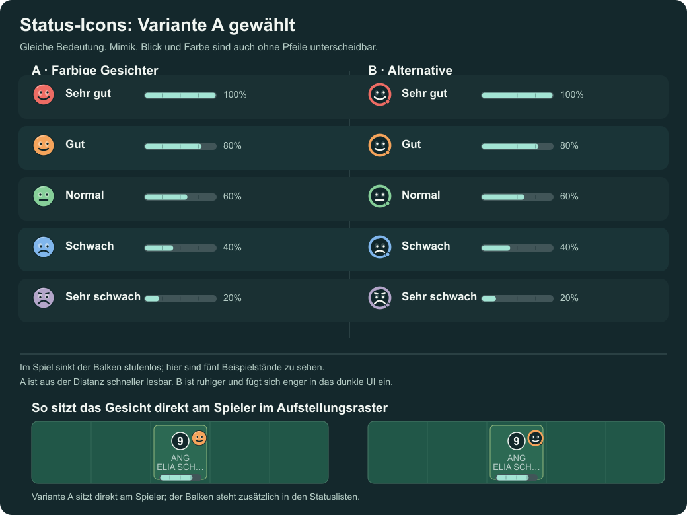
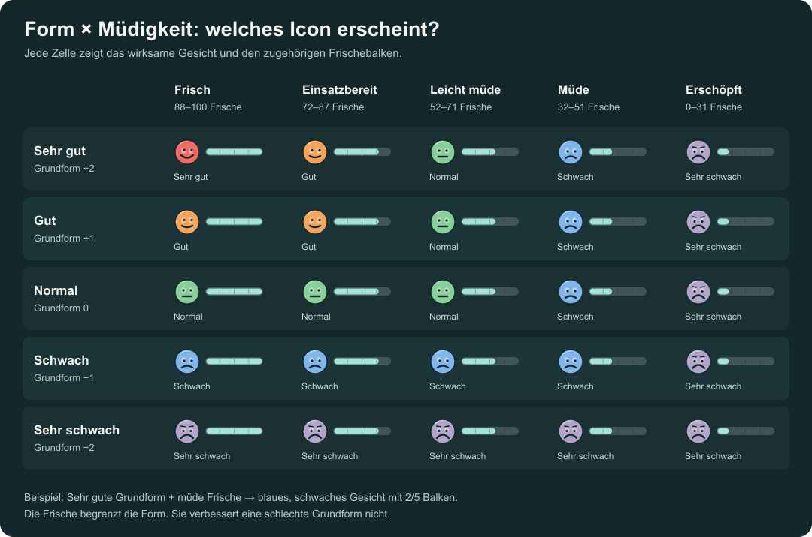

# Vorschläge für Form und Müdigkeit

- **A – Farbige Gesichter (gewählt):** Die ganze Fläche trägt die Formfarbe. Mimik und Blickrichtung bleiben auch in kleiner Größe gut erkennbar. Diese Richtung soll im Aufstellungsscreen verwendet werden.
- **B – Farbring:** Dunkler Kern mit farbigem Ring. Ruhiger im bestehenden dunklen UI, aber bei kleinen Spielerchips schwächer unterscheidbar.
- In der gewählten Richtung steht das Gesicht direkt beim Spieler auf dem Feld. In der Ersatzbank, der Startelfliste und im Live-Match steht der Frischebalken daneben. Im Match sinkt der Balken kontinuierlich.

## Bedeutung

Das Gesicht zeigt die **wirksame Form**: Rot = sehr gut, Orange = gut, Grün = normal, Blau = schwach, Violett = sehr schwach. Das Gesicht schaut bei besserer Form eher nach oben rechts, bei schlechter Form nach unten. Der Balken zeigt die **aktuelle Frische**. Farbe, Mimik und Balken sind gemeinsam lesbar; die Farbe allein ist nicht nötig.

Die gespeicherte Grundform stammt aus den letzten fünf Spielernoten, wobei neuere Spiele stärker zählen. Die aktuelle Frische kann diese Form begrenzen, aber schlechte Grundform nicht verbessern. Die folgende Tabelle zeigt die aktuell geltende Begrenzung. Jede Zelle bedeutet **Gesicht + Balkenfüllung**.

| Grundform | Frisch 88–100 · 5/5 | Einsatzbereit 72–87 · 4/5 | Leicht müde 52–71 · 3/5 | Müde 32–51 · 2/5 | Erschöpft 0–31 · 1/5 |
| --- | --- | --- | --- | --- | --- |
| Sehr gut | Rot · 5/5 | Orange · 4/5 | Grün · 3/5 | Blau · 2/5 | Violett · 1/5 |
| Gut | Orange · 5/5 | Orange · 4/5 | Grün · 3/5 | Blau · 2/5 | Violett · 1/5 |
| Normal | Grün · 5/5 | Grün · 4/5 | Grün · 3/5 | Blau · 2/5 | Violett · 1/5 |
| Schwach | Blau · 5/5 | Blau · 4/5 | Blau · 3/5 | Blau · 2/5 | Violett · 1/5 |
| Sehr schwach | Violett · 5/5 | Violett · 4/5 | Violett · 3/5 | Violett · 2/5 | Violett · 1/5 |

## So funktioniert Müdigkeit derzeit

- Ein Spieler startet mit **0 bis 100 Frischepunkten**. Während des Matches sinkt die angezeigte Frische gleichmäßig; der endgültige Verlust wird nach Abpfiff gespeichert.
- Feldspieler verlieren grob **20 bis 35 Punkte pro Einsatz**. Weniger Kondition, frühes Pressing und ein Alter ab 33 erhöhen den Verlust. Sehr gute Grundform vermindert ihn etwas, sehr schwache erhöht ihn etwas. Der Torwart verliert ungefähr **9 Punkte**.
- Niedrige Startfrische und die laufende Matchermüdung schwächen Fähigkeiten. Zusätzlich deckelt die aktuelle Frische die wirksame Form gemäß der Tabelle. So wird ein erschöpfter Spieler selbst mit guter Grundform violett angezeigt und spielt entsprechend schwächer.
- Eingesetzte Spieler erholen sich zwischen zwei Partien einmalig um **16 Punkte**, Bankspieler um **24 Punkte**, jeweils höchstens bis 100. Der Abpfiffbericht zeigt noch die Frische vor der Erholung. Zu Beginn einer neuen Saison werden alle Spieler auf 100 gesetzt.

Variante A ist ins Spiel übernommen. Im Aufstellungsraster steht das Gesicht direkt beim Spieler; die gemeinsame Anzeige erscheint zusätzlich in Startelf, Ersatzbank und Live-Match. Der Balken sinkt im Spiel stufenlos.
