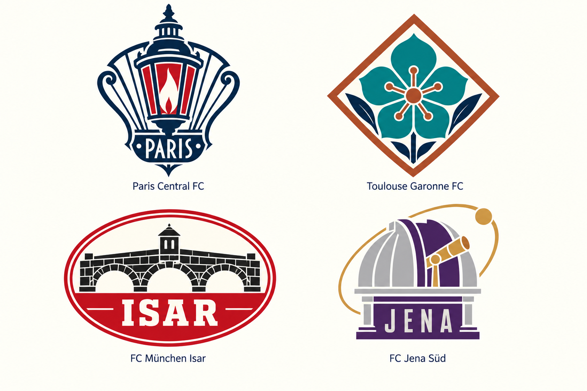
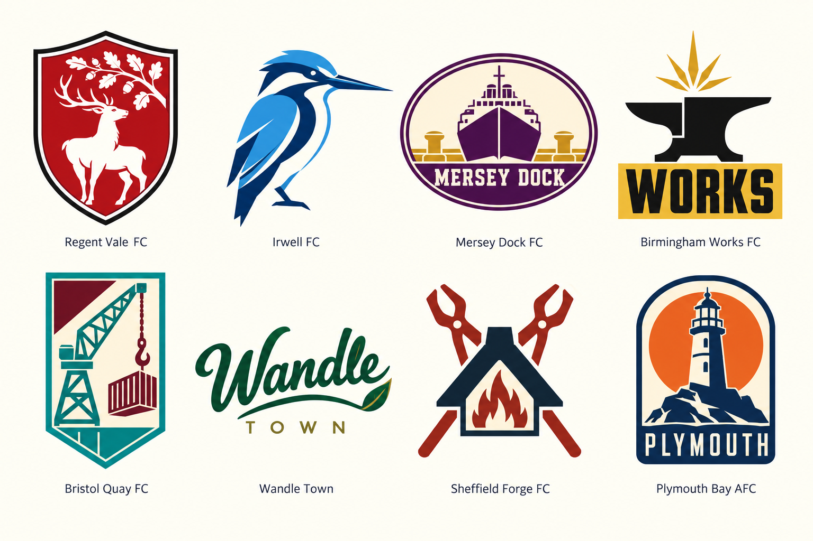
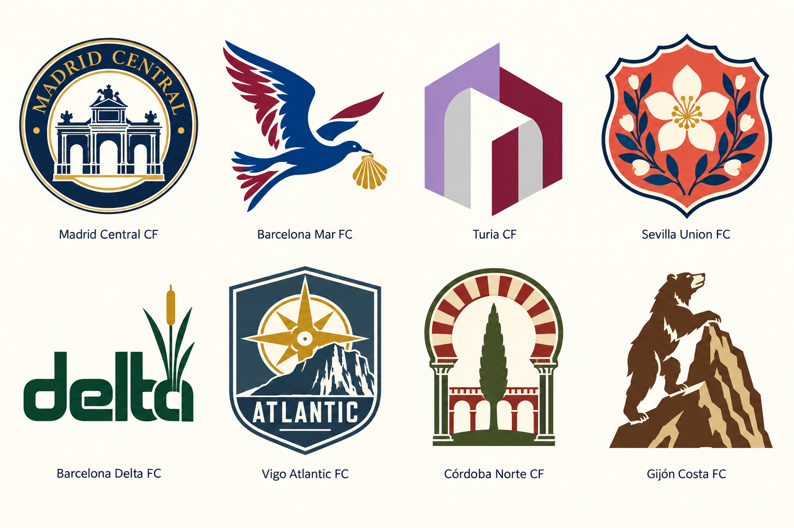
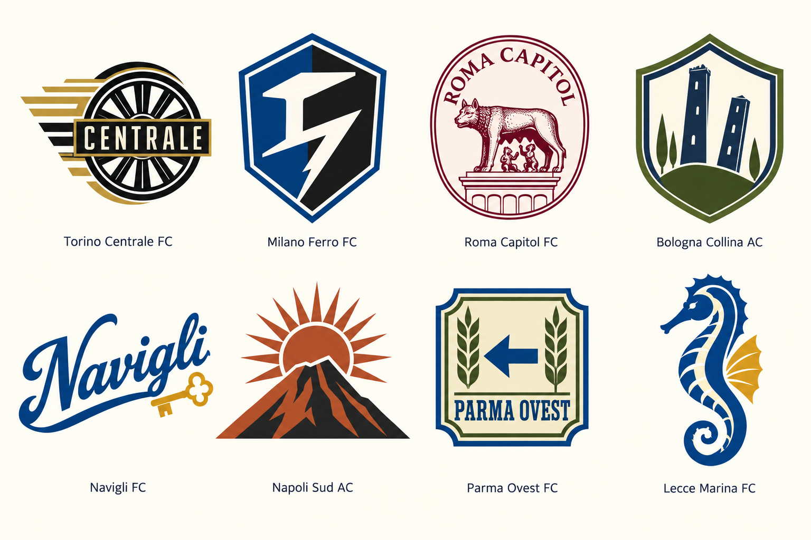
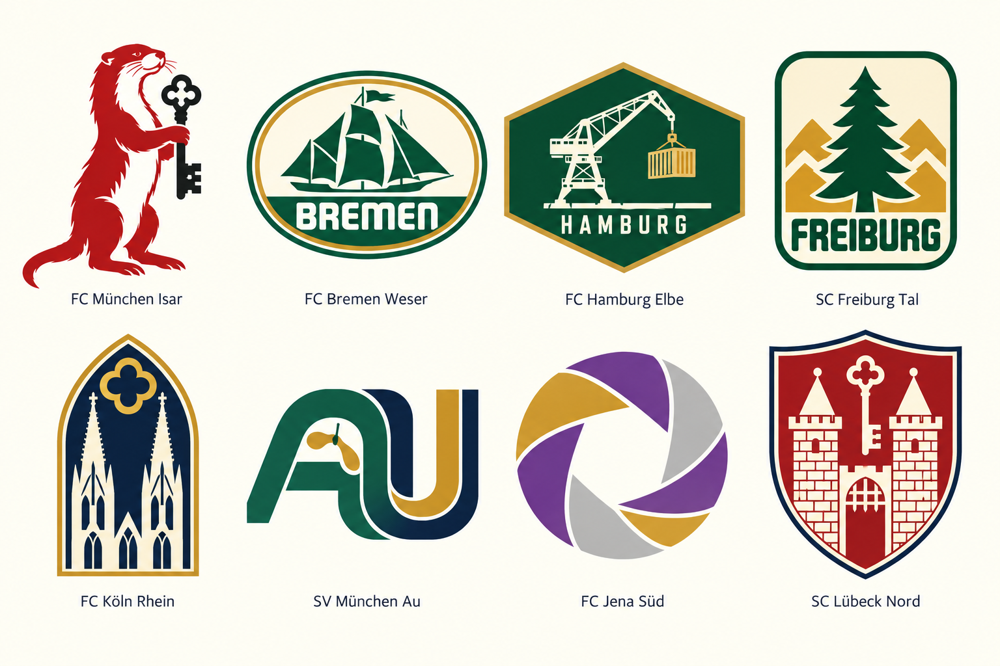
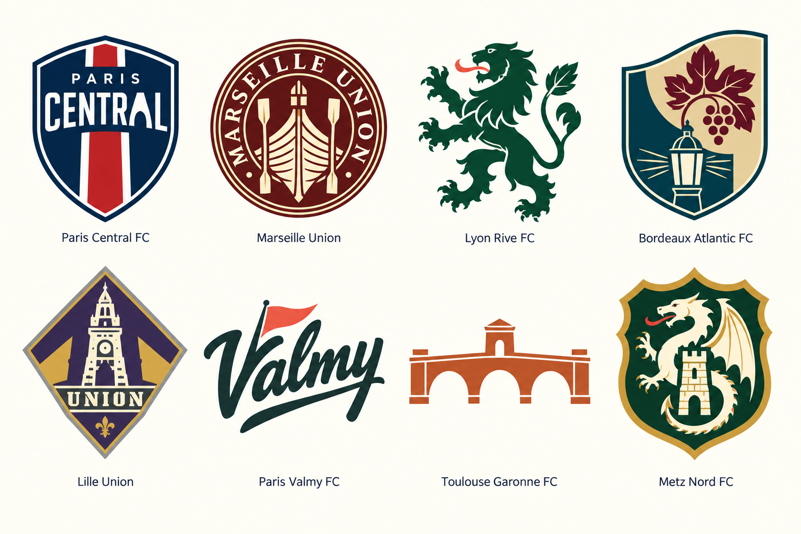
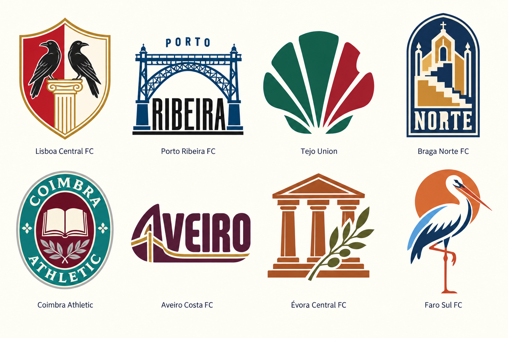
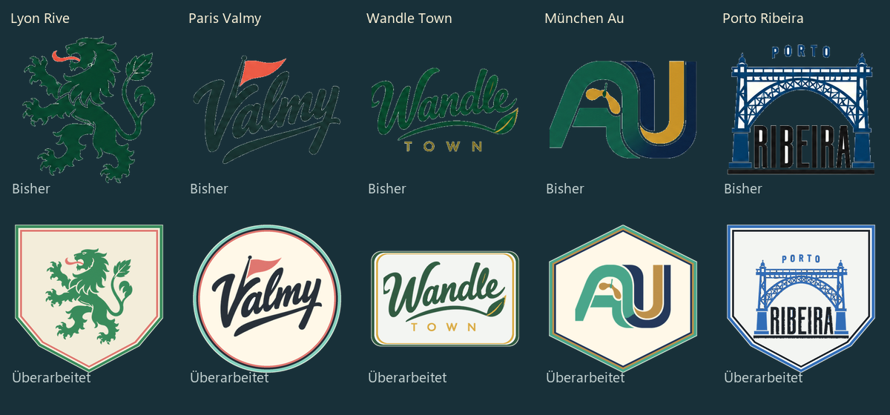

# Vereinswappen – 48 Entwürfe

## Eingebundener Stand

Die freigegebenen Motive sind einschließlich der vier Ersatzwappen seit Prototyp 89 eingebunden. Die transparenten Einzelbilder und Farbmasken liegen in `dist/crests/`; alle Wappenansichten verwenden den gemeinsamen Renderer. Die folgenden Tafeln bleiben die gestalterische Referenz.

## Überarbeitung: vier Vereine

Die folgende Tafel ersetzt die bisherigen Entwürfe für Paris Central FC, Toulouse Garonne FC, FC München Isar und FC Jena Süd. Die ursprünglichen Ländertafeln weiter unten dokumentieren die erste Fassung. Die neuen Motive sind eine Pariser Laterne, eine heraldische Blüte, eine Isarbrücke und eine Sternwarte. Erstellt mit dem integrierten Imagegen-Werkzeug; der verwendete Prompt steht in `vier-vereine-v2-prompt.txt`. Die vier Namen und Motive wurden visuell geprüft.

## Erste vollständige Entwurfsserie

Stand: 29. September 2026. Sechs Ländertafeln mit jeweils acht Vereinslogos, erstellt mit dem integrierten Imagegen-Werkzeug auf Basis der zuletzt bestätigten Referenztafel. Die Reihenfolge entspricht dem Vereinskatalog: oben vier Ligavereine, unten zwei Ligavereine und zwei Pokalvereine.

Die Entwürfe mischen Heraldik, Tier- und Pflanzenzeichen, Industrie- und Architekturzeichen, historische Siegel sowie eigenständige Schriftlogos. Wiederkehrende Initialenpaare und Wellenbänder wurden als Grundmuster aufgegeben.

Diese Gestaltungstafeln sind die Rastervorlagen der eingebundenen Wappen. Bei unveränderten Katalogfarben bleibt die Bildgestaltung erhalten; angepasste Vereinsfarben verwenden drei feste Masken. Die Bildgenerierung interpretiert einzelne Farben und Details; die Tafeln ändern den Farbkatalog und gespeicherte Spielstände nicht. Namen und Vollständigkeit aller sechs Tafeln wurden visuell geprüft. Die vollständigen verwendeten Prompts stehen in `prompts.json`.

## England

## Spanien

## Italien

## Deutschland

## Frankreich

## Portugal

## Qualitätskorrektur · Prototyp 91

Alle 48 Motive auf die drei hinterlegten Vereinsfarben abgestimmt, einschließlich Standarddarstellung. Elf erhalten passende Rahmen für mehr Kontrast. Schattierungen bleiben dezent, neutrale Schwarz-/Elfenbeindetails sind zulässig. Pixelprüfungen und Browservergleich mit gespeicherten Farbänderungen erfolgreich.

[Alle 48 Wappen auf dunklem Grund](alle-wappen-dunkel.png)
